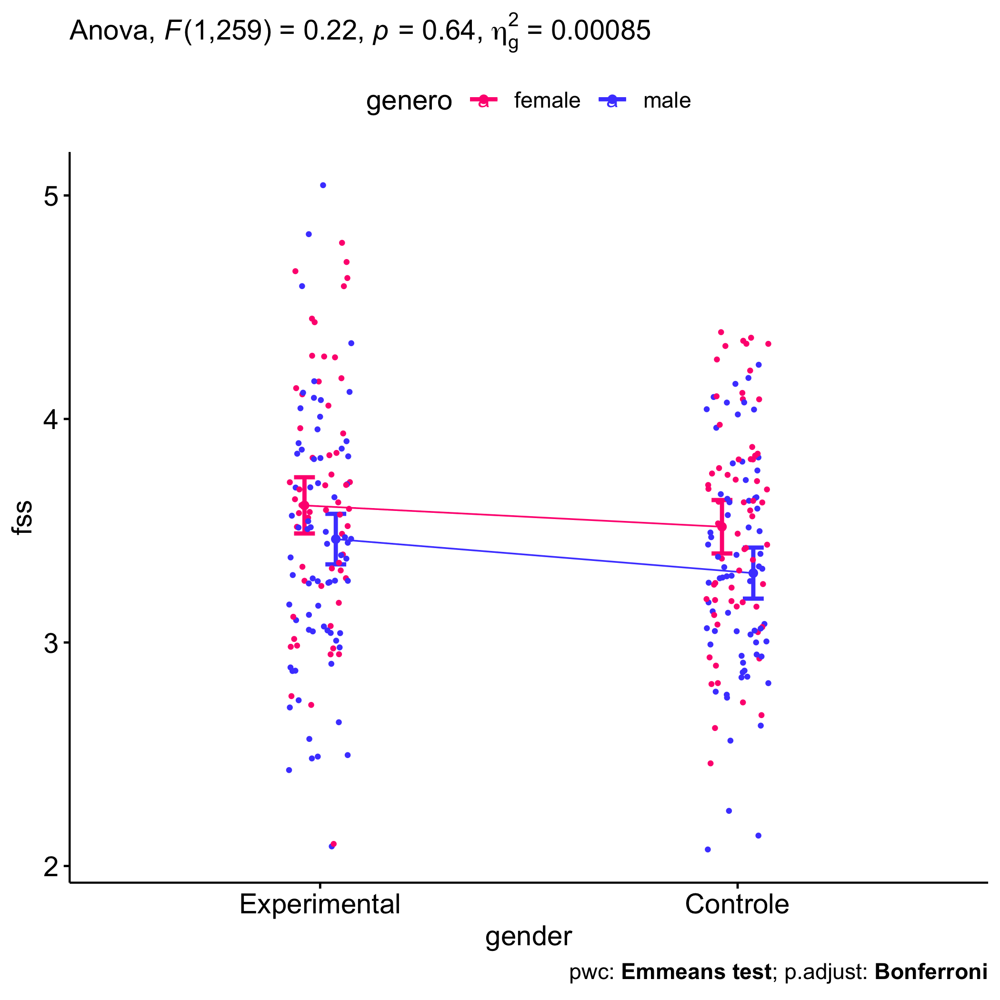
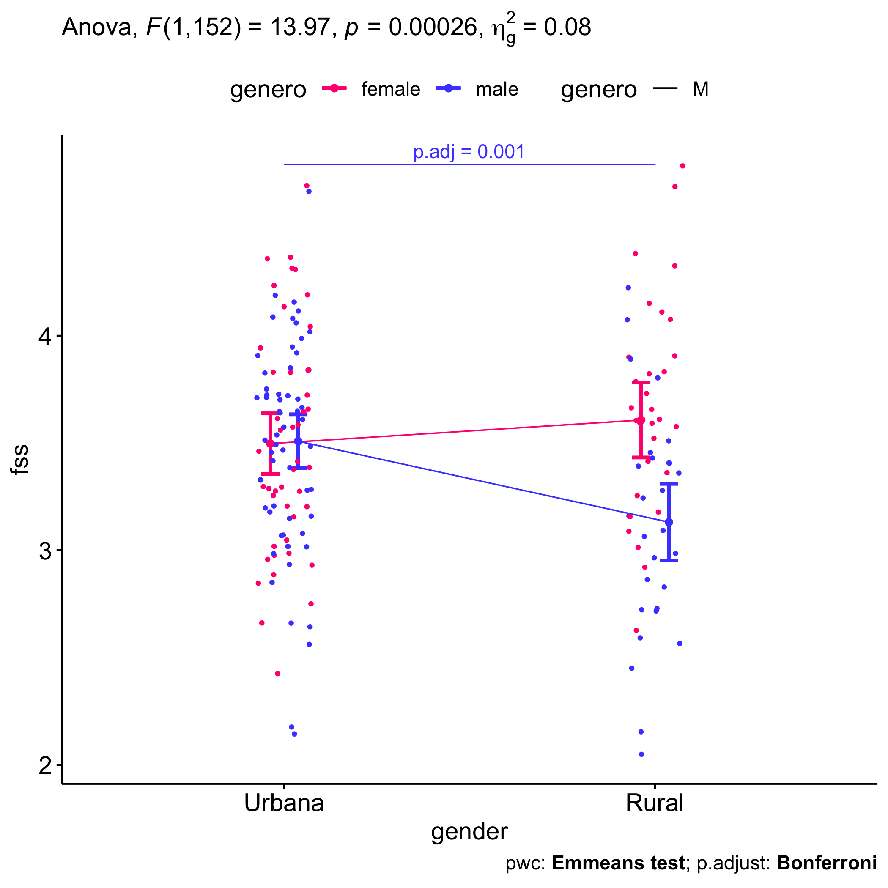

ANCOVA test for `media_fss`~`media_dfs`+`grupo`*`genero`*`zona`
================
Geiser C. Challco <geiser@alumni.usp.br>

- [Initial Variables and Descriptive Statistics of initial
  data](#initial-variables-and-descriptive-statistics-of-initial-data)
- [Checking of Assumptions](#checking-of-assumptions)
  - [Assumption: Symmetry and treatment of
    outliers](#assumption-symmetry-and-treatment-of-outliers)
  - [Identify and dealing with outliers (performing treatment of
    outliers)](#identify-and-dealing-with-outliers-performing-treatment-of-outliers)
  - [Assumption: Normality distribution of
    data](#assumption-normality-distribution-of-data)
  - [Assumption: Linearity of dependent variables and covariate
    variable](#assumption-linearity-of-dependent-variables-and-covariate-variable)
  - [Assumption: Homogeneity of data
    distribution](#assumption-homogeneity-of-data-distribution)
- [Computation of ANCOVA test and Pairwise
  Comparison](#computation-of-ancova-test-and-pairwise-comparison)
  - [ANCOVA test](#ancova-test)
  - [Pairwise comparison using factor:
    **grupo**](#pairwise-comparison-using-factor-grupo)
  - [Pairwise comparison using factor:
    **genero**](#pairwise-comparison-using-factor-genero)
  - [Pairwise comparison using factor:
    **zona**](#pairwise-comparison-using-factor-zona)
  - [Pairwise comparison using factor:
    **grupo:genero**](#pairwise-comparison-using-factor-grupogenero)
  - [Pairwise comparison using factor:
    **grupo:zona**](#pairwise-comparison-using-factor-grupozona)
  - [Pairwise comparison using factor:
    **genero:zona**](#pairwise-comparison-using-factor-generozona)
- [Descriptive statistics and estimated marginal means to be reported by
  grupo and
  genero](#descriptive-statistics-and-estimated-marginal-means-to-be-reported-by-grupo-and-genero)
- [Descriptive statistics and estimated marginal means to be reported
  with
  zona](#descriptive-statistics-and-estimated-marginal-means-to-be-reported-with-zona)
- [Tips and References](#tips-and-references)

## Initial Variables and Descriptive Statistics of initial data

- R-script file: [../code/ancova.R](../code/ancova.R)
- Initial table file:
  [../data/initial-table.csv](../data/initial-table.csv)
- Data for media_fss
  [../data/table-for-media_fss.csv](../data/table-for-media_fss.csv)
- Table without outliers and normal distribution of data:
  [../data/table-with-normal-distribution.csv](../data/table-with-normal-distribution.csv)
- Other data files: [../data/](../data/)
- Files related to the presented results: [../results/](../results/)

| grupo        | genero | zona   | variable |   n |  mean | median |   min |   max |    sd |    se |    ci |   iqr |
|:-------------|:-------|:-------|:---------|----:|------:|-------:|------:|------:|------:|------:|------:|------:|
| Experimental | F      | Urbana | fss      |  22 | 3.463 |  3.500 | 2.750 | 4.667 | 0.475 | 0.101 | 0.211 | 0.750 |
| Experimental | F      | Rural  | fss      |  13 | 3.887 |  3.778 | 3.333 | 4.750 | 0.440 | 0.122 | 0.266 | 0.556 |
| Experimental | F      | NA     | fss      |  23 | 3.681 |  3.667 | 2.111 | 4.667 | 0.635 | 0.132 | 0.275 | 0.889 |
| Experimental | M      | Urbana | fss      |  25 | 3.589 |  3.667 | 2.625 | 4.667 | 0.473 | 0.095 | 0.195 | 0.653 |
| Experimental | M      | Rural  | fss      |  19 | 3.224 |  3.333 | 2.111 | 4.222 | 0.569 | 0.131 | 0.274 | 0.583 |
| Experimental | M      | NA     | fss      |  28 | 3.425 |  3.333 | 2.556 | 5.000 | 0.589 | 0.111 | 0.228 | 0.611 |
| Controle     | F      | Urbana | fss      |  23 | 3.546 |  3.444 | 2.444 | 4.333 | 0.565 | 0.118 | 0.245 | 0.833 |
| Controle     | F      | Rural  | fss      |  17 | 3.508 |  3.556 | 2.667 | 4.333 | 0.498 | 0.121 | 0.256 | 0.667 |
| Controle     | F      | NA     | fss      |  24 | 3.549 |  3.667 | 2.556 | 4.333 | 0.420 | 0.086 | 0.178 | 0.556 |
| Controle     | M      | Urbana | fss      |  33 | 3.379 |  3.375 | 2.111 | 4.111 | 0.498 | 0.087 | 0.177 | 0.667 |
| Controle     | M      | Rural  | fss      |   9 | 2.932 |  2.889 | 2.111 | 3.500 | 0.406 | 0.135 | 0.312 | 0.222 |
| Controle     | M      | NA     | fss      |  28 | 3.329 |  3.222 | 2.556 | 4.222 | 0.470 | 0.089 | 0.182 | 0.635 |

<!-- -->

    ## [1] "225" "165" "174" "180"

## Checking of Assumptions

### Assumption: Symmetry and treatment of outliers

| grupo        | genero | variable |   n |  mean | median |   min |   max |    sd |    se |    ci |   iqr | symmetry | skewness | kurtosis |
|:-------------|:-------|:---------|----:|------:|-------:|------:|------:|------:|------:|------:|------:|:---------|---------:|---------:|
| Experimental | F      | fss      |  58 | 3.645 |  3.611 | 2.111 | 4.750 | 0.553 | 0.073 | 0.146 | 0.722 | YES      |    0.004 |   -0.178 |
| Experimental | M      | fss      |  72 | 3.429 |  3.444 | 2.111 | 5.000 | 0.557 | 0.066 | 0.131 | 0.667 | YES      |    0.301 |    0.175 |
| Controle     | F      | fss      |  64 | 3.537 |  3.556 | 2.444 | 4.333 | 0.489 | 0.061 | 0.122 | 0.580 | YES      |   -0.087 |   -0.765 |
| Controle     | M      | fss      |  70 | 3.301 |  3.333 | 2.111 | 4.222 | 0.491 | 0.059 | 0.117 | 0.667 | YES      |   -0.118 |   -0.310 |

| grupo        | zona   | variable |   n |  mean | median |   min |   max |    sd |    se |    ci |   iqr | symmetry | skewness | kurtosis |
|:-------------|:-------|:---------|----:|------:|-------:|------:|------:|------:|------:|------:|------:|:---------|---------:|---------:|
| Experimental | Urbana | fss      |  47 | 3.530 |  3.556 | 2.625 | 4.667 | 0.473 | 0.069 | 0.139 | 0.611 | YES      |    0.236 |   -0.296 |
| Experimental | Rural  | fss      |  32 | 3.493 |  3.528 | 2.111 | 4.750 | 0.610 | 0.108 | 0.220 | 0.674 | YES      |   -0.156 |   -0.229 |
| Experimental | NA     | fss      |  51 | 3.541 |  3.444 | 2.111 | 5.000 | 0.618 | 0.086 | 0.174 | 0.778 | YES      |    0.312 |   -0.376 |
| Controle     | Urbana | fss      |  56 | 3.447 |  3.410 | 2.111 | 4.333 | 0.528 | 0.071 | 0.141 | 0.656 | YES      |   -0.257 |   -0.311 |
| Controle     | Rural  | fss      |  26 | 3.309 |  3.167 | 2.111 | 4.333 | 0.538 | 0.106 | 0.217 | 0.750 | YES      |    0.137 |   -0.535 |
| Controle     | NA     | fss      |  52 | 3.430 |  3.444 | 2.556 | 4.333 | 0.457 | 0.063 | 0.127 | 0.667 | YES      |    0.027 |   -0.897 |

*Note*: There is not necessary to apply any transformation for skewness
because all data satisfy symmetry

### Identify and dealing with outliers (performing treatment of outliers)

| grupo        | genero | zona   | id_estudante |      fss |      dfs | is.outlier | is.extreme |
|:-------------|:-------|:-------|:-------------|---------:|---------:|:-----------|:-----------|
| Experimental | M      | NA     | E119         | 5.000000 | 4.222222 | TRUE       | FALSE      |
| Experimental | M      | NA     | E130         | 4.777778 | 3.777778 | TRUE       | FALSE      |
| Controle     | M      | Urbana | E272         | 2.111111 | 2.000000 | TRUE       | FALSE      |
| Controle     | M      | Rural  | E201         | 2.111111 | 3.777778 | TRUE       | FALSE      |
| Controle     | M      | Rural  | E214         | 3.500000 | 3.111111 | TRUE       | FALSE      |
| Controle     | M      | Rural  | E220         | 3.444444 | 2.777778 | TRUE       | FALSE      |

*Note*: No one outlier is extreme, they are possible outliers then we
removed them only if normality is unsatisfied

### Assumption: Normality distribution of data

| var |   n | skewness | kurtosis | symmetry | statistic | method     |     p | p.signif | normality |
|:----|----:|---------:|---------:|:---------|----------:|:-----------|------:|:---------|:----------|
| fss | 161 |    0.126 |   -0.129 | YES      |      0.47 | D’Agostino | 0.791 | ns       | QQ        |

| grupo        | genero | zona   | variable |   n |  mean | median |   min |   max |    sd |    se |    ci |   iqr | normality | method       | statistic |     p | p.signif |
|:-------------|:-------|:-------|:---------|----:|------:|-------:|------:|------:|------:|------:|------:|------:|:----------|:-------------|----------:|------:|:---------|
| Experimental | F      | Urbana | fss      |  22 | 3.463 |  3.500 | 2.750 | 4.667 | 0.475 | 0.101 | 0.211 | 0.750 | YES       | Shapiro-Wilk |     0.931 | 0.129 | ns       |
| Experimental | F      | Rural  | fss      |  13 | 3.887 |  3.778 | 3.333 | 4.750 | 0.440 | 0.122 | 0.266 | 0.556 | YES       | Shapiro-Wilk |     0.884 | 0.082 | ns       |
| Experimental | F      | NA     | fss      |  23 | 3.681 |  3.667 | 2.111 | 4.667 | 0.635 | 0.132 | 0.275 | 0.889 | YES       | Shapiro-Wilk |     0.968 | 0.648 | ns       |
| Experimental | M      | Urbana | fss      |  25 | 3.589 |  3.667 | 2.625 | 4.667 | 0.473 | 0.095 | 0.195 | 0.653 | YES       | Shapiro-Wilk |     0.973 | 0.719 | ns       |
| Experimental | M      | Rural  | fss      |  19 | 3.224 |  3.333 | 2.111 | 4.222 | 0.569 | 0.131 | 0.274 | 0.583 | YES       | Shapiro-Wilk |     0.973 | 0.841 | ns       |
| Experimental | M      | NA     | fss      |  28 | 3.425 |  3.333 | 2.556 | 5.000 | 0.589 | 0.111 | 0.228 | 0.611 | NO        | Shapiro-Wilk |     0.912 | 0.022 | \*       |
| Controle     | F      | Urbana | fss      |  23 | 3.546 |  3.444 | 2.444 | 4.333 | 0.565 | 0.118 | 0.245 | 0.833 | YES       | Shapiro-Wilk |     0.936 | 0.144 | ns       |
| Controle     | F      | Rural  | fss      |  17 | 3.508 |  3.556 | 2.667 | 4.333 | 0.498 | 0.121 | 0.256 | 0.667 | YES       | Shapiro-Wilk |     0.960 | 0.629 | ns       |
| Controle     | F      | NA     | fss      |  24 | 3.549 |  3.667 | 2.556 | 4.333 | 0.420 | 0.086 | 0.178 | 0.556 | YES       | Shapiro-Wilk |     0.959 | 0.413 | ns       |
| Controle     | M      | Urbana | fss      |  33 | 3.379 |  3.375 | 2.111 | 4.111 | 0.498 | 0.087 | 0.177 | 0.667 | YES       | Shapiro-Wilk |     0.952 | 0.152 | ns       |
| Controle     | M      | Rural  | fss      |   9 | 2.932 |  2.889 | 2.111 | 3.500 | 0.406 | 0.135 | 0.312 | 0.222 | YES       | Shapiro-Wilk |     0.898 | 0.239 | ns       |
| Controle     | M      | NA     | fss      |  28 | 3.329 |  3.222 | 2.556 | 4.222 | 0.470 | 0.089 | 0.182 | 0.635 | YES       | Shapiro-Wilk |     0.947 | 0.165 | ns       |

*Note*: Normality test only fails in the subset of grupo=“Experimental”,
genero=“M” and zona=“NA”, thus we decided not remove any data record.
This subset of data will not be used on data analysis because variable
“zona” is undefined.

### Assumption: Linearity of dependent variables and covariate variable

``` r
ggscatter(dat, x="dfs", y="fss", facet.by=c("grupo","genero"), short.panel.labs = F) + stat_smooth(method = "lm", span = 0.9)
```

    ## `geom_smooth()` using formula = 'y ~ x'

<!-- -->

``` r
ggscatter(dat, x="dfs", y="fss", facet.by=c("grupo","zona"), short.panel.labs = F) + stat_smooth(method = "lm", span = 0.9)
```

    ## `geom_smooth()` using formula = 'y ~ x'

<!-- -->

### Assumption: Homogeneity of data distribution

| var | method         | formula                        |   n | DFn.df1 | DFd.df2 | statistic |     p | p.signif |
|:----|:---------------|:-------------------------------|----:|--------:|--------:|----------:|------:|:---------|
| fss | Levene’s test  | `.res`~`grupo`*`genero`*`zona` | 161 |       7 |     153 |     0.858 | 0.541 | ns       |
| fss | Anova’s slopes | `.res`~`grupo`*`genero`*`zona` | 161 |       7 |     145 |     1.638 | 0.129 | ns       |

| var | method         | formula                  |   n | DFn.df1 | DFd.df2 | statistic |     p | p.signif |
|:----|:---------------|:-------------------------|----:|--------:|--------:|----------:|------:|:---------|
| fss | Levene’s test  | `.res`~`grupo`\*`genero` | 264 |       3 |     260 |     1.113 | 0.344 | ns       |
| fss | Anova’s slopes | `.res`~`grupo`\*`genero` | 264 |       3 |     256 |     1.311 | 0.271 | ns       |

## Computation of ANCOVA test and Pairwise Comparison

### ANCOVA test

| Effect       | DFn | DFd |    SSn |    SSd |      F | p       |   ges | p\<.05 |
|:-------------|----:|----:|-------:|-------:|-------:|:--------|------:|:-------|
| dfs          |   1 | 259 | 10.299 | 60.933 | 43.777 | \<0.001 | 0.145 | \*     |
| grupo        |   1 | 259 |  1.047 | 60.933 |  4.452 | 0.036   | 0.017 | \*     |
| genero       |   1 | 259 |  2.092 | 60.933 |  8.891 | 0.003   | 0.033 | \*     |
| grupo:genero |   1 | 259 |  0.052 | 60.933 |  0.221 | 0.638   | 0.001 |        |

*Note*: There are significant differences on the factors: “grupo”, and
“genero”

| Effect            | DFn | DFd |   SSn |    SSd |      F | p       |   ges | p\<.05 |
|:------------------|----:|----:|------:|-------:|-------:|:--------|------:|:-------|
| dfs               |   1 | 152 | 4.915 | 33.623 | 22.219 | \<0.001 | 0.128 | \*     |
| grupo             |   1 | 152 | 0.933 | 33.623 |  4.218 | 0.042   | 0.027 | \*     |
| genero            |   1 | 152 | 1.326 | 33.623 |  5.992 | 0.016   | 0.038 | \*     |
| zona              |   1 | 152 | 0.888 | 33.623 |  4.013 | 0.047   | 0.026 | \*     |
| grupo:genero      |   1 | 152 | 0.284 | 33.623 |  1.283 | 0.259   | 0.008 |        |
| grupo:zona        |   1 | 152 | 0.879 | 33.623 |  3.972 | 0.048   | 0.025 | \*     |
| genero:zona       |   1 | 152 | 3.090 | 33.623 | 13.969 | \<0.001 | 0.084 | \*     |
| grupo:genero:zona |   1 | 152 | 0.143 | 33.623 |  0.646 | 0.423   | 0.004 |        |

*Note*: There are significant differences on the factors: “grupo”,
“genero”, “zona”, “grupo:zona”, and “genero:zona”

- For the analysis using “grupo”, and “genero”, we recommend to use all
  the gathered dataset (variable: dat)
- For the analysis using “grupo”, and “genero”, we recommend to use the
  dataset without NA in “zona” (variable: sdat)

### Pairwise comparison using factor: **grupo**

| var | grupo | group1       | group2   | estimate | conf.low | conf.high |    se | statistic |     p | p.adj | p.adj.signif |
|:----|:------|:-------------|:---------|---------:|---------:|----------:|------:|----------:|------:|------:|:-------------|
| fss | NA    | Experimental | Controle |    0.121 |    0.002 |      0.24 | 0.061 |     1.997 | 0.047 | 0.047 | \*           |

``` r
oneWayAncovaPlots(dat, "fss", "grupo", aov1, pwc.grupo$fss, addParam = c("jitter"), font.label.size=14, step.increase=0.25, p.label="p.adj", subtitle = 2)$grupo + ggplot2::scale_color_manual(values=c("#00AA00","#FFBA00"))
```

    ## Scale for colour is already present.
    ## Adding another scale for colour, which will replace the existing scale.

<!-- -->

### Pairwise comparison using factor: **genero**

| var | genero | group1 | group2 | estimate | conf.low | conf.high |    se | statistic |     p | p.adj | p.adj.signif |
|:----|:-------|:-------|:-------|---------:|---------:|----------:|------:|----------:|------:|------:|:-------------|
| fss | NA     | F      | M      |    0.176 |    0.057 |     0.295 | 0.061 |     2.907 | 0.004 | 0.004 | \*\*         |

``` r
oneWayAncovaPlots(dat, "fss", "genero", aov1, pwc.genero$fss, addParam = c("jitter"), font.label.size=14, step.increase=0.25, p.label="p.adj", subtitle = 3)$genero + ggplot2::scale_color_manual(labels=c("female","male"), values=c("#FF007F","#4D4DFF")) + scale_x_discrete("gender")
```

    ## Scale for colour is already present.
    ## Adding another scale for colour, which will replace the existing scale.

<!-- -->

### Pairwise comparison using factor: **zona**

| var | zona | group1 | group2 | estimate | conf.low | conf.high |    se | statistic |     p | p.adj | p.adj.signif |
|:----|:-----|:-------|:-------|---------:|---------:|----------:|------:|----------:|------:|------:|:-------------|
| fss | NA   | Urbana | Rural  |    0.131 |   -0.032 |     0.293 | 0.082 |     1.586 | 0.115 | 0.115 | ns           |

``` r
oneWayAncovaPlots(sdat, "fss", "zona", aov2, pwc.zona$fss, addParam = c("jitter"), font.label.size=14, step.increase=0.25, p.label="p.adj", subtitle = 4)$zona +  ggplot2::scale_color_manual(values=c("#AA00FF","#00CCCC"))
```

    ## Scale for colour is already present.
    ## Adding another scale for colour, which will replace the existing scale.

<!-- -->

### Pairwise comparison using factor: **grupo:genero**

| var | grupo        | genero | group1       | group2   | estimate | conf.low | conf.high |    se | statistic |     p | p.adj | p.adj.signif |
|:----|:-------------|:-------|:-------------|:---------|---------:|---------:|----------:|------:|----------:|------:|------:|:-------------|
| fss | NA           | F      | Experimental | Controle |    0.096 |   -0.077 |     0.269 | 0.088 |     1.088 | 0.278 | 0.278 | ns           |
| fss | NA           | M      | Experimental | Controle |    0.152 |   -0.008 |     0.313 | 0.081 |     1.867 | 0.063 | 0.063 | ns           |
| fss | Experimental | NA     | F            | M        |    0.151 |   -0.019 |     0.321 | 0.086 |     1.752 | 0.081 | 0.081 | ns           |
| fss | Controle     | NA     | F            | M        |    0.207 |    0.042 |     0.373 | 0.084 |     2.469 | 0.014 | 0.014 | \*           |

``` r
plots <- twoWayAncovaPlots(dat, "fss", c("grupo","genero"), aov1, pwc.grupo_genero$fss, addParam = c("jitter"), font.label.size=14, step.increase=0.25, p.label="p.adj", subtitle = 4)
```

``` r
plots$grupo + ggplot2::scale_color_manual(labels=c("female","male"), values=c("#FF007F","#4D4DFF")) + scale_x_discrete("gender")
```

    ## Scale for colour is already present.
    ## Adding another scale for colour, which will replace the existing scale.

<!-- -->

``` r
plots$genero + ggplot2::scale_color_manual(values=c("#00AA00","#FFBA00"))
```

    ## Scale for colour is already present.
    ## Adding another scale for colour, which will replace the existing scale.

<!-- -->

### Pairwise comparison using factor: **grupo:zona**

| var | grupo        | zona   | group1       | group2   | estimate | conf.low | conf.high |    se | statistic |     p | p.adj | p.adj.signif |
|:----|:-------------|:-------|:-------------|:---------|---------:|---------:|----------:|------:|----------:|------:|------:|:-------------|
| fss | NA           | Urbana | Experimental | Controle |    0.047 |   -0.147 |     0.241 | 0.098 |     0.479 | 0.632 | 0.632 | ns           |
| fss | NA           | Rural  | Experimental | Controle |    0.214 |   -0.045 |     0.473 | 0.131 |     1.633 | 0.105 | 0.105 | ns           |
| fss | Experimental | NA     | Urbana       | Rural    |    0.061 |   -0.164 |     0.285 | 0.114 |     0.535 | 0.593 | 0.593 | ns           |
| fss | Controle     | NA     | Urbana       | Rural    |    0.228 |   -0.007 |     0.462 | 0.119 |     1.913 | 0.058 | 0.058 | ns           |

``` r
plots <- twoWayAncovaPlots(sdat, "fss", c("grupo","zona"), aov2, pwc.grupo_zona$fss, addParam = c("jitter"), font.label.size=14, step.increase=0.25, p.label="p.adj", subtitle = 6)
```

``` r
plots$grupo + ggplot2::scale_color_manual(values=c("#AA00FF","#00CCCC"))
```

    ## Scale for colour is already present.
    ## Adding another scale for colour, which will replace the existing scale.

<!-- -->

``` r
plots$zona + ggplot2::scale_color_manual(values=c("#00AA00","#FFBA00"))
```

    ## Scale for colour is already present.
    ## Adding another scale for colour, which will replace the existing scale.

<!-- -->

### Pairwise comparison using factor: **genero:zona**

| var | genero | zona   | group1 | group2 | estimate | conf.low | conf.high |    se | statistic | p       | p.adj   | p.adj.signif |
|:----|:-------|:-------|:-------|:-------|---------:|---------:|----------:|------:|----------:|:--------|:--------|:-------------|
| fss | NA     | Urbana | F      | M      |   -0.011 |   -0.200 |     0.178 | 0.096 |    -0.117 | 0.907   | 0.907   | ns           |
| fss | NA     | Rural  | F      | M      |    0.476 |    0.226 |     0.726 | 0.127 |     3.763 | \<0.001 | \<0.001 | \*\*\*       |
| fss | F      | NA     | Urbana | Rural  |   -0.110 |   -0.334 |     0.114 | 0.114 |    -0.970 | 0.334   | 0.334   | ns           |
| fss | M      | NA     | Urbana | Rural  |    0.378 |    0.159 |     0.596 | 0.110 |     3.417 | \<0.001 | \<0.001 | \*\*\*       |

``` r
plots <- twoWayAncovaPlots(sdat, "fss", c("genero","zona"), aov2, pwc.genero_zona$fss, addParam = c("jitter"), font.label.size=14, step.increase=0.25, p.label="p.adj", subtitle = 7)
```

``` r
plots$genero + ggplot2::scale_color_manual(values=c("#AA00FF","#00CCCC"))
```

    ## Scale for colour is already present.
    ## Adding another scale for colour, which will replace the existing scale.

<!-- -->

``` r
plots$zona + ggplot2::scale_color_manual(labels=c("female","male"), values=c("#FF007F","#4D4DFF")) + scale_x_discrete("gender")
```

    ## Scale for colour is already present.
    ## Adding another scale for colour, which will replace the existing scale.

<!-- -->

## Descriptive statistics and estimated marginal means to be reported by grupo and genero

| var | grupo        |   n | M (pre) | SE (pre) | M (unadj) | SE (unadj) | M (adj) | SE (adj) |
|:----|:-------------|----:|--------:|---------:|----------:|-----------:|--------:|---------:|
| fss | Controle     | 134 |   3.414 |    0.051 |     3.414 |      0.043 |   3.409 |    0.042 |
| fss | Experimental | 130 |   3.388 |    0.048 |     3.525 |      0.049 |   3.530 |    0.043 |

| var | genero |   n | M (pre) | SE (pre) | M (unadj) | SE (unadj) | M (adj) | SE (adj) |
|:----|:-------|----:|--------:|---------:|----------:|-----------:|--------:|---------:|
| fss | F      | 122 |   3.473 |    0.049 |     3.588 |      0.047 |   3.563 |    0.044 |
| fss | M      | 142 |   3.340 |    0.049 |     3.366 |      0.044 |   3.387 |    0.041 |

| var | grupo        | genero |   n | M (pre) | SE (pre) | M (unadj) | SE (unadj) | M (adj) | SE (adj) |
|:----|:-------------|:-------|----:|--------:|---------:|----------:|-----------:|--------:|---------:|
| fss | Controle     | F      |  64 |   3.457 |    0.066 |     3.537 |      0.061 |   3.518 |    0.061 |
| fss | Controle     | M      |  70 |   3.375 |    0.077 |     3.301 |      0.059 |   3.310 |    0.058 |
| fss | Experimental | F      |  58 |   3.491 |    0.074 |     3.645 |      0.073 |   3.613 |    0.064 |
| fss | Experimental | M      |  72 |   3.305 |    0.062 |     3.429 |      0.066 |   3.463 |    0.057 |

## Descriptive statistics and estimated marginal means to be reported with zona

| var | zona   |   n | M (pre) | SE (pre) | M (unadj) | SE (unadj) | M (adj) | SE (adj) |
|:----|:-------|----:|--------:|---------:|----------:|-----------:|--------:|---------:|
| fss | Rural  |  58 |   3.501 |    0.069 |     3.410 |      0.076 |   3.375 |    0.066 |
| fss | Urbana | 103 |   3.331 |    0.062 |     3.485 |      0.050 |   3.505 |    0.049 |

| var | grupo        | zona   |   n | M (pre) | SE (pre) | M (unadj) | SE (unadj) | M (adj) | SE (adj) |
|:----|:-------------|:-------|----:|--------:|---------:|----------:|-----------:|--------:|---------:|
| fss | Controle     | Rural  |  26 |   3.550 |    0.104 |     3.309 |      0.106 |   3.257 |    0.098 |
| fss | Controle     | Urbana |  56 |   3.282 |    0.089 |     3.447 |      0.071 |   3.484 |    0.067 |
| fss | Experimental | Rural  |  32 |   3.461 |    0.094 |     3.493 |      0.108 |   3.470 |    0.088 |
| fss | Experimental | Urbana |  47 |   3.390 |    0.086 |     3.530 |      0.069 |   3.531 |    0.072 |

| var | genero | zona   |   n | M (pre) | SE (pre) | M (unadj) | SE (unadj) | M (adj) | SE (adj) |
|:----|:-------|:-------|----:|--------:|---------:|----------:|-----------:|--------:|---------:|
| fss | F      | Rural  |  30 |   3.606 |    0.092 |     3.672 |      0.092 |   3.608 |    0.089 |
| fss | F      | Urbana |  45 |   3.419 |    0.087 |     3.506 |      0.077 |   3.497 |    0.071 |
| fss | M      | Rural  |  28 |   3.389 |    0.102 |     3.130 |      0.101 |   3.131 |    0.090 |
| fss | M      | Urbana |  58 |   3.263 |    0.086 |     3.470 |      0.065 |   3.509 |    0.063 |

## Tips and References

- Use the site <https://www.tablesgenerator.com> to convert the HTML
  tables into Latex format

- \[2\]: Miot, H. A. (2017). Assessing normality of data in clinical and
  experimental trials. J Vasc Bras, 16(2), 88-91.

- \[3\]: Bárány, Imre; Vu, Van (2007). “Central limit theorems for
  Gaussian polytopes”. Annals of Probability. Institute of Mathematical
  Statistics. 35 (4): 1593–1621.
