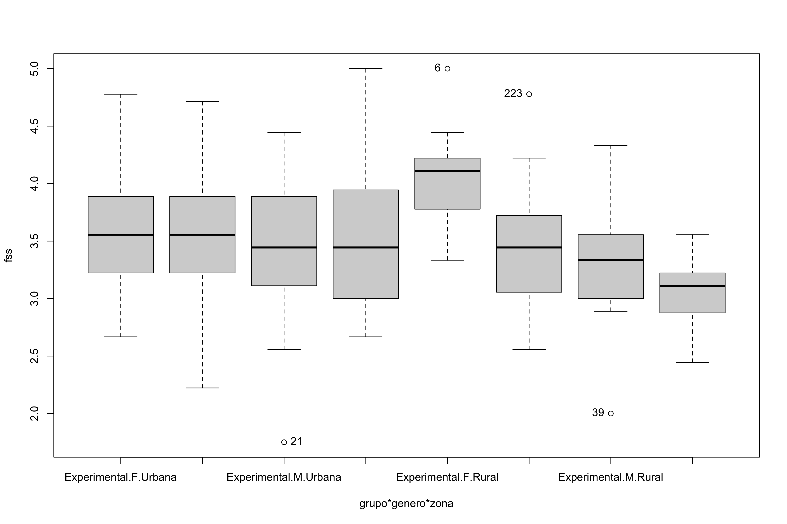

ANCOVA test for `media_fss`~`media_dfs`+`grupo`*`genero`*`zona`
================
Geiser C. Challco <geiser@alumni.usp.br>

- [Initial Variables and Descriptive Statistics of initial
  data](#initial-variables-and-descriptive-statistics-of-initial-data)
- [Checking of Assumptions](#checking-of-assumptions)
  - [Assumption: Symmetry and treatment of
    outliers](#assumption-symmetry-and-treatment-of-outliers)
  - [Identify and dealing with outliers (performing treatment of
    outliers)](#identify-and-dealing-with-outliers-performing-treatment-of-outliers)
  - [Assumption: Normality distribution of
    data](#assumption-normality-distribution-of-data)
  - [Assumption: Linearity of dependent variables and covariate
    variable](#assumption-linearity-of-dependent-variables-and-covariate-variable)
  - [Assumption: Homogeneity of data
    distribution](#assumption-homogeneity-of-data-distribution)
- [Computation of ANCOVA test and Pairwise
  Comparison](#computation-of-ancova-test-and-pairwise-comparison)
  - [ANCOVA test](#ancova-test)
  - [Pairwise comparison using factor:
    **grupo**](#pairwise-comparison-using-factor-grupo)
  - [Pairwise comparison using factor:
    **genero**](#pairwise-comparison-using-factor-genero)
  - [Pairwise comparison using factor:
    **zona**](#pairwise-comparison-using-factor-zona)
  - [Pairwise comparison using factor:
    **grupo:genero**](#pairwise-comparison-using-factor-grupogenero)
  - [Pairwise comparison using factor:
    **grupo:zona**](#pairwise-comparison-using-factor-grupozona)
  - [Pairwise comparison using factor:
    **genero:zona**](#pairwise-comparison-using-factor-generozona)
- [Descriptive statistics and estimated marginal means to be reported by
  grupo and
  genero](#descriptive-statistics-and-estimated-marginal-means-to-be-reported-by-grupo-and-genero)
- [Descriptive statistics and estimated marginal means to be reported
  with
  zona](#descriptive-statistics-and-estimated-marginal-means-to-be-reported-with-zona)
- [Tips and References](#tips-and-references)

## Initial Variables and Descriptive Statistics of initial data

- R-script file: [../code/ancova.R](../code/ancova.R)
- Initial table file:
  [../data/initial-table.csv](../data/initial-table.csv)
- Data for media_fss
  [../data/table-for-media_fss.csv](../data/table-for-media_fss.csv)
- Table without outliers and normal distribution of data:
  [../data/table-with-normal-distribution.csv](../data/table-with-normal-distribution.csv)
- Other data files: [../data/](../data/)
- Files related to the presented results: [../results/](../results/)

| grupo        | genero | zona   | variable |   n |  mean | median |   min |   max |    sd |    se |    ci |   iqr |
|:-------------|:-------|:-------|:---------|----:|------:|-------:|------:|------:|------:|------:|------:|------:|
| Experimental | F      | Urbana | fss      |  22 | 3.505 |  3.556 | 2.667 | 4.778 | 0.491 | 0.105 | 0.218 | 0.639 |
| Experimental | F      | Rural  | fss      |  13 | 4.026 |  4.111 | 3.333 | 5.000 | 0.458 | 0.127 | 0.277 | 0.444 |
| Experimental | F      | NA     | fss      |  24 | 3.662 |  3.667 | 2.222 | 4.667 | 0.623 | 0.127 | 0.263 | 0.917 |
| Experimental | M      | Urbana | fss      |  25 | 3.476 |  3.444 | 1.750 | 4.444 | 0.608 | 0.122 | 0.251 | 0.778 |
| Experimental | M      | Rural  | fss      |  18 | 3.352 |  3.333 | 2.000 | 4.333 | 0.526 | 0.124 | 0.261 | 0.528 |
| Experimental | M      | NA     | fss      |  28 | 3.352 |  3.236 | 2.222 | 4.667 | 0.629 | 0.119 | 0.244 | 0.889 |
| Controle     | F      | Urbana | fss      |  22 | 3.538 |  3.556 | 2.222 | 4.714 | 0.639 | 0.136 | 0.283 | 0.667 |
| Controle     | F      | Rural  | fss      |  15 | 3.452 |  3.444 | 2.556 | 4.778 | 0.614 | 0.158 | 0.340 | 0.667 |
| Controle     | F      | NA     | fss      |  24 | 3.562 |  3.667 | 2.222 | 4.444 | 0.607 | 0.124 | 0.256 | 0.806 |
| Controle     | M      | Urbana | fss      |  35 | 3.518 |  3.444 | 2.667 | 5.000 | 0.568 | 0.096 | 0.195 | 0.944 |
| Controle     | M      | Rural  | fss      |   9 | 3.060 |  3.111 | 2.444 | 3.556 | 0.374 | 0.125 | 0.287 | 0.347 |
| Controle     | M      | NA     | fss      |  26 | 3.291 |  3.222 | 2.556 | 4.556 | 0.541 | 0.106 | 0.218 | 0.750 |

<!-- -->

    ## [1] "21"  "6"   "223" "39"

## Checking of Assumptions

### Assumption: Symmetry and treatment of outliers

| grupo        | variable |   n |  mean | median |   min | max |    sd |    se |    ci |   iqr | symmetry | skewness | kurtosis |
|:-------------|:---------|----:|------:|-------:|------:|----:|------:|------:|------:|------:|:---------|---------:|---------:|
| Experimental | fss      | 130 | 3.526 |  3.556 | 1.750 |   5 | 0.597 | 0.052 | 0.104 | 0.778 | YES      |   -0.094 |   -0.047 |
| Controle     | fss      | 131 | 3.445 |  3.444 | 2.222 |   5 | 0.584 | 0.051 | 0.101 | 0.833 | YES      |    0.195 |   -0.516 |

| genero | variable |   n |  mean | median |   min | max |    sd |    se |    ci |   iqr | symmetry | skewness | kurtosis |
|:-------|:---------|----:|------:|-------:|------:|----:|------:|------:|------:|------:|:---------|---------:|---------:|
| F      | fss      | 120 | 3.604 |  3.556 | 2.222 |   5 | 0.593 | 0.054 | 0.107 | 0.778 | YES      |   -0.147 |   -0.330 |
| M      | fss      | 141 | 3.385 |  3.333 | 1.750 |   5 | 0.571 | 0.048 | 0.095 | 0.778 | YES      |    0.201 |   -0.071 |

| zona   | variable |   n |  mean | median |  min | max |    sd |    se |    ci |   iqr | symmetry | skewness | kurtosis |
|:-------|:---------|----:|------:|-------:|-----:|----:|------:|------:|------:|------:|:---------|---------:|---------:|
| Urbana | fss      | 104 | 3.509 |  3.556 | 1.75 |   5 | 0.570 | 0.056 | 0.111 | 0.778 | YES      |   -0.002 |    0.136 |
| Rural  | fss      |  55 | 3.491 |  3.444 | 2.00 |   5 | 0.599 | 0.081 | 0.162 | 0.778 | YES      |    0.170 |   -0.083 |

*Note*: There is not necessary to apply any transformation for skewness
because all data satisfy symmetry

### Identify and dealing with outliers (performing treatment of outliers)

| grupo        | genero | zona   | id_estudante |      fss |      dfs | is.outlier | is.extreme |
|:-------------|:-------|:-------|:-------------|---------:|---------:|:-----------|:-----------|
| Experimental | F      | Rural  | E07          | 5.000000 | 3.555556 | TRUE       | FALSE      |
| Experimental | M      | Urbana | E25          | 1.750000 | 2.888889 | TRUE       | FALSE      |
| Experimental | M      | Rural  | E48          | 2.000000 | 2.444444 | TRUE       | FALSE      |
| Controle     | F      | Rural  | E271         | 4.777778 | 2.444444 | TRUE       | FALSE      |

*Note*: No one outlier is extreme, they are possible outliers then we
removed them only if normality is unsatisfied

### Assumption: Normality distribution of data

| var |   n | skewness | kurtosis | symmetry | statistic | method     |     p | p.signif | normality |
|:----|----:|---------:|---------:|:---------|----------:|:-----------|------:|:---------|:----------|
| fss | 159 |    0.123 |    0.893 | YES      |     4.869 | D’Agostino | 0.088 | ns       | QQ        |

| grupo        | genero | zona   | variable |   n |  mean | median |   min |   max |    sd |    se |    ci |   iqr | normality | method       | statistic |     p | p.signif |
|:-------------|:-------|:-------|:---------|----:|------:|-------:|------:|------:|------:|------:|------:|------:|:----------|:-------------|----------:|------:|:---------|
| Experimental | F      | Urbana | fss      |  22 | 3.505 |  3.556 | 2.667 | 4.778 | 0.491 | 0.105 | 0.218 | 0.639 | YES       | Shapiro-Wilk |     0.960 | 0.482 | ns       |
| Experimental | F      | Rural  | fss      |  13 | 4.026 |  4.111 | 3.333 | 5.000 | 0.458 | 0.127 | 0.277 | 0.444 | YES       | Shapiro-Wilk |     0.960 | 0.750 | ns       |
| Experimental | F      | NA     | fss      |  24 | 3.662 |  3.667 | 2.222 | 4.667 | 0.623 | 0.127 | 0.263 | 0.917 | YES       | Shapiro-Wilk |     0.973 | 0.733 | ns       |
| Experimental | M      | Urbana | fss      |  25 | 3.476 |  3.444 | 1.750 | 4.444 | 0.608 | 0.122 | 0.251 | 0.778 | YES       | Shapiro-Wilk |     0.953 | 0.299 | ns       |
| Experimental | M      | Rural  | fss      |  18 | 3.352 |  3.333 | 2.000 | 4.333 | 0.526 | 0.124 | 0.261 | 0.528 | YES       | Shapiro-Wilk |     0.940 | 0.289 | ns       |
| Experimental | M      | NA     | fss      |  28 | 3.352 |  3.236 | 2.222 | 4.667 | 0.629 | 0.119 | 0.244 | 0.889 | YES       | Shapiro-Wilk |     0.951 | 0.216 | ns       |
| Controle     | F      | Urbana | fss      |  22 | 3.538 |  3.556 | 2.222 | 4.714 | 0.639 | 0.136 | 0.283 | 0.667 | YES       | Shapiro-Wilk |     0.980 | 0.923 | ns       |
| Controle     | F      | Rural  | fss      |  15 | 3.452 |  3.444 | 2.556 | 4.778 | 0.614 | 0.158 | 0.340 | 0.667 | YES       | Shapiro-Wilk |     0.959 | 0.679 | ns       |
| Controle     | F      | NA     | fss      |  24 | 3.562 |  3.667 | 2.222 | 4.444 | 0.607 | 0.124 | 0.256 | 0.806 | YES       | Shapiro-Wilk |     0.922 | 0.065 | ns       |
| Controle     | M      | Urbana | fss      |  35 | 3.518 |  3.444 | 2.667 | 5.000 | 0.568 | 0.096 | 0.195 | 0.944 | YES       | Shapiro-Wilk |     0.948 | 0.098 | ns       |
| Controle     | M      | Rural  | fss      |   9 | 3.060 |  3.111 | 2.444 | 3.556 | 0.374 | 0.125 | 0.287 | 0.347 | YES       | Shapiro-Wilk |     0.933 | 0.510 | ns       |
| Controle     | M      | NA     | fss      |  26 | 3.291 |  3.222 | 2.556 | 4.556 | 0.541 | 0.106 | 0.218 | 0.750 | YES       | Shapiro-Wilk |     0.936 | 0.110 | ns       |

*Note*: Normality test not fail in no one group.

### Assumption: Linearity of dependent variables and covariate variable

``` r
ggscatter(dat, x="dfs", y="fss", facet.by=c("grupo","genero"), short.panel.labs = F) + stat_smooth(method = "lm", span = 0.9)
```

    ## `geom_smooth()` using formula = 'y ~ x'

<!-- -->

``` r
ggscatter(dat, x="dfs", y="fss", facet.by=c("grupo","zona"), short.panel.labs = F) + stat_smooth(method = "lm", span = 0.9)
```

    ## `geom_smooth()` using formula = 'y ~ x'

<!-- -->

### Assumption: Homogeneity of data distribution

| var | method         | formula                        |   n | DFn.df1 | DFd.df2 | statistic |     p | p.signif |
|:----|:---------------|:-------------------------------|----:|--------:|--------:|----------:|------:|:---------|
| fss | Levene’s test  | `.res`~`grupo`*`genero`*`zona` | 159 |       7 |     151 |     0.372 | 0.917 | ns       |
| fss | Anova’s slopes | `.res`~`grupo`*`genero`*`zona` | 159 |       7 |     143 |     0.680 | 0.689 | ns       |

| var | method         | formula                  |   n | DFn.df1 | DFd.df2 | statistic |     p | p.signif |
|:----|:---------------|:-------------------------|----:|--------:|--------:|----------:|------:|:---------|
| fss | Levene’s test  | `.res`~`grupo`\*`genero` | 261 |       3 |     257 |     0.589 | 0.623 | ns       |
| fss | Anova’s slopes | `.res`~`grupo`\*`genero` | 261 |       3 |     253 |     0.418 | 0.740 | ns       |

## Computation of ANCOVA test and Pairwise Comparison

### ANCOVA test

| Effect       | DFn | DFd |    SSn |    SSd |      F | p       |   ges | p\<.05 |
|:-------------|----:|----:|-------:|-------:|-------:|:--------|------:|:-------|
| dfs          |   1 | 256 | 13.822 | 73.027 | 48.453 | \<0.001 | 0.159 | \*     |
| grupo        |   1 | 256 |  0.485 | 73.027 |  1.701 | 0.193   | 0.007 |        |
| genero       |   1 | 256 |  1.887 | 73.027 |  6.615 | 0.011   | 0.025 | \*     |
| grupo:genero |   1 | 256 |  0.240 | 73.027 |  0.842 | 0.36    | 0.003 |        |

*Note*: There are significant differences on the factors: “grupo”, and
“genero”

| Effect            | DFn | DFd |   SSn |    SSd |      F | p       |   ges | p\<.05 |
|:------------------|----:|----:|------:|-------:|-------:|:--------|------:|:-------|
| dfs               |   1 | 150 | 7.101 | 39.962 | 26.654 | \<0.001 | 0.151 | \*     |
| grupo             |   1 | 150 | 0.371 | 39.962 |  1.391 | 0.24    | 0.009 |        |
| genero            |   1 | 150 | 0.771 | 39.962 |  2.892 | 0.091   | 0.019 |        |
| zona              |   1 | 150 | 0.106 | 39.962 |  0.398 | 0.529   | 0.003 |        |
| grupo:genero      |   1 | 150 | 0.056 | 39.962 |  0.212 | 0.646   | 0.001 |        |
| grupo:zona        |   1 | 150 | 1.701 | 39.962 |  6.387 | 0.013   | 0.041 | \*     |
| genero:zona       |   1 | 150 | 1.357 | 39.962 |  5.093 | 0.025   | 0.033 | \*     |
| grupo:genero:zona |   1 | 150 | 0.034 | 39.962 |  0.126 | 0.723   | 0.001 |        |

*Note*: There are significant differences on the factors: “genero”,
“grupo:zona”, and “genero:zona”

- For the analysis using “genero”, we recommend to use all the gathered
  dataset (variable: dat)
- For the analysis using “grupo:zona”, and “genero:zona”, we recommend
  to use the dataset without NA in “zona” (variable: sdat)

### Pairwise comparison using factor: **grupo**

| var | grupo | group1       | group2   | estimate | conf.low | conf.high |    se | statistic |     p | p.adj | p.adj.signif |
|:----|:------|:-------------|:---------|---------:|---------:|----------:|------:|----------:|------:|------:|:-------------|
| fss | NA    | Experimental | Controle |    0.084 |   -0.047 |     0.216 | 0.067 |     1.263 | 0.208 | 0.208 | ns           |

``` r
oneWayAncovaPlots(dat, "fss", "grupo", aov1, pwc.grupo$fss, addParam = c("jitter"), font.label.size=14, step.increase=0.25, p.label="p.adj", subtitle = 2)$grupo + ggplot2::scale_color_manual(values=c("#00AA00","#FFBA00"))
```

    ## Scale for colour is already present.
    ## Adding another scale for colour, which will replace the existing scale.

<!-- -->

### Pairwise comparison using factor: **genero**

| var | genero | group1 | group2 | estimate | conf.low | conf.high |    se | statistic |     p | p.adj | p.adj.signif |
|:----|:-------|:-------|:-------|---------:|---------:|----------:|------:|----------:|------:|------:|:-------------|
| fss | NA     | F      | M      |    0.171 |    0.039 |     0.302 | 0.067 |     2.555 | 0.011 | 0.011 | \*           |

``` r
oneWayAncovaPlots(dat, "fss", "genero", aov1, pwc.genero$fss, addParam = c("jitter"), font.label.size=14, step.increase=0.25, p.label="p.adj", subtitle = 3)$genero + ggplot2::scale_color_manual(labels=c("female","male"), values=c("#FF007F","#4D4DFF")) + scale_x_discrete("gender")
```

    ## Scale for colour is already present.
    ## Adding another scale for colour, which will replace the existing scale.

<!-- -->

### Pairwise comparison using factor: **zona**

| var | zona | group1 | group2 | estimate | conf.low | conf.high |    se | statistic |     p | p.adj | p.adj.signif |
|:----|:-----|:-------|:-------|---------:|---------:|----------:|------:|----------:|------:|------:|:-------------|
| fss | NA   | Urbana | Rural  |    0.049 |   -0.126 |     0.223 | 0.088 |      0.55 | 0.583 | 0.583 | ns           |

``` r
oneWayAncovaPlots(sdat, "fss", "zona", aov2, pwc.zona$fss, addParam = c("jitter"), font.label.size=14, step.increase=0.25, p.label="p.adj", subtitle = 4)$zona +  ggplot2::scale_color_manual(values=c("#AA00FF","#00CCCC"))
```

    ## Scale for colour is already present.
    ## Adding another scale for colour, which will replace the existing scale.

<!-- -->

### Pairwise comparison using factor: **grupo:genero**

| var | grupo        | genero | group1       | group2   | estimate | conf.low | conf.high |    se | statistic |     p | p.adj | p.adj.signif |
|:----|:-------------|:-------|:-------------|:---------|---------:|---------:|----------:|------:|----------:|------:|------:|:-------------|
| fss | NA           | F      | Experimental | Controle |    0.152 |   -0.040 |     0.344 | 0.098 |     1.559 | 0.120 | 0.120 | ns           |
| fss | NA           | M      | Experimental | Controle |    0.030 |   -0.147 |     0.207 | 0.090 |     0.336 | 0.737 | 0.737 | ns           |
| fss | Experimental | NA     | F            | M        |    0.233 |    0.047 |     0.419 | 0.094 |     2.466 | 0.014 | 0.014 | \*           |
| fss | Controle     | NA     | F            | M        |    0.111 |   -0.073 |     0.296 | 0.094 |     1.185 | 0.237 | 0.237 | ns           |

``` r
plots <- twoWayAncovaPlots(dat, "fss", c("grupo","genero"), aov1, pwc.grupo_genero$fss, addParam = c("jitter"), font.label.size=14, step.increase=0.25, p.label="p.adj", subtitle = 4)
```

``` r
plots$grupo + ggplot2::scale_color_manual(labels=c("female","male"), values=c("#FF007F","#4D4DFF")) + scale_x_discrete("gender")
```

    ## Scale for colour is already present.
    ## Adding another scale for colour, which will replace the existing scale.

<!-- -->

``` r
plots$genero + ggplot2::scale_color_manual(values=c("#00AA00","#FFBA00"))
```

    ## Scale for colour is already present.
    ## Adding another scale for colour, which will replace the existing scale.

<!-- -->

### Pairwise comparison using factor: **grupo:zona**

| var | grupo        | zona   | group1       | group2   | estimate | conf.low | conf.high |    se | statistic |     p | p.adj | p.adj.signif |
|:----|:-------------|:-------|:-------------|:---------|---------:|---------:|----------:|------:|----------:|------:|------:|:-------------|
| fss | NA           | Urbana | Experimental | Controle |   -0.056 |   -0.260 |     0.148 | 0.103 |    -0.541 | 0.589 | 0.589 | ns           |
| fss | NA           | Rural  | Experimental | Controle |    0.314 |    0.033 |     0.595 | 0.142 |     2.204 | 0.029 | 0.029 | \*           |
| fss | Experimental | NA     | Urbana       | Rural    |   -0.119 |   -0.359 |     0.120 | 0.121 |    -0.982 | 0.328 | 0.328 | ns           |
| fss | Controle     | NA     | Urbana       | Rural    |    0.251 |   -0.001 |     0.503 | 0.128 |     1.966 | 0.051 | 0.051 | ns           |

``` r
plots <- twoWayAncovaPlots(sdat, "fss", c("grupo","zona"), aov2, pwc.grupo_zona$fss, addParam = c("jitter"), font.label.size=14, step.increase=0.25, p.label="p.adj", subtitle = 6)
```

``` r
plots$grupo + ggplot2::scale_color_manual(values=c("#AA00FF","#00CCCC"))
```

    ## Scale for colour is already present.
    ## Adding another scale for colour, which will replace the existing scale.

<!-- -->

``` r
plots$zona + ggplot2::scale_color_manual(values=c("#00AA00","#FFBA00"))
```

    ## Scale for colour is already present.
    ## Adding another scale for colour, which will replace the existing scale.

<!-- -->

### Pairwise comparison using factor: **genero:zona**

| var | genero | zona   | group1 | group2 | estimate | conf.low | conf.high |    se | statistic |     p | p.adj | p.adj.signif |
|:----|:-------|:-------|:-------|:-------|---------:|---------:|----------:|------:|----------:|------:|------:|:-------------|
| fss | NA     | Urbana | F      | M      |    0.001 |   -0.205 |     0.206 | 0.104 |     0.008 | 0.994 | 0.994 | ns           |
| fss | NA     | Rural  | F      | M      |    0.331 |    0.047 |     0.614 | 0.143 |     2.306 | 0.022 | 0.022 | \*           |
| fss | F      | NA     | Urbana | Rural  |   -0.115 |   -0.367 |     0.136 | 0.127 |    -0.905 | 0.367 | 0.367 | ns           |
| fss | M      | NA     | Urbana | Rural  |    0.215 |   -0.025 |     0.454 | 0.121 |     1.766 | 0.079 | 0.079 | ns           |

``` r
plots <- twoWayAncovaPlots(sdat, "fss", c("genero","zona"), aov2, pwc.genero_zona$fss, addParam = c("jitter"), font.label.size=14, step.increase=0.25, p.label="p.adj", subtitle = 7)
```

``` r
plots$genero + ggplot2::scale_color_manual(values=c("#AA00FF","#00CCCC"))
```

    ## Scale for colour is already present.
    ## Adding another scale for colour, which will replace the existing scale.

<!-- -->

``` r
plots$zona + ggplot2::scale_color_manual(labels=c("female","male"), values=c("#FF007F","#4D4DFF")) + scale_x_discrete("gender")
```

    ## Scale for colour is already present.
    ## Adding another scale for colour, which will replace the existing scale.

<!-- -->

## Descriptive statistics and estimated marginal means to be reported by grupo and genero

| var | grupo        |   n | M (pre) | SE (pre) | M (unadj) | SE (unadj) | M (adj) | SE (adj) |
|:----|:-------------|----:|--------:|---------:|----------:|-----------:|--------:|---------:|
| fss | Controle     | 131 |   3.466 |    0.054 |     3.445 |      0.051 |   3.444 |    0.047 |
| fss | Experimental | 130 |   3.457 |    0.049 |     3.526 |      0.052 |   3.528 |    0.047 |

| var | genero |   n | M (pre) | SE (pre) | M (unadj) | SE (unadj) | M (adj) | SE (adj) |
|:----|:-------|----:|--------:|---------:|----------:|-----------:|--------:|---------:|
| fss | F      | 120 |   3.527 |    0.053 |     3.604 |      0.054 |   3.578 |    0.049 |
| fss | M      | 141 |   3.406 |    0.050 |     3.385 |      0.048 |   3.407 |    0.045 |

| var | grupo        | genero |   n | M (pre) | SE (pre) | M (unadj) | SE (unadj) | M (adj) | SE (adj) |
|:----|:-------------|:-------|----:|--------:|---------:|----------:|-----------:|--------:|---------:|
| fss | Controle     | F      |  61 |   3.521 |    0.075 |     3.527 |      0.078 |   3.503 |    0.068 |
| fss | Controle     | M      |  70 |   3.418 |    0.076 |     3.375 |      0.066 |   3.392 |    0.064 |
| fss | Experimental | F      |  59 |   3.534 |    0.075 |     3.684 |      0.074 |   3.655 |    0.070 |
| fss | Experimental | M      |  71 |   3.394 |    0.064 |     3.395 |      0.070 |   3.422 |    0.064 |

## Descriptive statistics and estimated marginal means to be reported with zona

| var | zona   |   n | M (pre) | SE (pre) | M (unadj) | SE (unadj) | M (adj) | SE (adj) |
|:----|:-------|----:|--------:|---------:|----------:|-----------:|--------:|---------:|
| fss | Rural  |  55 |   3.503 |    0.073 |     3.491 |      0.081 |   3.471 |    0.071 |
| fss | Urbana | 104 |   3.427 |    0.063 |     3.509 |      0.056 |   3.520 |    0.052 |

| var | grupo        | zona   |   n | M (pre) | SE (pre) | M (unadj) | SE (unadj) | M (adj) | SE (adj) |
|:----|:-------------|:-------|----:|--------:|---------:|----------:|-----------:|--------:|---------:|
| fss | Controle     | Rural  |  24 |   3.481 |    0.111 |     3.305 |      0.115 |   3.294 |    0.107 |
| fss | Controle     | Urbana |  57 |   3.405 |    0.093 |     3.526 |      0.078 |   3.545 |    0.069 |
| fss | Experimental | Rural  |  31 |   3.520 |    0.098 |     3.634 |      0.107 |   3.608 |    0.094 |
| fss | Experimental | Urbana |  47 |   3.454 |    0.084 |     3.489 |      0.080 |   3.489 |    0.076 |

| var | genero | zona   |   n | M (pre) | SE (pre) | M (unadj) | SE (unadj) | M (adj) | SE (adj) |
|:----|:-------|:-------|----:|--------:|---------:|----------:|-----------:|--------:|---------:|
| fss | F      | Rural  |  28 |   3.681 |    0.104 |     3.718 |      0.116 |   3.635 |    0.100 |
| fss | F      | Urbana |  44 |   3.459 |    0.094 |     3.522 |      0.085 |   3.519 |    0.079 |
| fss | M      | Rural  |  27 |   3.319 |    0.091 |     3.255 |      0.095 |   3.304 |    0.101 |
| fss | M      | Urbana |  60 |   3.403 |    0.086 |     3.500 |      0.075 |   3.519 |    0.068 |

## Tips and References

- Use the site <https://www.tablesgenerator.com> to convert the HTML
  tables into Latex format

- \[2\]: Miot, H. A. (2017). Assessing normality of data in clinical and
  experimental trials. J Vasc Bras, 16(2), 88-91.

- \[3\]: Bárány, Imre; Vu, Van (2007). “Central limit theorems for
  Gaussian polytopes”. Annals of Probability. Institute of Mathematical
  Statistics. 35 (4): 1593–1621.
