ANCOVA test for `media_fss`~`media_dfs`+`grupo`*`genero`*`zona`
================
Geiser C. Challco <geiser@alumni.usp.br>

- [Initial Variables and Descriptive Statistics of initial
  data](#initial-variables-and-descriptive-statistics-of-initial-data)
- [Checking of Assumptions](#checking-of-assumptions)
  - [Assumption: Symmetry and treatment of
    outliers](#assumption-symmetry-and-treatment-of-outliers)
  - [Identify and dealing with outliers (performing treatment of
    outliers)](#identify-and-dealing-with-outliers-performing-treatment-of-outliers)
  - [Assumption: Normality distribution of
    data](#assumption-normality-distribution-of-data)
  - [Assumption: Linearity of dependent variables and covariate
    variable](#assumption-linearity-of-dependent-variables-and-covariate-variable)
  - [Assumption: Homogeneity of data
    distribution](#assumption-homogeneity-of-data-distribution)
- [Computation of ANCOVA test and Pairwise
  Comparison](#computation-of-ancova-test-and-pairwise-comparison)
  - [ANCOVA test](#ancova-test)
  - [Pairwise comparison using factor:
    **grupo**](#pairwise-comparison-using-factor-grupo)
  - [Pairwise comparison using factor:
    **genero**](#pairwise-comparison-using-factor-genero)
  - [Pairwise comparison using factor:
    **zona**](#pairwise-comparison-using-factor-zona)
  - [Pairwise comparison using factor:
    **grupo:genero**](#pairwise-comparison-using-factor-grupogenero)
  - [Pairwise comparison using factor:
    **grupo:zona**](#pairwise-comparison-using-factor-grupozona)
  - [Pairwise comparison using factor:
    **genero:zona**](#pairwise-comparison-using-factor-generozona)
- [Descriptive statistics and estimated marginal means to be reported by
  grupo and
  genero](#descriptive-statistics-and-estimated-marginal-means-to-be-reported-by-grupo-and-genero)
- [Descriptive statistics and estimated marginal means to be reported
  with
  zona](#descriptive-statistics-and-estimated-marginal-means-to-be-reported-with-zona)
- [Tips and References](#tips-and-references)

## Initial Variables and Descriptive Statistics of initial data

- R-script file: [../code/ancova.R](../code/ancova.R)
- Initial table file:
  [../data/initial-table.csv](../data/initial-table.csv)
- Data for media_fss
  [../data/table-for-media_fss.csv](../data/table-for-media_fss.csv)
- Table without outliers and normal distribution of data:
  [../data/table-with-normal-distribution.csv](../data/table-with-normal-distribution.csv)
- Other data files: [../data/](../data/)
- Files related to the presented results: [../results/](../results/)

| grupo        | genero | zona   | variable |   n |  mean | median |   min |   max |    sd |    se |    ci |   iqr |
|:-------------|:-------|:-------|:---------|----:|------:|-------:|------:|------:|------:|------:|------:|------:|
| Experimental | F      | Urbana | fss      |  22 | 3.411 |  3.354 | 2.556 | 4.556 | 0.554 | 0.118 | 0.246 | 0.750 |
| Experimental | F      | Rural  | fss      |  13 | 3.880 |  3.778 | 3.444 | 4.667 | 0.367 | 0.102 | 0.222 | 0.444 |
| Experimental | F      | NA     | fss      |  24 | 3.708 |  3.722 | 2.778 | 4.778 | 0.509 | 0.104 | 0.215 | 0.583 |
| Experimental | M      | Urbana | fss      |  26 | 3.491 |  3.444 | 2.778 | 4.375 | 0.388 | 0.076 | 0.157 | 0.528 |
| Experimental | M      | Rural  | fss      |  19 | 3.123 |  3.222 | 1.667 | 4.333 | 0.664 | 0.152 | 0.320 | 0.625 |
| Experimental | M      | NA     | fss      |  28 | 3.349 |  3.333 | 2.222 | 4.556 | 0.578 | 0.109 | 0.224 | 0.583 |
| Controle     | F      | Urbana | fss      |  23 | 3.466 |  3.556 | 2.667 | 4.111 | 0.393 | 0.082 | 0.170 | 0.667 |
| Controle     | F      | Rural  | fss      |  17 | 3.425 |  3.444 | 2.556 | 4.000 | 0.385 | 0.093 | 0.198 | 0.333 |
| Controle     | F      | NA     | fss      |  24 | 3.656 |  3.778 | 2.556 | 4.222 | 0.454 | 0.093 | 0.192 | 0.500 |
| Controle     | M      | Urbana | fss      |  36 | 3.387 |  3.472 | 2.000 | 4.556 | 0.624 | 0.104 | 0.211 | 0.778 |
| Controle     | M      | Rural  | fss      |   9 | 3.245 |  3.222 | 2.889 | 3.750 | 0.257 | 0.086 | 0.198 | 0.222 |
| Controle     | M      | NA     | fss      |  28 | 3.342 |  3.236 | 2.750 | 4.375 | 0.487 | 0.092 | 0.189 | 0.472 |

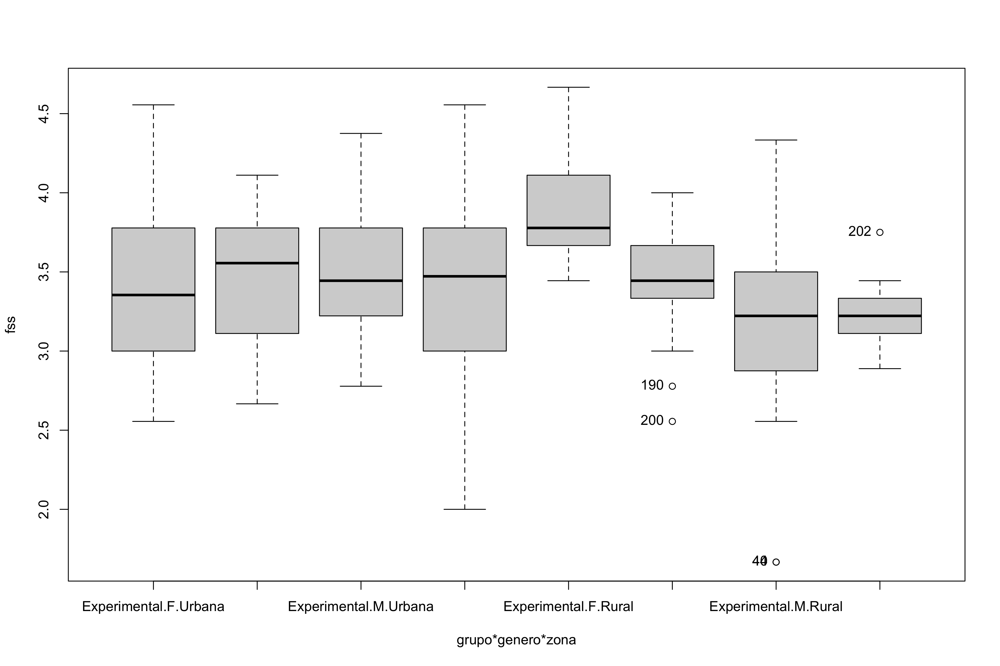<!-- -->

    ## [1] "190" "200" "40"  "44"  "202"

## Checking of Assumptions

### Assumption: Symmetry and treatment of outliers

| grupo        | variable |   n |  mean | median |   min |   max |    sd |    se |    ci |   iqr | symmetry | skewness | kurtosis |
|:-------------|:---------|----:|------:|-------:|------:|------:|------:|------:|------:|------:|:---------|---------:|---------:|
| Experimental | fss      | 132 | 3.472 |  3.444 | 1.667 | 4.778 | 0.560 | 0.049 | 0.096 | 0.667 | YES      |   -0.309 |    0.595 |
| Controle     | fss      | 137 | 3.434 |  3.444 | 2.000 | 4.556 | 0.492 | 0.042 | 0.083 | 0.667 | YES      |   -0.292 |    0.005 |
| NA           | fss      | 269 | 3.453 |  3.444 | 1.667 | 4.778 | 0.526 | 0.032 | 0.063 | 0.667 | YES      |   -0.291 |    0.440 |

| genero | variable |   n |  mean | median |   min |   max |    sd |    se |    ci |   iqr | symmetry | skewness | kurtosis |
|:-------|:---------|----:|------:|-------:|------:|------:|------:|------:|------:|------:|:---------|---------:|---------:|
| F      | fss      | 123 | 3.579 |  3.667 | 2.556 | 4.778 | 0.475 | 0.043 | 0.085 | 0.556 | YES      |   -0.092 |   -0.354 |
| M      | fss      | 146 | 3.347 |  3.333 | 1.667 | 4.556 | 0.544 | 0.045 | 0.089 | 0.667 | YES      |   -0.297 |    0.610 |
| NA     | fss      | 269 | 3.453 |  3.444 | 1.667 | 4.778 | 0.526 | 0.032 | 0.063 | 0.667 | YES      |   -0.291 |    0.440 |

| zona   | variable |   n |  mean | median |   min |   max |    sd |    se |    ci |   iqr | symmetry | skewness | kurtosis |
|:-------|:---------|----:|------:|-------:|------:|------:|------:|------:|------:|------:|:---------|---------:|---------:|
| Urbana | fss      | 107 | 3.434 |  3.444 | 2.000 | 4.556 | 0.509 | 0.049 | 0.098 | 0.667 | YES      |   -0.262 |    0.196 |
| Rural  | fss      |  58 | 3.400 |  3.444 | 1.667 | 4.667 | 0.548 | 0.072 | 0.144 | 0.660 | NO       |   -0.768 |    1.837 |
| NA     | fss      | 165 | 3.422 |  3.444 | 1.667 | 4.667 | 0.522 | 0.041 | 0.080 | 0.667 | YES      |   -0.477 |    0.997 |

*Note*: There is not necessary to apply any transformation for skewness
because all data satisfy symmetry. Althoug there is not symetry for the
factor of zona=“Rural”, in the cumulative data there is symmetry

### Identify and dealing with outliers (performing treatment of outliers)

| grupo        | genero | zona  | id_estudante |      fss |      dfs | is.outlier | is.extreme |
|:-------------|:-------|:------|:-------------|---------:|---------:|:-----------|:-----------|
| Experimental | M      | Rural | E48          | 1.666667 | 2.625000 | TRUE       | FALSE      |
| Experimental | M      | Rural | E53          | 1.666667 | 3.444444 | TRUE       | FALSE      |
| Experimental | M      | NA    | E119         | 4.555556 | 4.888889 | TRUE       | FALSE      |
| Controle     | F      | Rural | E227         | 2.777778 | 3.285714 | TRUE       | FALSE      |
| Controle     | F      | Rural | E239         | 2.555556 | 4.000000 | TRUE       | FALSE      |
| Controle     | F      | NA    | E296         | 2.555556 | 2.777778 | TRUE       | FALSE      |
| Controle     | F      | NA    | E314         | 2.666667 | 3.777778 | TRUE       | FALSE      |
| Controle     | M      | Rural | E241         | 3.750000 | 3.555556 | TRUE       | FALSE      |
| Controle     | M      | NA    | E208         | 4.375000 | 4.111111 | TRUE       | FALSE      |
| Controle     | M      | NA    | E284         | 4.333333 | 4.111111 | TRUE       | FALSE      |
| Controle     | M      | NA    | E300         | 4.222222 | 3.666667 | TRUE       | FALSE      |

*Note*: No one outlier is extreme, they are possible outliers then we
removed them only if normality is unsatisfied

### Assumption: Normality distribution of data

| var |   n | skewness | kurtosis | symmetry | statistic | method     |     p | p.signif | normality |
|:----|----:|---------:|---------:|:---------|----------:|:-----------|------:|:---------|:----------|
| fss | 165 |   -0.244 |    0.383 | YES      |     3.329 | D’Agostino | 0.189 | ns       | QQ        |

| grupo        | genero | zona   | variable |   n |  mean | median |   min |   max |    sd |    se |    ci |   iqr | normality | method       | statistic |     p | p.signif |
|:-------------|:-------|:-------|:---------|----:|------:|-------:|------:|------:|------:|------:|------:|------:|:----------|:-------------|----------:|------:|:---------|
| Experimental | F      | Urbana | fss      |  22 | 3.411 |  3.354 | 2.556 | 4.556 | 0.554 | 0.118 | 0.246 | 0.750 | YES       | Shapiro-Wilk |     0.954 | 0.377 | ns       |
| Experimental | F      | Rural  | fss      |  13 | 3.880 |  3.778 | 3.444 | 4.667 | 0.367 | 0.102 | 0.222 | 0.444 | YES       | Shapiro-Wilk |     0.905 | 0.157 | ns       |
| Experimental | F      | NA     | fss      |  24 | 3.708 |  3.722 | 2.778 | 4.778 | 0.509 | 0.104 | 0.215 | 0.583 | YES       | Shapiro-Wilk |     0.982 | 0.936 | ns       |
| Experimental | M      | Urbana | fss      |  26 | 3.491 |  3.444 | 2.778 | 4.375 | 0.388 | 0.076 | 0.157 | 0.528 | YES       | Shapiro-Wilk |     0.969 | 0.606 | ns       |
| Experimental | M      | Rural  | fss      |  19 | 3.123 |  3.222 | 1.667 | 4.333 | 0.664 | 0.152 | 0.320 | 0.625 | YES       | Shapiro-Wilk |     0.924 | 0.134 | ns       |
| Experimental | M      | NA     | fss      |  28 | 3.349 |  3.333 | 2.222 | 4.556 | 0.578 | 0.109 | 0.224 | 0.583 | YES       | Shapiro-Wilk |     0.977 | 0.775 | ns       |
| Controle     | F      | Urbana | fss      |  23 | 3.466 |  3.556 | 2.667 | 4.111 | 0.393 | 0.082 | 0.170 | 0.667 | YES       | Shapiro-Wilk |     0.958 | 0.428 | ns       |
| Controle     | F      | Rural  | fss      |  17 | 3.425 |  3.444 | 2.556 | 4.000 | 0.385 | 0.093 | 0.198 | 0.333 | YES       | Shapiro-Wilk |     0.935 | 0.267 | ns       |
| Controle     | F      | NA     | fss      |  24 | 3.656 |  3.778 | 2.556 | 4.222 | 0.454 | 0.093 | 0.192 | 0.500 | NO        | Shapiro-Wilk |     0.901 | 0.023 | \*       |
| Controle     | M      | Urbana | fss      |  36 | 3.387 |  3.472 | 2.000 | 4.556 | 0.624 | 0.104 | 0.211 | 0.778 | YES       | Shapiro-Wilk |     0.963 | 0.273 | ns       |
| Controle     | M      | Rural  | fss      |   9 | 3.245 |  3.222 | 2.889 | 3.750 | 0.257 | 0.086 | 0.198 | 0.222 | YES       | Shapiro-Wilk |     0.964 | 0.840 | ns       |
| Controle     | M      | NA     | fss      |  28 | 3.342 |  3.236 | 2.750 | 4.375 | 0.487 | 0.092 | 0.189 | 0.472 | NO        | Shapiro-Wilk |     0.903 | 0.013 | \*       |

*Note*: Normality test fails in groups where zona=“<NA>” (not specified)
but as these group are not applied in the analysis, we don’t need to
remove one data.

### Assumption: Linearity of dependent variables and covariate variable

``` r
ggscatter(dat, x="dfs", y="fss", facet.by=c("grupo","genero"), short.panel.labs = F) + stat_smooth(method = "lm", span = 0.9)
```

    ## `geom_smooth()` using formula = 'y ~ x'

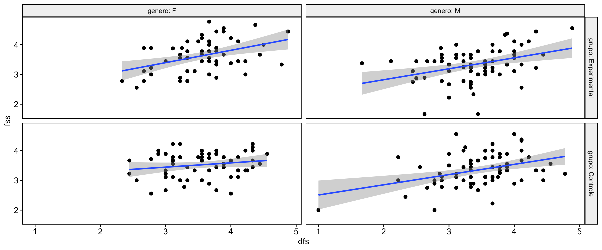<!-- -->

``` r
ggscatter(dat, x="dfs", y="fss", facet.by=c("grupo","zona"), short.panel.labs = F) + stat_smooth(method = "lm", span = 0.9)
```

    ## `geom_smooth()` using formula = 'y ~ x'

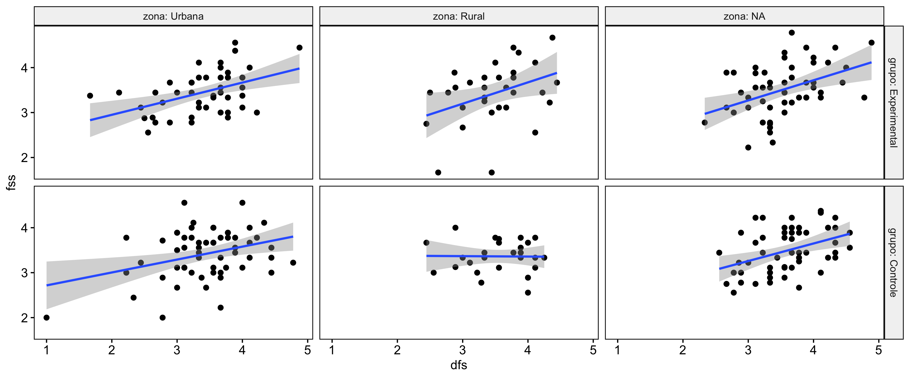<!-- -->

### Assumption: Homogeneity of data distribution

| var | method         | formula                        |   n | DFn.df1 | DFd.df2 | statistic |     p | p.signif |
|:----|:---------------|:-------------------------------|----:|--------:|--------:|----------:|------:|:---------|
| fss | Levene’s test  | `.res`~`grupo`*`genero`*`zona` | 165 |       7 |     157 |     2.413 | 0.023 | ns       |
| fss | Anova’s slopes | `.res`~`grupo`*`genero`*`zona` | 165 |       7 |     149 |     0.753 | 0.627 | ns       |

| var | method         | formula                  |   n | DFn.df1 | DFd.df2 | statistic |     p | p.signif |
|:----|:---------------|:-------------------------|----:|--------:|--------:|----------:|------:|:---------|
| fss | Levene’s test  | `.res`~`grupo`\*`genero` | 269 |       3 |     265 |     0.428 | 0.733 | ns       |
| fss | Anova’s slopes | `.res`~`grupo`\*`genero` | 269 |       3 |     261 |     1.097 | 0.351 | ns       |

## Computation of ANCOVA test and Pairwise Comparison

### ANCOVA test

| Effect       | DFn | DFd |   SSn |    SSd |      F | p       |   ges | p\<.05 |
|:-------------|----:|----:|------:|-------:|-------:|:--------|------:|:-------|
| dfs          |   1 | 264 | 8.884 | 61.241 | 38.299 | \<0.001 | 0.127 | \*     |
| grupo        |   1 | 264 | 0.189 | 61.241 |  0.813 | 0.368   | 0.003 |        |
| genero       |   1 | 264 | 2.313 | 61.241 |  9.971 | 0.002   | 0.036 | \*     |
| grupo:genero |   1 | 264 | 0.180 | 61.241 |  0.774 | 0.38    | 0.003 |        |

*Note*: There are significant differences on the factors: “grupo”, and
“genero”

| Effect            | DFn | DFd |   SSn |    SSd |      F | p       |   ges | p\<.05 |
|:------------------|----:|----:|------:|-------:|-------:|:--------|------:|:-------|
| dfs               |   1 | 156 | 3.536 | 36.154 | 15.259 | \<0.001 | 0.089 | \*     |
| grupo             |   1 | 156 | 0.342 | 36.154 |  1.475 | 0.226   | 0.009 |        |
| genero            |   1 | 156 | 0.531 | 36.154 |  2.291 | 0.132   | 0.014 |        |
| zona              |   1 | 156 | 0.187 | 36.154 |  0.807 | 0.37    | 0.005 |        |
| grupo:genero      |   1 | 156 | 0.006 | 36.154 |  0.026 | 0.871   | 0.000 |        |
| grupo:zona        |   1 | 156 | 0.153 | 36.154 |  0.660 | 0.418   | 0.004 |        |
| genero:zona       |   1 | 156 | 1.592 | 36.154 |  6.868 | 0.01    | 0.042 | \*     |
| grupo:genero:zona |   1 | 156 | 0.879 | 36.154 |  3.794 | 0.053   | 0.024 |        |

*Note*: There are significant differences on the factors: “genero”, and
“genero:zona”

- For the analysis using “genero”, we recommend to use all the gathered
  dataset (variable: dat)
- For the analysis using “genero:zona”, we recommend to use the dataset
  without NA in “zona” (variable: sdat)

### Pairwise comparison using factor: **grupo**

| var | grupo | group1       | group2   | estimate | conf.low | conf.high |   se | statistic |     p | p.adj | p.adj.signif |
|:----|:------|:-------------|:---------|---------:|---------:|----------:|-----:|----------:|------:|------:|:-------------|
| fss | NA    | Experimental | Controle |     0.05 |   -0.068 |     0.167 | 0.06 |     0.835 | 0.404 | 0.404 | ns           |

``` r
oneWayAncovaPlots(dat, "fss", "grupo", aov1, pwc.grupo$fss, addParam = c("jitter"), font.label.size=14, step.increase=0.25, p.label="p.adj", subtitle = 2)$grupo + ggplot2::scale_color_manual(values=c("#00AA00","#FFBA00"))
```

    ## Scale for colour is already present.
    ## Adding another scale for colour, which will replace the existing scale.

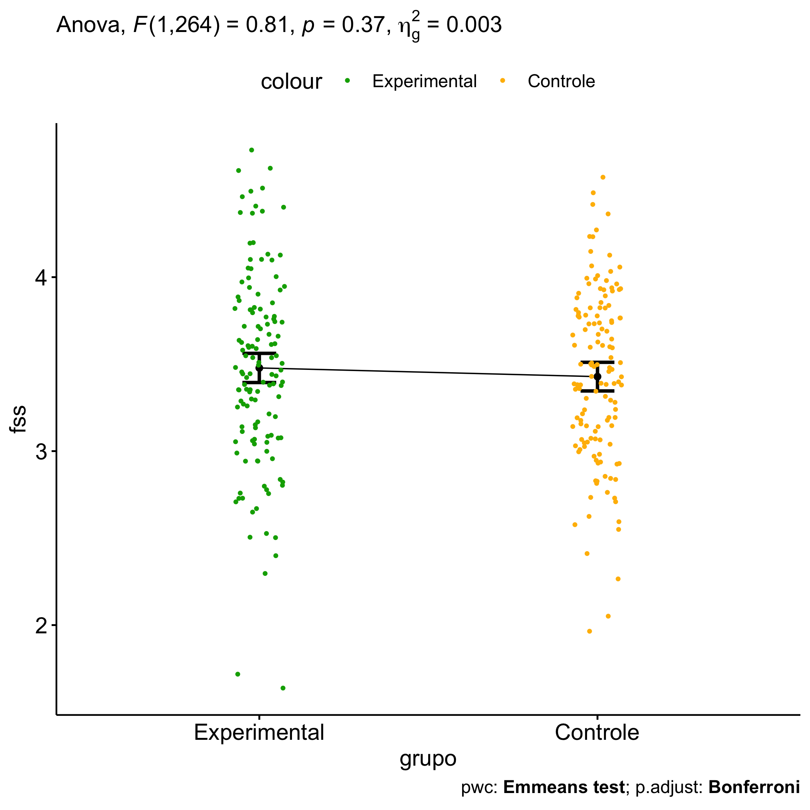<!-- -->

### Pairwise comparison using factor: **genero**

| var | genero | group1 | group2 | estimate | conf.low | conf.high |    se | statistic |     p | p.adj | p.adj.signif |
|:----|:-------|:-------|:-------|---------:|---------:|----------:|------:|----------:|------:|------:|:-------------|
| fss | NA     | F      | M      |    0.187 |     0.07 |     0.304 | 0.059 |     3.145 | 0.002 | 0.002 | \*\*         |

``` r
oneWayAncovaPlots(dat, "fss", "genero", aov1, pwc.genero$fss, addParam = c("jitter"), font.label.size=14, step.increase=0.25, p.label="p.adj", subtitle = 3)$genero + ggplot2::scale_color_manual(labels=c("female","male"), values=c("#FF007F","#4D4DFF")) + scale_x_discrete("gender")
```

    ## Scale for colour is already present.
    ## Adding another scale for colour, which will replace the existing scale.

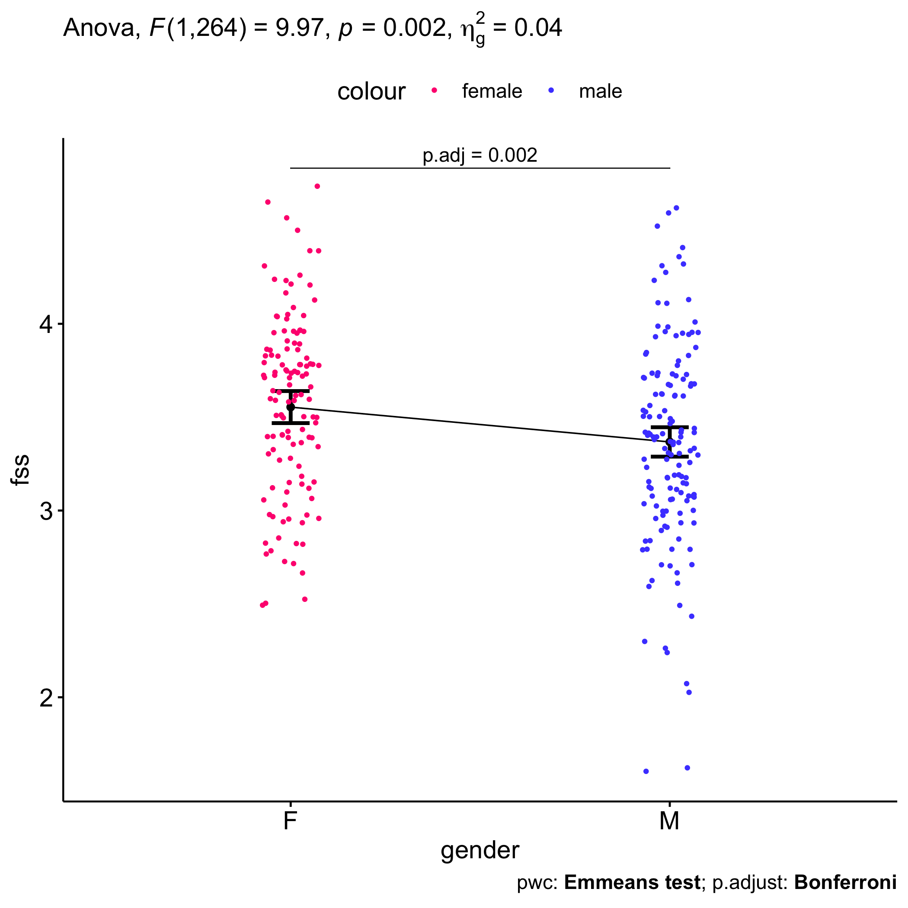<!-- -->

### Pairwise comparison using factor: **zona**

| var | zona | group1 | group2 | estimate | conf.low | conf.high |    se | statistic |     p | p.adj | p.adj.signif |
|:----|:-----|:-------|:-------|---------:|---------:|----------:|------:|----------:|------:|------:|:-------------|
| fss | NA   | Urbana | Rural  |    0.062 |   -0.098 |     0.221 | 0.081 |     0.764 | 0.446 | 0.446 | ns           |

``` r
oneWayAncovaPlots(sdat, "fss", "zona", aov2, pwc.zona$fss, addParam = c("jitter"), font.label.size=14, step.increase=0.25, p.label="p.adj", subtitle = 4)$zona +  ggplot2::scale_color_manual(values=c("#AA00FF","#00CCCC"))
```

    ## Scale for colour is already present.
    ## Adding another scale for colour, which will replace the existing scale.

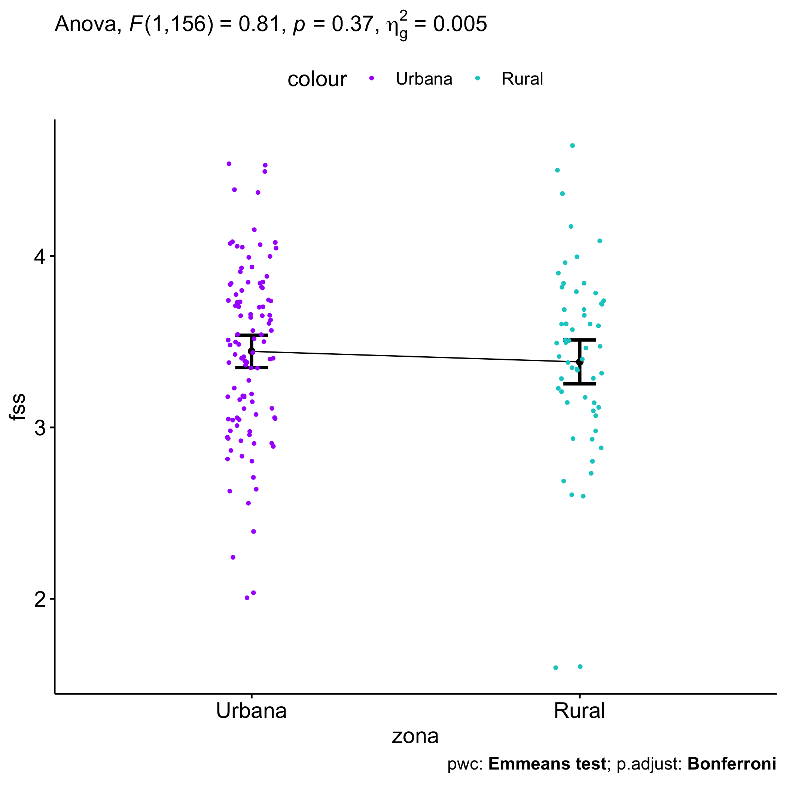<!-- -->

### Pairwise comparison using factor: **grupo:genero**

| var | grupo        | genero | group1       | group2   | estimate | conf.low | conf.high |    se | statistic |     p | p.adj | p.adj.signif |
|:----|:-------------|:-------|:-------------|:---------|---------:|---------:|----------:|------:|----------:|------:|------:|:-------------|
| fss | NA           | F      | Experimental | Controle |    0.109 |   -0.062 |     0.281 | 0.087 |     1.258 | 0.210 | 0.210 | ns           |
| fss | NA           | M      | Experimental | Controle |    0.006 |   -0.152 |     0.163 | 0.080 |     0.070 | 0.945 | 0.945 | ns           |
| fss | Experimental | NA     | F            | M        |    0.241 |    0.074 |     0.408 | 0.085 |     2.841 | 0.005 | 0.005 | \*\*         |
| fss | Controle     | NA     | F            | M        |    0.137 |   -0.026 |     0.300 | 0.083 |     1.657 | 0.099 | 0.099 | ns           |

``` r
plots <- twoWayAncovaPlots(dat, "fss", c("grupo","genero"), aov1, pwc.grupo_genero$fss, addParam = c("jitter"), font.label.size=14, step.increase=0.25, p.label="p.adj", subtitle = 4)
```

``` r
plots$grupo + ggplot2::scale_color_manual(labels=c("female","male"), values=c("#FF007F","#4D4DFF")) + scale_x_discrete("gender")
```

    ## Scale for colour is already present.
    ## Adding another scale for colour, which will replace the existing scale.

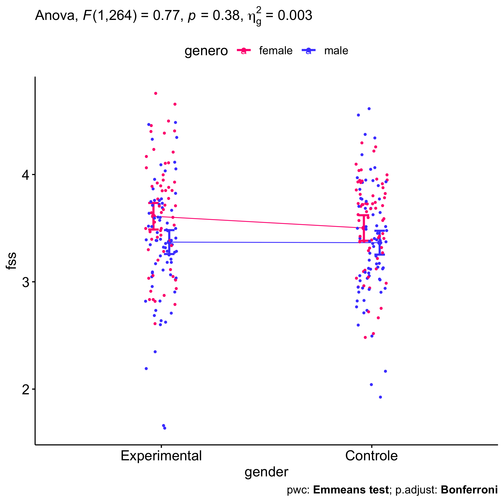<!-- -->

``` r
plots$genero + ggplot2::scale_color_manual(values=c("#00AA00","#FFBA00"))
```

    ## Scale for colour is already present.
    ## Adding another scale for colour, which will replace the existing scale.

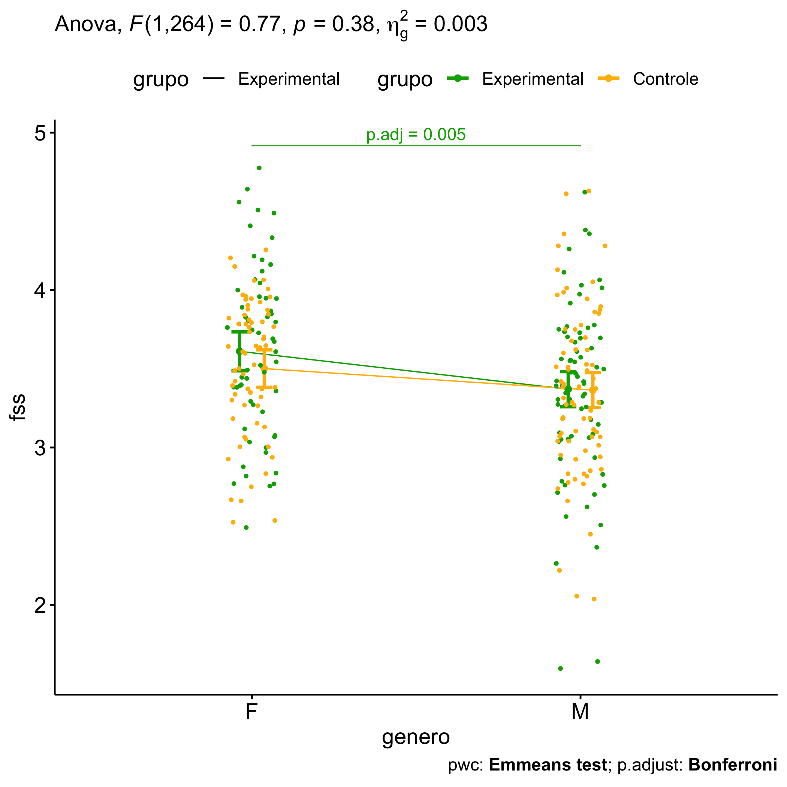<!-- -->

### Pairwise comparison using factor: **grupo:zona**

| var | grupo        | zona   | group1       | group2   | estimate | conf.low | conf.high |    se | statistic |     p | p.adj | p.adj.signif |
|:----|:-------------|:-------|:-------------|:---------|---------:|---------:|----------:|------:|----------:|------:|------:|:-------------|
| fss | NA           | Urbana | Experimental | Controle |    0.046 |   -0.144 |     0.236 | 0.096 |     0.483 | 0.630 | 0.630 | ns           |
| fss | NA           | Rural  | Experimental | Controle |    0.084 |   -0.174 |     0.342 | 0.131 |     0.642 | 0.522 | 0.522 | ns           |
| fss | Experimental | NA     | Urbana       | Rural    |    0.050 |   -0.174 |     0.273 | 0.113 |     0.440 | 0.661 | 0.661 | ns           |
| fss | Controle     | NA     | Urbana       | Rural    |    0.087 |   -0.143 |     0.318 | 0.117 |     0.747 | 0.456 | 0.456 | ns           |

``` r
plots <- twoWayAncovaPlots(sdat, "fss", c("grupo","zona"), aov2, pwc.grupo_zona$fss, addParam = c("jitter"), font.label.size=14, step.increase=0.25, p.label="p.adj", subtitle = 6)
```

``` r
plots$grupo + ggplot2::scale_color_manual(values=c("#AA00FF","#00CCCC"))
```

    ## Scale for colour is already present.
    ## Adding another scale for colour, which will replace the existing scale.

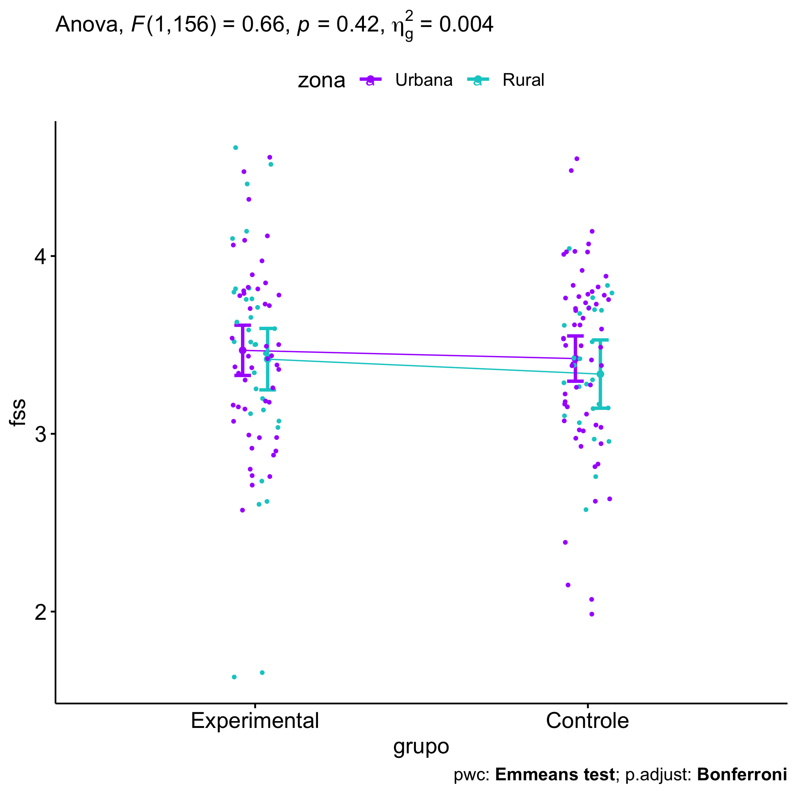<!-- -->

``` r
plots$zona + ggplot2::scale_color_manual(values=c("#00AA00","#FFBA00"))
```

    ## Scale for colour is already present.
    ## Adding another scale for colour, which will replace the existing scale.

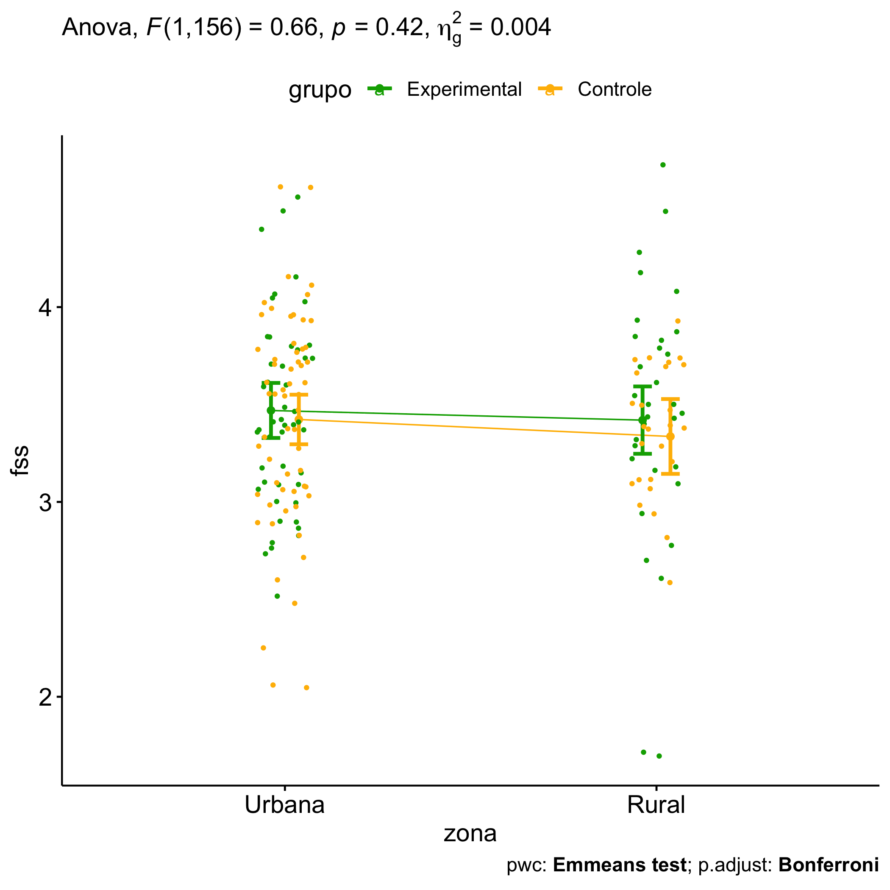<!-- -->

### Pairwise comparison using factor: **genero:zona**

| var | genero | zona   | group1 | group2 | estimate | conf.low | conf.high |    se | statistic |     p | p.adj | p.adj.signif |
|:----|:-------|:-------|:-------|:-------|---------:|---------:|----------:|------:|----------:|------:|------:|:-------------|
| fss | NA     | Urbana | F      | M      |   -0.023 |   -0.211 |     0.165 | 0.095 |    -0.239 | 0.811 | 0.811 | ns           |
| fss | NA     | Rural  | F      | M      |    0.358 |    0.102 |     0.614 | 0.130 |     2.762 | 0.006 | 0.006 | \*\*         |
| fss | F      | NA     | Urbana | Rural  |   -0.128 |   -0.355 |     0.100 | 0.115 |    -1.109 | 0.269 | 0.269 | ns           |
| fss | M      | NA     | Urbana | Rural  |    0.253 |    0.035 |     0.471 | 0.110 |     2.296 | 0.023 | 0.023 | \*           |

``` r
plots <- twoWayAncovaPlots(sdat, "fss", c("genero","zona"), aov2, pwc.genero_zona$fss, addParam = c("jitter"), font.label.size=14, step.increase=0.25, p.label="p.adj", subtitle = 7)
```

``` r
plots$genero + ggplot2::scale_color_manual(values=c("#AA00FF","#00CCCC"))
```

    ## Scale for colour is already present.
    ## Adding another scale for colour, which will replace the existing scale.

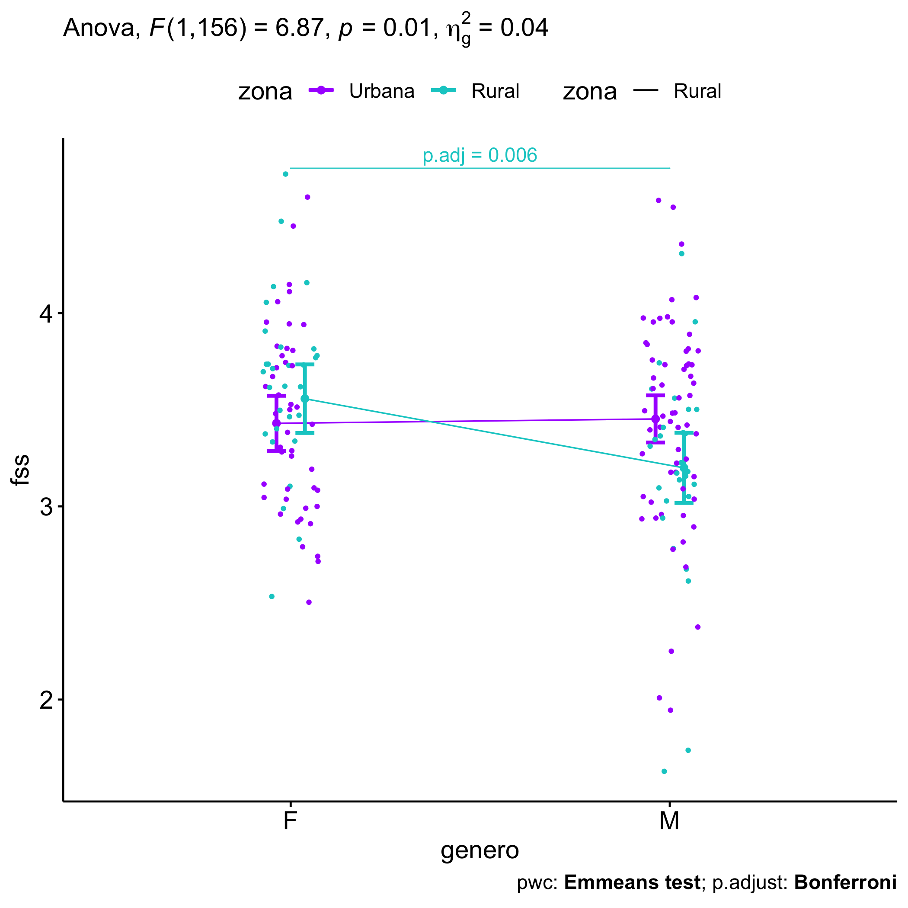<!-- -->

``` r
plots$zona + ggplot2::scale_color_manual(labels=c("female","male"), values=c("#FF007F","#4D4DFF")) + scale_x_discrete("gender")
```

    ## Scale for colour is already present.
    ## Adding another scale for colour, which will replace the existing scale.

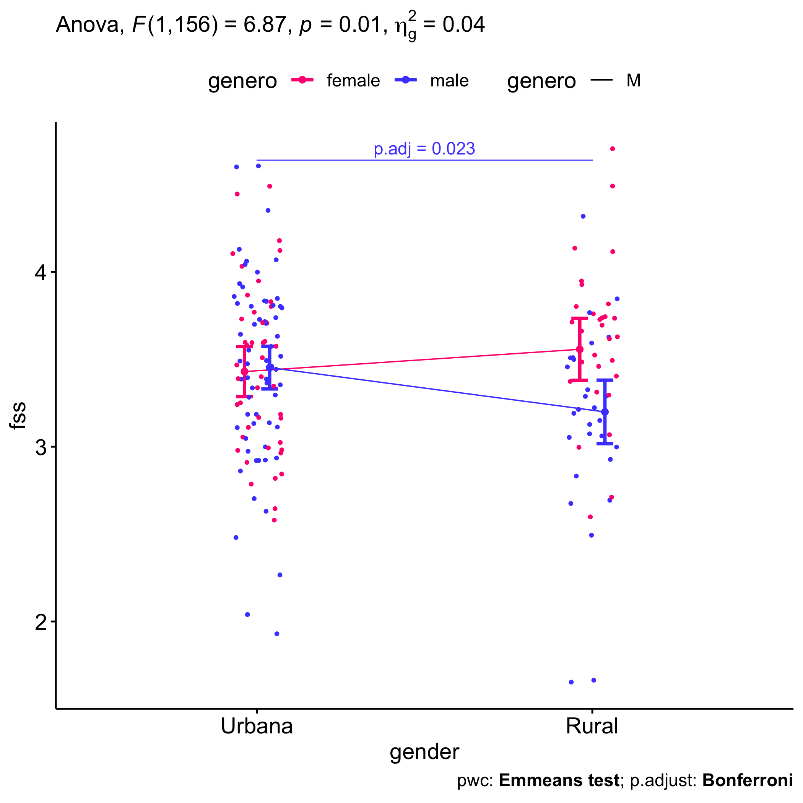<!-- -->

## Descriptive statistics and estimated marginal means to be reported by grupo and genero

| var | grupo        |   n | M (pre) | SE (pre) | M (unadj) | SE (unadj) | M (adj) | SE (adj) |
|:----|:-------------|----:|--------:|---------:|----------:|-----------:|--------:|---------:|
| fss | Controle     | 137 |   3.515 |    0.049 |     3.434 |      0.042 |   3.428 |    0.042 |
| fss | Experimental | 132 |   3.482 |    0.049 |     3.472 |      0.049 |   3.478 |    0.043 |

| var | genero |   n | M (pre) | SE (pre) | M (unadj) | SE (unadj) | M (adj) | SE (adj) |
|:----|:-------|----:|--------:|---------:|----------:|-----------:|--------:|---------:|
| fss | F      | 123 |   3.574 |    0.048 |     3.579 |      0.043 |   3.554 |    0.044 |
| fss | M      | 146 |   3.435 |    0.049 |     3.347 |      0.045 |   3.367 |    0.040 |

| var | grupo        | genero |   n | M (pre) | SE (pre) | M (unadj) | SE (unadj) | M (adj) | SE (adj) |
|:----|:-------------|:-------|----:|--------:|---------:|----------:|-----------:|--------:|---------:|
| fss | Controle     | F      |  64 |   3.575 |    0.066 |     3.526 |      0.053 |   3.502 |    0.060 |
| fss | Controle     | M      |  73 |   3.461 |    0.071 |     3.353 |      0.063 |   3.365 |    0.056 |
| fss | Experimental | F      |  59 |   3.573 |    0.069 |     3.635 |      0.068 |   3.611 |    0.063 |
| fss | Experimental | M      |  73 |   3.408 |    0.068 |     3.341 |      0.065 |   3.370 |    0.057 |

## Descriptive statistics and estimated marginal means to be reported with zona

| var | zona   |   n | M (pre) | SE (pre) | M (unadj) | SE (unadj) | M (adj) | SE (adj) |
|:----|:-------|----:|--------:|---------:|----------:|-----------:|--------:|---------:|
| fss | Rural  |  58 |   3.515 |    0.069 |     3.400 |      0.072 |   3.382 |    0.065 |
| fss | Urbana | 107 |   3.425 |    0.060 |     3.434 |      0.049 |   3.444 |    0.048 |

| var | grupo        | zona   |   n | M (pre) | SE (pre) | M (unadj) | SE (unadj) | M (adj) | SE (adj) |
|:----|:-------------|:-------|----:|--------:|---------:|----------:|-----------:|--------:|---------:|
| fss | Controle     | Rural  |  26 |   3.544 |    0.099 |     3.363 |      0.069 |   3.336 |    0.097 |
| fss | Controle     | Urbana |  59 |   3.440 |    0.084 |     3.418 |      0.071 |   3.423 |    0.064 |
| fss | Experimental | Rural  |  32 |   3.492 |    0.096 |     3.431 |      0.119 |   3.420 |    0.088 |
| fss | Experimental | Urbana |  48 |   3.407 |    0.087 |     3.455 |      0.068 |   3.470 |    0.072 |

| var | genero | zona   |   n | M (pre) | SE (pre) | M (unadj) | SE (unadj) | M (adj) | SE (adj) |
|:----|:-------|:-------|----:|--------:|---------:|----------:|-----------:|--------:|---------:|
| fss | F      | Rural  |  30 |   3.697 |    0.091 |     3.622 |      0.080 |   3.557 |    0.090 |
| fss | F      | Urbana |  45 |   3.491 |    0.076 |     3.439 |      0.071 |   3.430 |    0.072 |
| fss | M      | Rural  |  28 |   3.320 |    0.092 |     3.162 |      0.106 |   3.199 |    0.092 |
| fss | M      | Urbana |  62 |   3.377 |    0.088 |     3.431 |      0.068 |   3.453 |    0.062 |

## Tips and References

- Use the site <https://www.tablesgenerator.com> to convert the HTML
  tables into Latex format

- \[2\]: Miot, H. A. (2017). Assessing normality of data in clinical and
  experimental trials. J Vasc Bras, 16(2), 88-91.

- \[3\]: Bárány, Imre; Vu, Van (2007). “Central limit theorems for
  Gaussian polytopes”. Annals of Probability. Institute of Mathematical
  Statistics. 35 (4): 1593–1621.
