ANCOVA test for `media_fss`~`media_dfs`+`grupo`*`genero`*`zona`
================
Geiser C. Challco <geiser@alumni.usp.br>

- [Initial Variables and Descriptive Statistics of initial
  data](#initial-variables-and-descriptive-statistics-of-initial-data)
- [Checking of Assumptions](#checking-of-assumptions)
  - [Assumption: Symmetry and treatment of
    outliers](#assumption-symmetry-and-treatment-of-outliers)
  - [Identify and dealing with outliers (performing treatment of
    outliers)](#identify-and-dealing-with-outliers-performing-treatment-of-outliers)
  - [Assumption: Normality distribution of
    data](#assumption-normality-distribution-of-data)
  - [Assumption: Linearity of dependent variables and covariate
    variable](#assumption-linearity-of-dependent-variables-and-covariate-variable)
  - [Assumption: Homogeneity of data
    distribution](#assumption-homogeneity-of-data-distribution)
- [Computation of ANCOVA test and Pairwise
  Comparison](#computation-of-ancova-test-and-pairwise-comparison)
  - [ANCOVA test](#ancova-test)
  - [Pairwise comparison using factor:
    **grupo**](#pairwise-comparison-using-factor-grupo)
  - [Pairwise comparison using factor:
    **genero**](#pairwise-comparison-using-factor-genero)
  - [Pairwise comparison using factor:
    **zona**](#pairwise-comparison-using-factor-zona)
  - [Pairwise comparison using factor:
    **grupo:genero**](#pairwise-comparison-using-factor-grupogenero)
  - [Pairwise comparison using factor:
    **grupo:zona**](#pairwise-comparison-using-factor-grupozona)
  - [Pairwise comparison using factor:
    **genero:zona**](#pairwise-comparison-using-factor-generozona)
- [Descriptive statistics and estimated marginal means to be reported by
  grupo and
  genero](#descriptive-statistics-and-estimated-marginal-means-to-be-reported-by-grupo-and-genero)
- [Descriptive statistics and estimated marginal means to be reported
  with
  zona](#descriptive-statistics-and-estimated-marginal-means-to-be-reported-with-zona)
- [Tips and References](#tips-and-references)

## Initial Variables and Descriptive Statistics of initial data

- R-script file: [../code/ancova.R](../code/ancova.R)
- Initial table file:
  [../data/initial-table.csv](../data/initial-table.csv)
- Data for media_fss
  [../data/table-for-media_fss.csv](../data/table-for-media_fss.csv)
- Table without outliers and normal distribution of data:
  [../data/table-with-normal-distribution.csv](../data/table-with-normal-distribution.csv)
- Other data files: [../data/](../data/)
- Files related to the presented results: [../results/](../results/)

| grupo        | genero | zona   | variable |   n |  mean | median |   min |   max |    sd |    se |    ci |   iqr |
|:-------------|:-------|:-------|:---------|----:|------:|-------:|------:|------:|------:|------:|------:|------:|
| Experimental | F      | Urbana | fss      |  22 | 3.209 |  3.222 | 2.444 | 4.222 | 0.485 | 0.103 | 0.215 | 0.538 |
| Experimental | F      | Rural  | fss      |  13 | 3.706 |  3.750 | 3.000 | 4.222 | 0.366 | 0.102 | 0.221 | 0.556 |
| Experimental | F      | NA     | fss      |  24 | 3.620 |  3.833 | 2.444 | 4.444 | 0.567 | 0.116 | 0.240 | 0.861 |
| Experimental | M      | Urbana | fss      |  25 | 3.520 |  3.556 | 1.889 | 4.714 | 0.624 | 0.125 | 0.258 | 0.667 |
| Experimental | M      | Rural  | fss      |  19 | 3.405 |  3.444 | 2.556 | 4.111 | 0.502 | 0.115 | 0.242 | 0.722 |
| Experimental | M      | NA     | fss      |  28 | 3.373 |  3.333 | 1.778 | 4.667 | 0.630 | 0.119 | 0.244 | 0.694 |
| Controle     | F      | Urbana | fss      |  23 | 3.367 |  3.333 | 2.444 | 4.333 | 0.558 | 0.116 | 0.241 | 0.722 |
| Controle     | F      | Rural  | fss      |  17 | 3.166 |  3.222 | 2.000 | 4.000 | 0.520 | 0.126 | 0.267 | 0.556 |
| Controle     | F      | NA     | fss      |  24 | 3.556 |  3.722 | 2.444 | 4.222 | 0.490 | 0.100 | 0.207 | 0.528 |
| Controle     | M      | Urbana | fss      |  36 | 3.380 |  3.444 | 2.000 | 4.444 | 0.562 | 0.094 | 0.190 | 0.667 |
| Controle     | M      | Rural  | fss      |   9 | 3.185 |  3.222 | 2.778 | 3.444 | 0.184 | 0.061 | 0.142 | 0.111 |
| Controle     | M      | NA     | fss      |  28 | 3.287 |  3.167 | 2.667 | 4.556 | 0.543 | 0.103 | 0.211 | 0.858 |

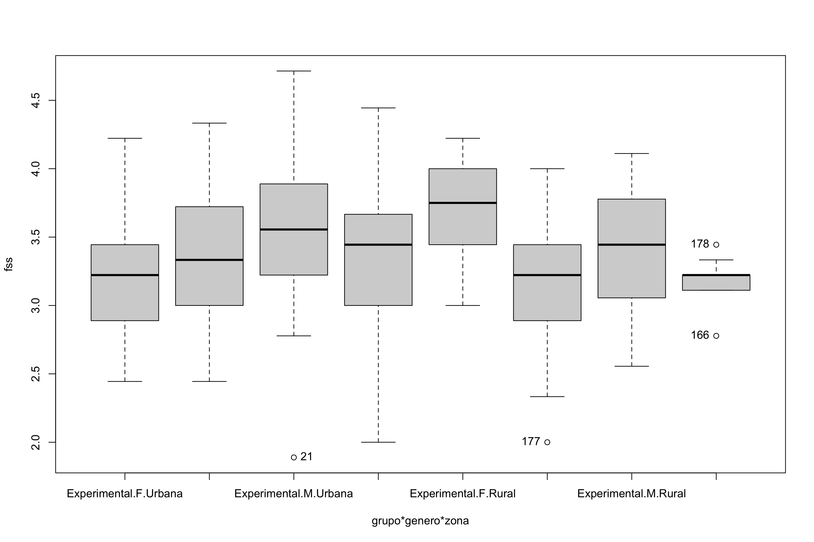<!-- -->

    ## [1] "21"  "177" "166" "178"

## Checking of Assumptions

### Assumption: Symmetry and treatment of outliers

| grupo        | variable |   n |  mean | median |   min |   max |    sd |    se |    ci |   iqr | symmetry | skewness | kurtosis |
|:-------------|:---------|----:|------:|-------:|------:|------:|------:|------:|------:|------:|:---------|---------:|---------:|
| Experimental | fss      | 131 | 3.457 |  3.444 | 1.778 | 4.714 | 0.566 | 0.049 | 0.098 | 0.889 | YES      |   -0.339 |    0.030 |
| Controle     | fss      | 137 | 3.350 |  3.333 | 2.000 | 4.556 | 0.529 | 0.045 | 0.089 | 0.667 | YES      |    0.072 |   -0.350 |
| NA           | fss      | 268 | 3.402 |  3.354 | 1.778 | 4.714 | 0.549 | 0.034 | 0.066 | 0.778 | YES      |   -0.129 |   -0.186 |

| genero | variable |   n |  mean | median |   min |   max |    sd |    se |    ci |   iqr | symmetry | skewness | kurtosis |
|:-------|:---------|----:|------:|-------:|------:|------:|------:|------:|------:|------:|:---------|---------:|---------:|
| F      | fss      | 123 | 3.433 |  3.444 | 2.000 | 4.444 | 0.538 | 0.048 | 0.096 | 0.889 | YES      |   -0.203 |   -0.780 |
| M      | fss      | 145 | 3.376 |  3.333 | 1.778 | 4.714 | 0.559 | 0.046 | 0.092 | 0.667 | YES      |   -0.063 |    0.223 |
| NA     | fss      | 268 | 3.402 |  3.354 | 1.778 | 4.714 | 0.549 | 0.034 | 0.066 | 0.778 | YES      |   -0.129 |   -0.186 |

| zona   | variable |   n |  mean | median |   min |   max |    sd |    se |    ci |   iqr | symmetry | skewness | kurtosis |
|:-------|:---------|----:|------:|-------:|------:|------:|------:|------:|------:|------:|:---------|---------:|---------:|
| Urbana | fss      | 106 | 3.375 |  3.333 | 1.889 | 4.714 | 0.564 | 0.055 | 0.109 | 0.667 | YES      |    0.042 |   -0.294 |
| Rural  | fss      |  58 | 3.368 |  3.333 | 2.000 | 4.222 | 0.482 | 0.063 | 0.127 | 0.660 | YES      |   -0.358 |   -0.198 |
| NA     | fss      | 164 | 3.372 |  3.333 | 1.889 | 4.714 | 0.535 | 0.042 | 0.082 | 0.688 | YES      |   -0.058 |   -0.183 |

### Identify and dealing with outliers (performing treatment of outliers)

| grupo        | genero | zona   | id_estudante |      fss |      dfs | is.outlier | is.extreme |
|:-------------|:-------|:-------|:-------------|---------:|---------:|:-----------|:-----------|
| Experimental | M      | Urbana | E25          | 1.888889 | 2.555556 | TRUE       | FALSE      |
| Experimental | M      | NA     | E126         | 1.888889 | 3.444444 | TRUE       | FALSE      |
| Experimental | M      | NA     | E133         | 1.777778 | 2.777778 | TRUE       | FALSE      |
| Controle     | F      | Rural  | E215         | 2.000000 | 3.333333 | TRUE       | FALSE      |
| Controle     | F      | NA     | E314         | 2.444444 | 3.777778 | TRUE       | FALSE      |
| Controle     | M      | Rural  | E201         | 2.777778 | 3.555556 | TRUE       | FALSE      |
| Controle     | M      | Rural  | E216         | 3.444444 | 3.444444 | TRUE       | FALSE      |

*Note*: No one outlier is extreme, they are possible outliers then we
removed them only if normality is unsatisfied

### Assumption: Normality distribution of data

| var |   n | skewness | kurtosis | symmetry | statistic | method     |     p | p.signif | normality |
|:----|----:|---------:|---------:|:---------|----------:|:-----------|------:|:---------|:----------|
| fss | 164 |    0.172 |    0.293 | YES      |     2.022 | D’Agostino | 0.364 | ns       | QQ        |

| grupo        | genero | zona   | variable |   n |  mean | median |   min |   max |    sd |    se |    ci |   iqr | normality | method       | statistic |     p | p.signif |
|:-------------|:-------|:-------|:---------|----:|------:|-------:|------:|------:|------:|------:|------:|------:|:----------|:-------------|----------:|------:|:---------|
| Experimental | F      | Urbana | fss      |  22 | 3.209 |  3.222 | 2.444 | 4.222 | 0.485 | 0.103 | 0.215 | 0.538 | YES       | Shapiro-Wilk |     0.951 | 0.336 | ns       |
| Experimental | F      | Rural  | fss      |  13 | 3.706 |  3.750 | 3.000 | 4.222 | 0.366 | 0.102 | 0.221 | 0.556 | YES       | Shapiro-Wilk |     0.958 | 0.717 | ns       |
| Experimental | F      | NA     | fss      |  24 | 3.620 |  3.833 | 2.444 | 4.444 | 0.567 | 0.116 | 0.240 | 0.861 | YES       | Shapiro-Wilk |     0.932 | 0.111 | ns       |
| Experimental | M      | Urbana | fss      |  25 | 3.520 |  3.556 | 1.889 | 4.714 | 0.624 | 0.125 | 0.258 | 0.667 | YES       | Shapiro-Wilk |     0.970 | 0.651 | ns       |
| Experimental | M      | Rural  | fss      |  19 | 3.405 |  3.444 | 2.556 | 4.111 | 0.502 | 0.115 | 0.242 | 0.722 | YES       | Shapiro-Wilk |     0.946 | 0.339 | ns       |
| Experimental | M      | NA     | fss      |  28 | 3.373 |  3.333 | 1.778 | 4.667 | 0.630 | 0.119 | 0.244 | 0.694 | YES       | Shapiro-Wilk |     0.945 | 0.150 | ns       |
| Controle     | F      | Urbana | fss      |  23 | 3.367 |  3.333 | 2.444 | 4.333 | 0.558 | 0.116 | 0.241 | 0.722 | YES       | Shapiro-Wilk |     0.926 | 0.088 | ns       |
| Controle     | F      | Rural  | fss      |  17 | 3.166 |  3.222 | 2.000 | 4.000 | 0.520 | 0.126 | 0.267 | 0.556 | YES       | Shapiro-Wilk |     0.968 | 0.790 | ns       |
| Controle     | F      | NA     | fss      |  24 | 3.556 |  3.722 | 2.444 | 4.222 | 0.490 | 0.100 | 0.207 | 0.528 | YES       | Shapiro-Wilk |     0.918 | 0.053 | ns       |
| Controle     | M      | Urbana | fss      |  36 | 3.380 |  3.444 | 2.000 | 4.444 | 0.562 | 0.094 | 0.190 | 0.667 | YES       | Shapiro-Wilk |     0.976 | 0.595 | ns       |
| Controle     | M      | Rural  | fss      |   9 | 3.185 |  3.222 | 2.778 | 3.444 | 0.184 | 0.061 | 0.142 | 0.111 | YES       | Shapiro-Wilk |     0.872 | 0.128 | ns       |
| Controle     | M      | NA     | fss      |  28 | 3.287 |  3.167 | 2.667 | 4.556 | 0.543 | 0.103 | 0.211 | 0.858 | NO        | Shapiro-Wilk |     0.905 | 0.015 | \*       |

*Note*: Normality test fails in groups where zona=“<NA>” (not specified)
but as these group are not applied in the analysis, we don’t need to
remove one data.

### Assumption: Linearity of dependent variables and covariate variable

``` r
ggscatter(dat, x="dfs", y="fss", facet.by=c("grupo","genero"), short.panel.labs = F) + stat_smooth(method = "lm", span = 0.9)
```

    ## `geom_smooth()` using formula = 'y ~ x'

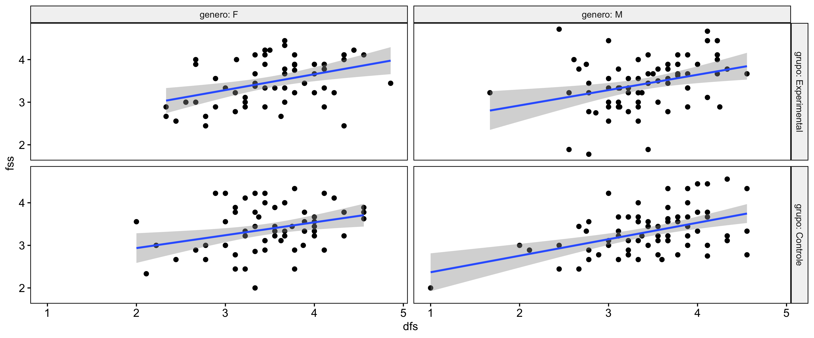<!-- -->

``` r
ggscatter(dat, x="dfs", y="fss", facet.by=c("grupo","zona"), short.panel.labs = F) + stat_smooth(method = "lm", span = 0.9)
```

    ## `geom_smooth()` using formula = 'y ~ x'

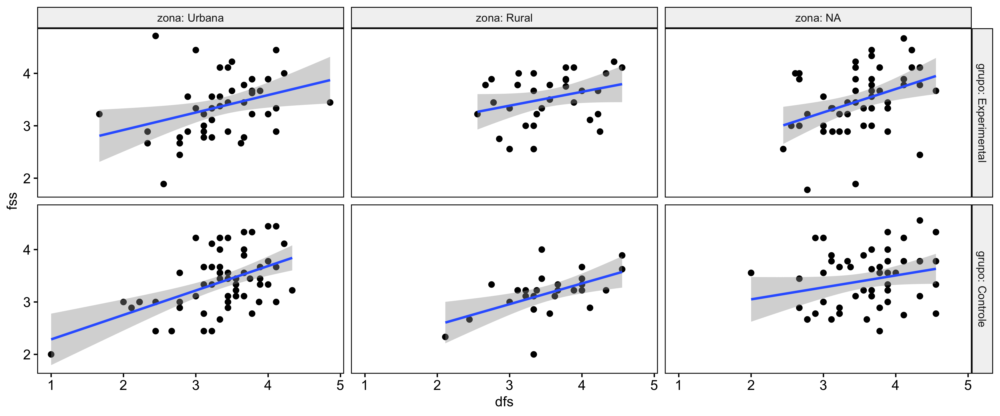<!-- -->

### Assumption: Homogeneity of data distribution

| var | method         | formula                        |   n | DFn.df1 | DFd.df2 | statistic |     p | p.signif |
|:----|:---------------|:-------------------------------|----:|--------:|--------:|----------:|------:|:---------|
| fss | Levene’s test  | `.res`~`grupo`*`genero`*`zona` | 164 |       7 |     156 |     1.102 | 0.365 | ns       |
| fss | Anova’s slopes | `.res`~`grupo`*`genero`*`zona` | 164 |       7 |     148 |     0.700 | 0.672 | ns       |

| var | method         | formula                  |   n | DFn.df1 | DFd.df2 | statistic |     p | p.signif |
|:----|:---------------|:-------------------------|----:|--------:|--------:|----------:|------:|:---------|
| fss | Levene’s test  | `.res`~`grupo`\*`genero` | 268 |       3 |     264 |     0.130 | 0.942 | ns       |
| fss | Anova’s slopes | `.res`~`grupo`\*`genero` | 268 |       3 |     260 |     0.122 | 0.947 | ns       |

## Computation of ANCOVA test and Pairwise Comparison

### ANCOVA test

| Effect       | DFn | DFd |    SSn |    SSd |      F | p       |   ges | p\<.05 |
|:-------------|----:|----:|-------:|-------:|-------:|:--------|------:|:-------|
| dfs          |   1 | 263 | 11.556 | 67.922 | 44.748 | \<0.001 | 0.145 | \*     |
| grupo        |   1 | 263 |  0.756 | 67.922 |  2.926 | 0.088   | 0.011 |        |
| genero       |   1 | 263 |  0.065 | 67.922 |  0.251 | 0.617   | 0.001 |        |
| grupo:genero |   1 | 263 |  0.037 | 67.922 |  0.143 | 0.706   | 0.001 |        |

*Note*: There are significant differences on the factors: “grupo”, and
“genero”

| Effect            | DFn | DFd |   SSn |    SSd |      F | p       |   ges | p\<.05 |
|:------------------|----:|----:|------:|-------:|-------:|:--------|------:|:-------|
| dfs               |   1 | 155 | 7.824 | 35.135 | 34.518 | \<0.001 | 0.182 | \*     |
| grupo             |   1 | 155 | 0.606 | 35.135 |  2.673 | 0.104   | 0.017 |        |
| genero            |   1 | 155 | 0.438 | 35.135 |  1.934 | 0.166   | 0.012 |        |
| zona              |   1 | 155 | 0.275 | 35.135 |  1.211 | 0.273   | 0.008 |        |
| grupo:genero      |   1 | 155 | 0.111 | 35.135 |  0.491 | 0.485   | 0.003 |        |
| grupo:zona        |   1 | 155 | 1.218 | 35.135 |  5.375 | 0.022   | 0.034 | \*     |
| genero:zona       |   1 | 155 | 0.405 | 35.135 |  1.788 | 0.183   | 0.011 |        |
| grupo:genero:zona |   1 | 155 | 0.434 | 35.135 |  1.917 | 0.168   | 0.012 |        |

*Note*: There are significant differences on the factors: “grupo:zona”

- For the analysis using “grupo:zona”, we recommend to use the dataset
  without NA in “zona” (variable: sdat)

### Pairwise comparison using factor: **grupo**

| var | grupo | group1       | group2   | estimate | conf.low | conf.high |    se | statistic |     p | p.adj | p.adj.signif |
|:----|:------|:-------------|:---------|---------:|---------:|----------:|------:|----------:|------:|------:|:-------------|
| fss | NA    | Experimental | Controle |    0.106 |   -0.016 |     0.228 | 0.062 |     1.708 | 0.089 | 0.089 | ns           |

``` r
oneWayAncovaPlots(dat, "fss", "grupo", aov1, pwc.grupo$fss, addParam = c("jitter"), font.label.size=14, step.increase=0.25, p.label="p.adj", subtitle = 2)$grupo + ggplot2::scale_color_manual(values=c("#00AA00","#FFBA00"))
```

    ## Scale for colour is already present.
    ## Adding another scale for colour, which will replace the existing scale.

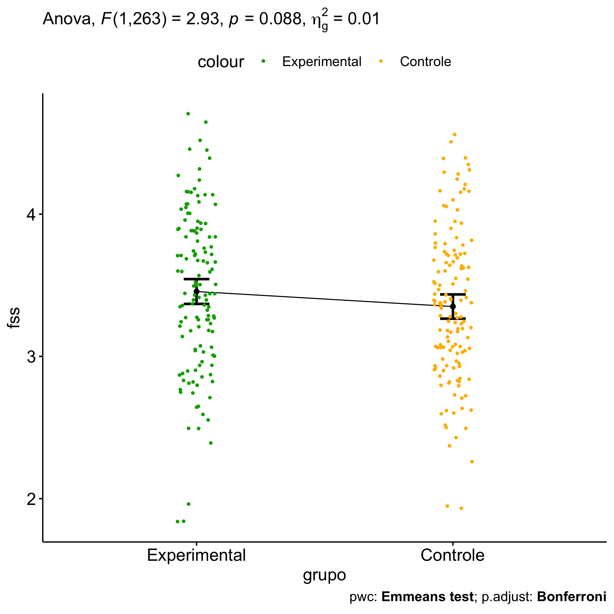<!-- -->

### Pairwise comparison using factor: **genero**

| var | genero | group1 | group2 | estimate | conf.low | conf.high |    se | statistic |     p | p.adj | p.adj.signif |
|:----|:-------|:-------|:-------|---------:|---------:|----------:|------:|----------:|------:|------:|:-------------|
| fss | NA     | F      | M      |    0.029 |   -0.094 |     0.153 | 0.063 |     0.471 | 0.638 | 0.638 | ns           |

``` r
oneWayAncovaPlots(dat, "fss", "genero", aov1, pwc.genero$fss, addParam = c("jitter"), font.label.size=14, step.increase=0.25, p.label="p.adj", subtitle = 3)$genero + ggplot2::scale_color_manual(labels=c("female","male"), values=c("#FF007F","#4D4DFF")) + scale_x_discrete("gender")
```

    ## Scale for colour is already present.
    ## Adding another scale for colour, which will replace the existing scale.

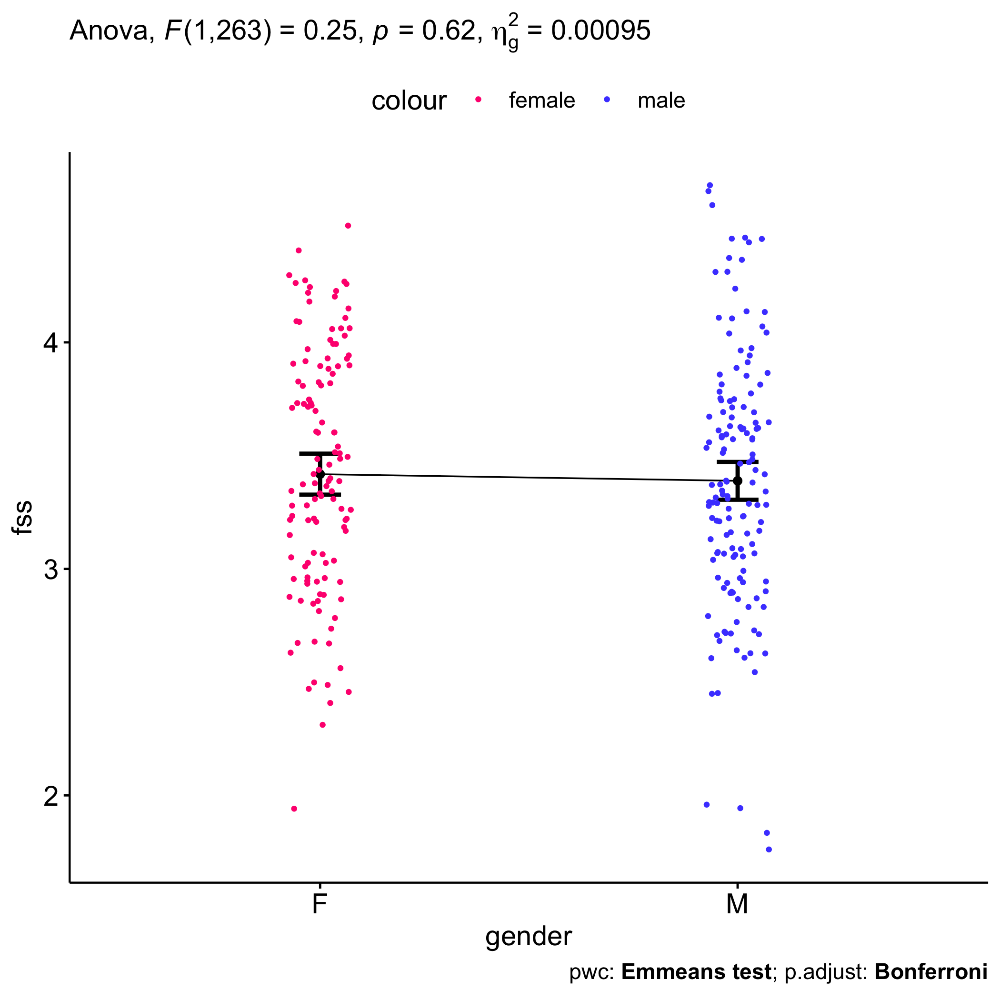<!-- -->

### Pairwise comparison using factor: **zona**

| var | zona | group1 | group2 | estimate | conf.low | conf.high |    se | statistic |     p | p.adj | p.adj.signif |
|:----|:-----|:-------|:-------|---------:|---------:|----------:|------:|----------:|------:|------:|:-------------|
| fss | NA   | Urbana | Rural  |    0.081 |   -0.078 |     0.241 | 0.081 |     1.007 | 0.315 | 0.315 | ns           |

``` r
oneWayAncovaPlots(sdat, "fss", "zona", aov2, pwc.zona$fss, addParam = c("jitter"), font.label.size=14, step.increase=0.25, p.label="p.adj", subtitle = 4)$zona +  ggplot2::scale_color_manual(values=c("#AA00FF","#00CCCC"))
```

    ## Scale for colour is already present.
    ## Adding another scale for colour, which will replace the existing scale.

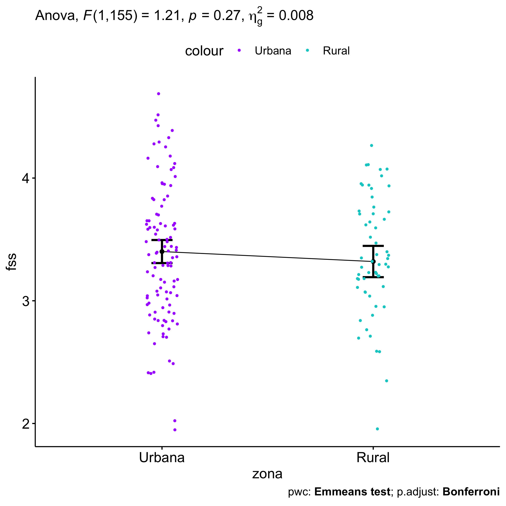<!-- -->

### Pairwise comparison using factor: **grupo:genero**

| var | grupo        | genero | group1       | group2   | estimate | conf.low | conf.high |    se | statistic |     p | p.adj | p.adj.signif |
|:----|:-------------|:-------|:-------------|:---------|---------:|---------:|----------:|------:|----------:|------:|------:|:-------------|
| fss | NA           | F      | Experimental | Controle |    0.081 |   -0.100 |     0.261 | 0.092 |     0.880 | 0.380 | 0.380 | ns           |
| fss | NA           | M      | Experimental | Controle |    0.128 |   -0.038 |     0.294 | 0.084 |     1.514 | 0.131 | 0.131 | ns           |
| fss | Experimental | NA     | F            | M        |    0.007 |   -0.169 |     0.183 | 0.090 |     0.079 | 0.937 | 0.937 | ns           |
| fss | Controle     | NA     | F            | M        |    0.054 |   -0.117 |     0.226 | 0.087 |     0.623 | 0.534 | 0.534 | ns           |

``` r
plots <- twoWayAncovaPlots(dat, "fss", c("grupo","genero"), aov1, pwc.grupo_genero$fss, addParam = c("jitter"), font.label.size=14, step.increase=0.25, p.label="p.adj", subtitle = 4)
```

``` r
plots$grupo + ggplot2::scale_color_manual(labels=c("female","male"), values=c("#FF007F","#4D4DFF")) + scale_x_discrete("gender")
```

    ## Scale for colour is already present.
    ## Adding another scale for colour, which will replace the existing scale.

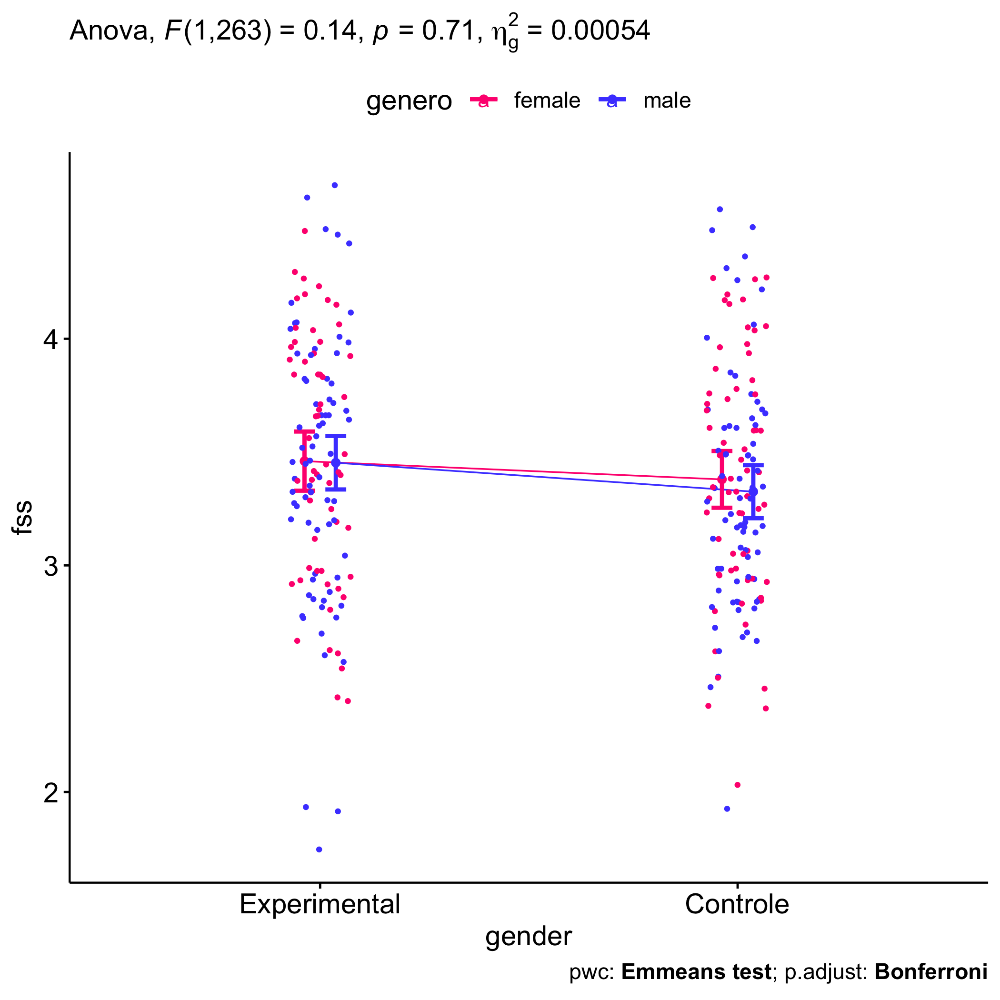<!-- -->

``` r
plots$genero + ggplot2::scale_color_manual(values=c("#00AA00","#FFBA00"))
```

    ## Scale for colour is already present.
    ## Adding another scale for colour, which will replace the existing scale.

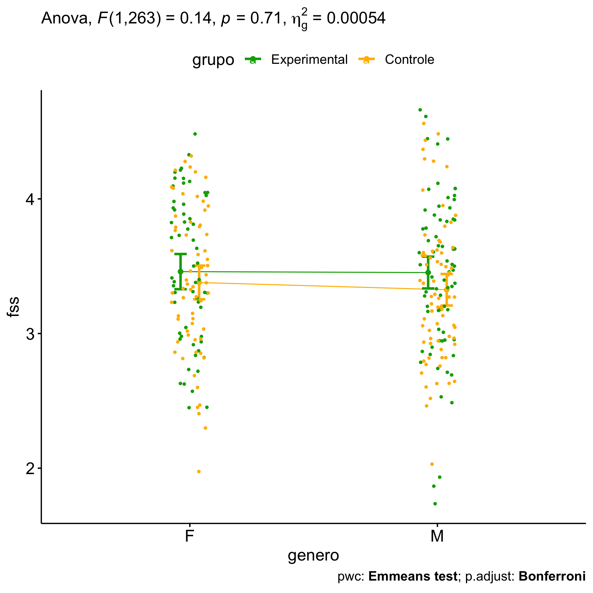<!-- -->

### Pairwise comparison using factor: **grupo:zona**

| var | grupo        | zona   | group1       | group2   | estimate | conf.low | conf.high |    se | statistic |     p | p.adj | p.adj.signif |
|:----|:-------------|:-------|:-------------|:---------|---------:|---------:|----------:|------:|----------:|------:|------:|:-------------|
| fss | NA           | Urbana | Experimental | Controle |   -0.013 |   -0.198 |     0.172 | 0.094 |    -0.134 | 0.893 | 0.893 | ns           |
| fss | NA           | Rural  | Experimental | Controle |    0.355 |    0.105 |     0.604 | 0.126 |     2.804 | 0.006 | 0.006 | \*\*         |
| fss | Experimental | NA     | Urbana       | Rural    |   -0.085 |   -0.303 |     0.133 | 0.110 |    -0.768 | 0.444 | 0.444 | ns           |
| fss | Controle     | NA     | Urbana       | Rural    |    0.283 |    0.058 |     0.507 | 0.114 |     2.488 | 0.014 | 0.014 | \*           |

``` r
plots <- twoWayAncovaPlots(sdat, "fss", c("grupo","zona"), aov2, pwc.grupo_zona$fss, addParam = c("jitter"), font.label.size=14, step.increase=0.25, p.label="p.adj", subtitle = 6)
```

``` r
plots$grupo + ggplot2::scale_color_manual(values=c("#AA00FF","#00CCCC"))
```

    ## Scale for colour is already present.
    ## Adding another scale for colour, which will replace the existing scale.

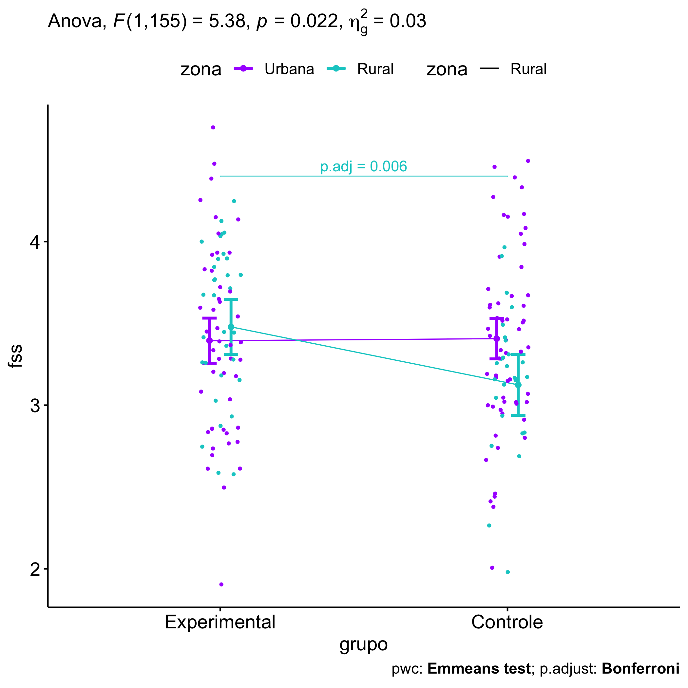<!-- -->

``` r
plots$zona + ggplot2::scale_color_manual(values=c("#00AA00","#FFBA00"))
```

    ## Scale for colour is already present.
    ## Adding another scale for colour, which will replace the existing scale.

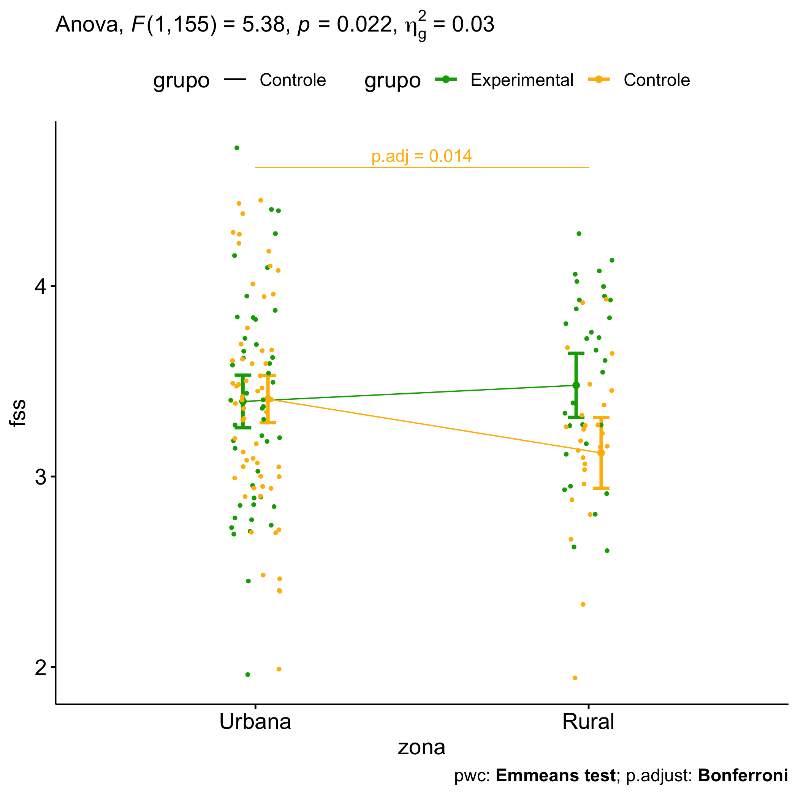<!-- -->

### Pairwise comparison using factor: **genero:zona**

| var | genero | zona   | group1 | group2 | estimate | conf.low | conf.high |    se | statistic |     p | p.adj | p.adj.signif |
|:----|:-------|:-------|:-------|:-------|---------:|---------:|----------:|------:|----------:|------:|------:|:-------------|
| fss | NA     | Urbana | F      | M      |   -0.176 |   -0.365 |     0.012 | 0.095 |    -1.845 | 0.067 | 0.067 | ns           |
| fss | NA     | Rural  | F      | M      |   -0.063 |   -0.318 |     0.193 | 0.129 |    -0.485 | 0.628 | 0.628 | ns           |
| fss | F      | NA     | Urbana | Rural  |    0.012 |   -0.217 |     0.242 | 0.116 |     0.106 | 0.916 | 0.916 | ns           |
| fss | M      | NA     | Urbana | Rural  |    0.126 |   -0.093 |     0.345 | 0.111 |     1.135 | 0.258 | 0.258 | ns           |

``` r
plots <- twoWayAncovaPlots(sdat, "fss", c("genero","zona"), aov2, pwc.genero_zona$fss, addParam = c("jitter"), font.label.size=14, step.increase=0.25, p.label="p.adj", subtitle = 7)
```

``` r
plots$genero + ggplot2::scale_color_manual(values=c("#AA00FF","#00CCCC"))
```

    ## Scale for colour is already present.
    ## Adding another scale for colour, which will replace the existing scale.

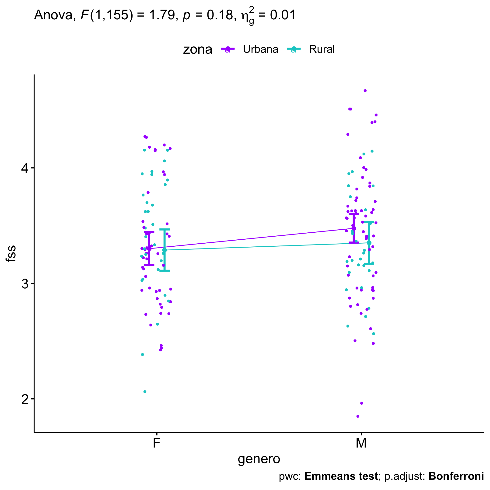<!-- -->

``` r
plots$zona + ggplot2::scale_color_manual(labels=c("female","male"), values=c("#FF007F","#4D4DFF")) + scale_x_discrete("gender")
```

    ## Scale for colour is already present.
    ## Adding another scale for colour, which will replace the existing scale.

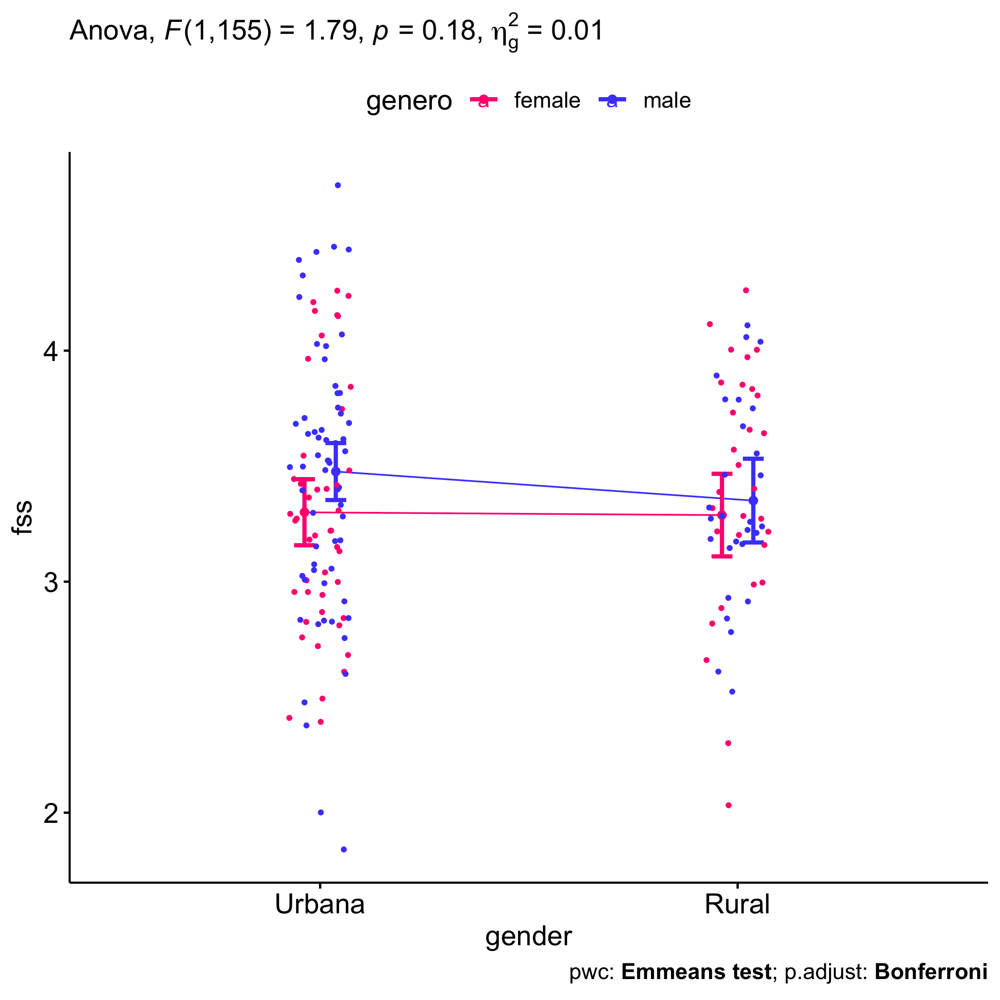<!-- -->

## Descriptive statistics and estimated marginal means to be reported by grupo and genero

| var | grupo        |   n | M (pre) | SE (pre) | M (unadj) | SE (unadj) | M (adj) | SE (adj) |
|:----|:-------------|----:|--------:|---------:|----------:|-----------:|--------:|---------:|
| fss | Controle     | 137 |   3.467 |    0.052 |     3.350 |      0.045 |   3.350 |    0.043 |
| fss | Experimental | 131 |   3.469 |    0.049 |     3.457 |      0.049 |   3.456 |    0.044 |

| var | genero |   n | M (pre) | SE (pre) | M (unadj) | SE (unadj) | M (adj) | SE (adj) |
|:----|:-------|----:|--------:|---------:|----------:|-----------:|--------:|---------:|
| fss | F      | 123 |   3.510 |    0.053 |     3.433 |      0.048 |   3.418 |    0.046 |
| fss | M      | 145 |   3.433 |    0.048 |     3.376 |      0.046 |   3.389 |    0.042 |

| var | grupo        | genero |   n | M (pre) | SE (pre) | M (unadj) | SE (unadj) | M (adj) | SE (adj) |
|:----|:-------------|:-------|----:|--------:|---------:|----------:|-----------:|--------:|---------:|
| fss | Controle     | F      |  64 |   3.482 |    0.074 |     3.384 |      0.067 |   3.379 |    0.064 |
| fss | Controle     | M      |  73 |   3.454 |    0.073 |     3.320 |      0.061 |   3.325 |    0.059 |
| fss | Experimental | F      |  59 |   3.540 |    0.077 |     3.486 |      0.070 |   3.460 |    0.066 |
| fss | Experimental | M      |  72 |   3.411 |    0.063 |     3.433 |      0.070 |   3.453 |    0.060 |

## Descriptive statistics and estimated marginal means to be reported with zona

| var | zona   |   n | M (pre) | SE (pre) | M (unadj) | SE (unadj) | M (adj) | SE (adj) |
|:----|:-------|----:|--------:|---------:|----------:|-----------:|--------:|---------:|
| fss | Rural  |  58 |   3.542 |    0.074 |     3.368 |      0.063 |   3.320 |    0.065 |
| fss | Urbana | 106 |   3.347 |    0.059 |     3.375 |      0.055 |   3.401 |    0.048 |

| var | grupo        | zona   |   n | M (pre) | SE (pre) | M (unadj) | SE (unadj) | M (adj) | SE (adj) |
|:----|:-------------|:-------|----:|--------:|---------:|----------:|-----------:|--------:|---------:|
| fss | Controle     | Rural  |  26 |   3.542 |    0.116 |     3.172 |      0.084 |   3.124 |    0.094 |
| fss | Controle     | Urbana |  59 |   3.333 |    0.081 |     3.375 |      0.072 |   3.407 |    0.063 |
| fss | Experimental | Rural  |  32 |   3.542 |    0.098 |     3.527 |      0.083 |   3.479 |    0.085 |
| fss | Experimental | Urbana |  47 |   3.365 |    0.086 |     3.375 |      0.084 |   3.394 |    0.070 |

| var | genero | zona   |   n | M (pre) | SE (pre) | M (unadj) | SE (unadj) | M (adj) | SE (adj) |
|:----|:-------|:-------|----:|--------:|---------:|----------:|-----------:|--------:|---------:|
| fss | F      | Rural  |  30 |   3.699 |    0.107 |     3.400 |      0.096 |   3.288 |    0.091 |
| fss | F      | Urbana |  45 |   3.389 |    0.084 |     3.290 |      0.078 |   3.301 |    0.072 |
| fss | M      | Rural  |  28 |   3.374 |    0.095 |     3.334 |      0.082 |   3.351 |    0.092 |
| fss | M      | Urbana |  61 |   3.316 |    0.081 |     3.437 |      0.075 |   3.477 |    0.062 |

## Tips and References

- Use the site <https://www.tablesgenerator.com> to convert the HTML
  tables into Latex format

- \[2\]: Miot, H. A. (2017). Assessing normality of data in clinical and
  experimental trials. J Vasc Bras, 16(2), 88-91.

- \[3\]: Bárány, Imre; Vu, Van (2007). “Central limit theorems for
  Gaussian polytopes”. Annals of Probability. Institute of Mathematical
  Statistics. 35 (4): 1593–1621.
