ANCOVA test for `pos.score`~`pre.score`+`grupo`*`genero`*`zona`
================
Geiser C. Challco <geiser@alumni.usp.br>

- [Initial Variables and Descriptive Statistics of initial
  data](#initial-variables-and-descriptive-statistics-of-initial-data)
- [Checking of Assumptions](#checking-of-assumptions)
  - [Assumption: Symmetry and treatment of
    outliers](#assumption-symmetry-and-treatment-of-outliers)
  - [Identify and dealing with outliers (performing treatment of
    outliers)](#identify-and-dealing-with-outliers-performing-treatment-of-outliers)
  - [Assumption: Normality distribution of
    data](#assumption-normality-distribution-of-data)
  - [Assumption: Linearity of dependent variables and covariate
    variable](#assumption-linearity-of-dependent-variables-and-covariate-variable)
  - [Assumption: Homogeneity of data
    distribution](#assumption-homogeneity-of-data-distribution)
- [Computation of T-test (Pre VS
  Pos-teste)](#computation-of-t-test-pre-vs-pos-teste)
  - [T-test from all responses](#t-test-from-all-responses)
  - [T-test from control group](#t-test-from-control-group)
  - [T-test from intervention group](#t-test-from-intervention-group)
- [Computation of ANCOVA test and Pairwise Comparison (Control VS
  Intervention)](#computation-of-ancova-test-and-pairwise-comparison-control-vs-intervention)
  - [ANCOVA test](#ancova-test)
  - [Pairwise comparison using factor:
    **grupo**](#pairwise-comparison-using-factor-grupo)
  - [Pairwise comparison using factor:
    **genero**](#pairwise-comparison-using-factor-genero)
  - [Pairwise comparison using factor:
    **zona**](#pairwise-comparison-using-factor-zona)
  - [Pairwise comparison using factor:
    **grupo:genero**](#pairwise-comparison-using-factor-grupogenero)
  - [Pairwise comparison using factor:
    **grupo:zona**](#pairwise-comparison-using-factor-grupozona)
  - [Pairwise comparison using factor:
    **genero:zona**](#pairwise-comparison-using-factor-generozona)
- [Descriptive statistics and estimated marginal means to be reported by
  grupo and
  genero](#descriptive-statistics-and-estimated-marginal-means-to-be-reported-by-grupo-and-genero)
- [Descriptive statistics and estimated marginal means to be reported
  with
  zona](#descriptive-statistics-and-estimated-marginal-means-to-be-reported-with-zona)
- [Tips and References](#tips-and-references)

## Initial Variables and Descriptive Statistics of initial data

| grupo        | genero | zona   | variable  |   n |   mean | median | min | max |    sd |    se |    ci |   iqr |
|:-------------|:-------|:-------|:----------|----:|-------:|-------:|----:|----:|------:|------:|------:|------:|
| Experimental | F      | Urbana | pos.score |  22 | 24.318 |   27.5 |   8 |  37 | 9.398 | 2.004 | 4.167 | 17.25 |
| Experimental | F      | Rural  | pos.score |  17 | 27.176 |   29.0 |  15 |  41 | 9.057 | 2.197 | 4.657 | 15.00 |
| Experimental | F      | NA     | pos.score |  14 | 21.786 |   20.0 |  12 |  37 | 7.668 | 2.049 | 4.427 |  8.00 |
| Experimental | M      | Urbana | pos.score |  25 | 21.520 |   22.0 |  10 |  41 | 7.752 | 1.550 | 3.200 |  9.00 |
| Experimental | M      | Rural  | pos.score |  34 | 21.118 |   22.0 |   7 |  33 | 7.666 | 1.315 | 2.675 | 12.50 |
| Experimental | M      | NA     | pos.score |  14 | 19.500 |   14.5 |   9 |  37 | 9.975 | 2.666 | 5.759 | 16.25 |
| Controle     | F      | Urbana | pos.score |  18 | 25.889 |   26.0 |  11 |  42 | 8.007 | 1.887 | 3.982 |  9.50 |
| Controle     | F      | Rural  | pos.score |  29 | 23.931 |   24.0 |  12 |  38 | 7.348 | 1.365 | 2.795 | 12.00 |
| Controle     | F      | NA     | pos.score |  12 | 23.000 |   21.0 |  14 |  36 | 6.782 | 1.958 | 4.309 |  8.75 |
| Controle     | M      | Urbana | pos.score |  29 | 23.207 |   24.0 |   4 |  39 | 9.649 | 1.792 | 3.670 | 18.00 |
| Controle     | M      | Rural  | pos.score |  19 | 19.158 |   20.0 |   9 |  31 | 6.593 | 1.513 | 3.178 | 10.00 |
| Controle     | M      | NA     | pos.score |  23 | 20.913 |   19.0 |   8 |  37 | 9.095 | 1.896 | 3.933 | 16.00 |

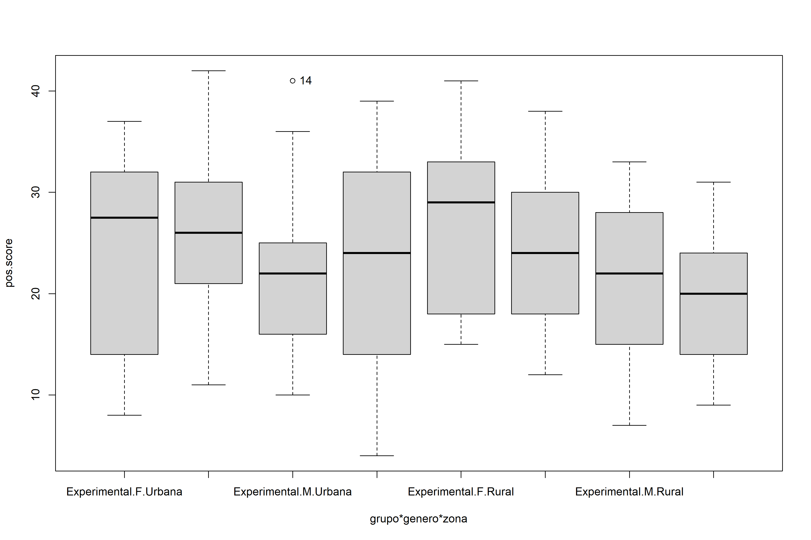<!-- -->

    ## [1] "14"

## Checking of Assumptions

### Assumption: Symmetry and treatment of outliers

| grupo        | variable  |   n |   mean | median | min | max |    sd |    se |    ci |   iqr | symmetry | skewness | kurtosis |
|:-------------|:----------|----:|-------:|-------:|----:|----:|------:|------:|------:|------:|:---------|---------:|---------:|
| Experimental | pos.score | 126 | 22.468 |     22 |   7 |  41 | 8.613 | 0.767 | 1.519 | 14.00 | YES      |    0.184 |   -1.030 |
| Controle     | pos.score | 130 | 22.723 |     23 |   4 |  42 | 8.289 | 0.727 | 1.438 | 13.75 | YES      |    0.036 |   -0.919 |

| genero | variable  |   n |   mean | median | min | max |    sd |    se |    ci | iqr | symmetry | skewness | kurtosis |
|:-------|:----------|----:|-------:|-------:|----:|----:|------:|------:|------:|----:|:---------|---------:|---------:|
| F      | pos.score | 112 | 24.446 |     25 |   8 |  42 | 8.129 | 0.768 | 1.522 |  14 | YES      |    0.038 |   -1.030 |
| M      | pos.score | 144 | 21.160 |     22 |   4 |  41 | 8.415 | 0.701 | 1.386 |  14 | YES      |    0.206 |   -0.947 |

| zona   | variable  |   n |   mean | median | min | max |    sd |    se |    ci |  iqr | symmetry | skewness | kurtosis |
|:-------|:----------|----:|-------:|-------:|----:|----:|------:|------:|------:|-----:|:---------|---------:|---------:|
| Urbana | pos.score |  94 | 23.532 |     24 |   4 |  42 | 8.806 | 0.908 | 1.804 | 15.5 | YES      |   -0.067 |   -1.000 |
| Rural  | pos.score |  99 | 22.606 |     22 |   7 |  41 | 7.988 | 0.803 | 1.593 | 12.5 | YES      |    0.112 |   -0.782 |

*Note*: There is not necessary to apply any transformation for skewness
because all data satisfy symmetry

### Identify and dealing with outliers (performing treatment of outliers)

| grupo        | genero | zona   | id_estudante | pos.score | pre.score | is.outlier | is.extreme |
|:-------------|:-------|:-------|:-------------|----------:|----------:|:-----------|:-----------|
| Experimental | F      | NA     | E147         |        37 |        40 | TRUE       | FALSE      |
| Experimental | M      | Urbana | E32          |        41 |        37 | TRUE       | FALSE      |

*Note*: No one outlier is extreme, they are possible outliers then we
removed them only if normality is unsatisfied

### Assumption: Normality distribution of data

| var       |   n | skewness | kurtosis | symmetry | statistic | method     |     p | p.signif | normality |
|:----------|----:|---------:|---------:|:---------|----------:|:-----------|------:|:---------|:----------|
| pos.score | 193 |    0.208 |    1.306 | YES      |     9.385 | D’Agostino | 0.009 | \*       | QQ        |

| grupo        | genero | zona   | variable  |   n |   mean | median | min | max |    sd |    se |    ci |   iqr | normality | method       | statistic |     p | p.signif |
|:-------------|:-------|:-------|:----------|----:|-------:|-------:|----:|----:|------:|------:|------:|------:|:----------|:-------------|----------:|------:|:---------|
| Experimental | F      | Urbana | pos.score |  22 | 24.318 |   27.5 |   8 |  37 | 9.398 | 2.004 | 4.167 | 17.25 | NO        | Shapiro-Wilk |     0.889 | 0.018 | \*       |
| Experimental | F      | Rural  | pos.score |  17 | 27.176 |   29.0 |  15 |  41 | 9.057 | 2.197 | 4.657 | 15.00 | YES       | Shapiro-Wilk |     0.912 | 0.110 | ns       |
| Experimental | F      | NA     | pos.score |  14 | 21.786 |   20.0 |  12 |  37 | 7.668 | 2.049 | 4.427 |  8.00 | YES       | Shapiro-Wilk |     0.892 | 0.085 | ns       |
| Experimental | M      | Urbana | pos.score |  25 | 21.520 |   22.0 |  10 |  41 | 7.752 | 1.550 | 3.200 |  9.00 | YES       | Shapiro-Wilk |     0.939 | 0.140 | ns       |
| Experimental | M      | Rural  | pos.score |  34 | 21.118 |   22.0 |   7 |  33 | 7.666 | 1.315 | 2.675 | 12.50 | YES       | Shapiro-Wilk |     0.951 | 0.132 | ns       |
| Experimental | M      | NA     | pos.score |  14 | 19.500 |   14.5 |   9 |  37 | 9.975 | 2.666 | 5.759 | 16.25 | NO        | Shapiro-Wilk |     0.872 | 0.045 | \*       |
| Controle     | F      | Urbana | pos.score |  18 | 25.889 |   26.0 |  11 |  42 | 8.007 | 1.887 | 3.982 |  9.50 | YES       | Shapiro-Wilk |     0.976 | 0.901 | ns       |
| Controle     | F      | Rural  | pos.score |  29 | 23.931 |   24.0 |  12 |  38 | 7.348 | 1.365 | 2.795 | 12.00 | YES       | Shapiro-Wilk |     0.969 | 0.540 | ns       |
| Controle     | F      | NA     | pos.score |  12 | 23.000 |   21.0 |  14 |  36 | 6.782 | 1.958 | 4.309 |  8.75 | YES       | Shapiro-Wilk |     0.950 | 0.635 | ns       |
| Controle     | M      | Urbana | pos.score |  29 | 23.207 |   24.0 |   4 |  39 | 9.649 | 1.792 | 3.670 | 18.00 | YES       | Shapiro-Wilk |     0.954 | 0.227 | ns       |
| Controle     | M      | Rural  | pos.score |  19 | 19.158 |   20.0 |   9 |  31 | 6.593 | 1.513 | 3.178 | 10.00 | YES       | Shapiro-Wilk |     0.946 | 0.341 | ns       |
| Controle     | M      | NA     | pos.score |  23 | 20.913 |   19.0 |   8 |  37 | 9.095 | 1.896 | 3.933 | 16.00 | YES       | Shapiro-Wilk |     0.925 | 0.086 | ns       |

*Note*: Normality test not fail in no one group.

### Assumption: Linearity of dependent variables and covariate variable

``` r
ggscatter(dat, x="pre.score", y="pos.score", facet.by=c("grupo","genero"), short.panel.labs = F) + stat_smooth(method = "lm", span = 0.9)
```

    ## `geom_smooth()` using formula = 'y ~ x'

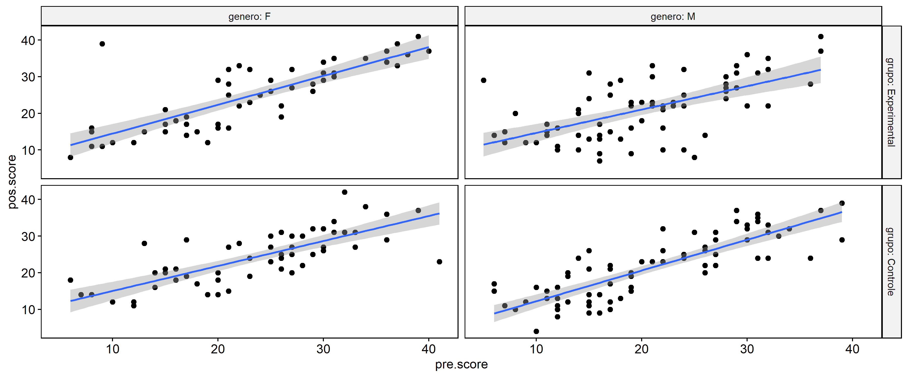<!-- -->

``` r
ggscatter(dat, x="pre.score", y="pos.score", facet.by=c("grupo","zona"), short.panel.labs = F) + stat_smooth(method = "lm", span = 0.9)
```

    ## `geom_smooth()` using formula = 'y ~ x'

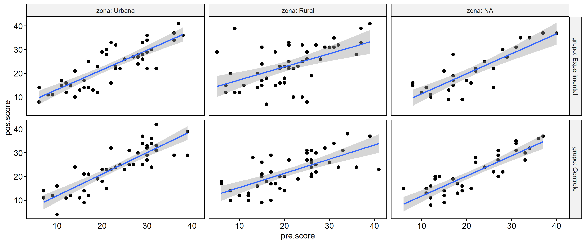<!-- -->

### Assumption: Homogeneity of data distribution

| var       | method         | formula                        |   n | DFn.df1 | DFd.df2 | statistic |     p | p.signif |
|:----------|:---------------|:-------------------------------|----:|--------:|--------:|----------:|------:|:---------|
| pos.score | Levene’s test  | `.res`~`grupo`*`genero`*`zona` | 193 |       7 |     185 |     0.569 | 0.781 | ns       |
| pos.score | Anova’s slopes | `.res`~`grupo`*`genero`*`zona` | 193 |       7 |     177 |     1.975 | 0.061 | ns       |

| var       | method         | formula                  |   n | DFn.df1 | DFd.df2 | statistic |     p | p.signif |
|:----------|:---------------|:-------------------------|----:|--------:|--------:|----------:|------:|:---------|
| pos.score | Levene’s test  | `.res`~`grupo`\*`genero` | 256 |       3 |     252 |     1.277 | 0.283 | ns       |
| pos.score | Anova’s slopes | `.res`~`grupo`\*`genero` | 256 |       3 |     248 |     1.335 | 0.263 | ns       |

## Computation of T-test (Pre VS Pos-teste)

### T-test from all responses

| .y.   | group1 | group2 |  n1 |  n2 | estimate | statistic |     p |  df | conf.low | conf.high | method | alternative | effsize | magnitude  | p.signif |
|:------|:-------|:-------|----:|----:|---------:|----------:|------:|----:|---------:|----------:|:-------|:------------|--------:|:-----------|:---------|
| score | pos    | pre    | 256 | 256 |    0.965 |     2.624 | 0.005 | 255 |    0.358 |       Inf | T-test | greater     |   0.163 | negligible | \*\*     |

### T-test from control group

| .y.   | group1 | group2 |  n1 |  n2 | estimate | statistic |    p |  df | conf.low | conf.high | method | alternative | effsize | magnitude  | p.signif |
|:------|:-------|:-------|----:|----:|---------:|----------:|-----:|----:|---------:|----------:|:-------|:------------|--------:|:-----------|:---------|
| score | pos    | pre    | 130 | 130 |    0.569 |     1.234 | 0.11 | 129 |   -0.195 |       Inf | T-test | greater     |   0.108 | negligible | ns       |

### T-test from intervention group

| .y.   | group1 | group2 |  n1 |  n2 | estimate | statistic |     p |  df | conf.low | conf.high | method | alternative | effsize | magnitude | p.signif |
|:------|:-------|:-------|----:|----:|---------:|----------:|------:|----:|---------:|----------:|:-------|:------------|--------:|:----------|:---------|
| score | pos    | pre    | 126 | 126 |    1.373 |     2.385 | 0.009 | 125 |    0.419 |       Inf | T-test | greater     |   0.211 | small     | \*\*     |

\`

``` r
stat.test <- rstatix::add_xy_position(rstatix::add_significance(p.tt$tt$score), x = "time")

library("ggpubr")
gg <- ggboxplot(pair.df.experimental, x = "time", y = "score", 
                color = "time", palette = c("#00AFBB", "#E7B800"),
                order = c("pre", "pos"),
                ylab = "Score", xlab = "Time")

gg <- gg + ggplot2::geom_jitter(data = pair.df.experimental,
                                ggplot2::aes(x = time, y = score, colour = time),
                                width = 0.075, height = 0.075, size = 0.75)
gg <- gg + ggpubr::stat_pvalue_manual(stat.test, hide.ns = T, tip.length = 0)
gg <- gg + ggplot2::labs(subtitle = rstatix::get_test_label(p.tt$tt$score, detailed = T))
gg
```

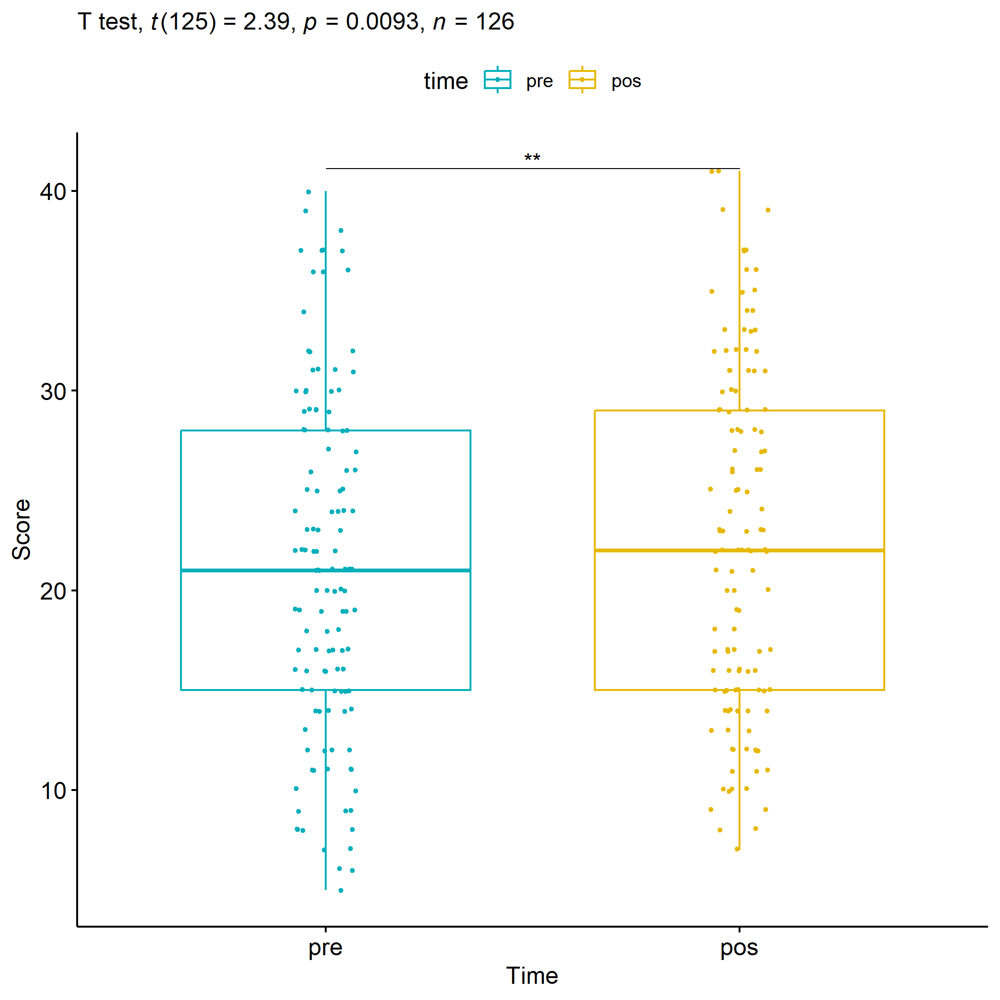<!-- -->

*Note*: There is significant difference in the experimenatal group
(apenas a intervenção causa efeito na aprendizagem)

## Computation of ANCOVA test and Pairwise Comparison (Control VS Intervention)

### ANCOVA test

| Effect       | DFn | DFd |      SSn |      SSd |       F | p       |   ges | p\<.05 |
|:-------------|----:|----:|---------:|---------:|--------:|:--------|------:|:-------|
| pre.score    |   1 | 251 | 9860.426 | 7592.327 | 325.983 | \<0.001 | 0.565 | \*     |
| grupo        |   1 | 251 |   20.744 | 7592.327 |   0.686 | 0.408   | 0.003 |        |
| genero       |   1 | 251 |   83.703 | 7592.327 |   2.767 | 0.097   | 0.011 |        |
| grupo:genero |   1 | 251 |    3.755 | 7592.327 |   0.124 | 0.725   | 0.000 |        |

*Note*: There are significant differences on the factors: “grupo”, and
“genero”

| Effect            | DFn | DFd |      SSn |      SSd |       F | p       |   ges | p\<.05 |
|:------------------|----:|----:|---------:|---------:|--------:|:--------|------:|:-------|
| pre.score         |   1 | 184 | 6455.077 | 6084.861 | 195.195 | \<0.001 | 0.515 | \*     |
| grupo             |   1 | 184 |   45.585 | 6084.861 |   1.378 | 0.242   | 0.007 |        |
| genero            |   1 | 184 |  130.555 | 6084.861 |   3.948 | 0.048   | 0.021 | \*     |
| zona              |   1 | 184 |    1.311 | 6084.861 |   0.040 | 0.842   | 0.000 |        |
| grupo:genero      |   1 | 184 |    0.010 | 6084.861 |   0.000 | 0.986   | 0.000 |        |
| grupo:zona        |   1 | 184 |   59.612 | 6084.861 |   1.803 | 0.181   | 0.010 |        |
| genero:zona       |   1 | 184 |   31.180 | 6084.861 |   0.943 | 0.333   | 0.005 |        |
| grupo:genero:zona |   1 | 184 |    2.080 | 6084.861 |   0.063 | 0.802   | 0.000 |        |

*Note*: There are no significant differences

### Pairwise comparison using factor: **grupo**

| var       | grupo | group1       | group2   | estimate | conf.low | conf.high |   se | statistic |     p | p.adj | p.adj.signif |
|:----------|:------|:-------------|:---------|---------:|---------:|----------:|-----:|----------:|------:|------:|:-------------|
| pos.score | NA    | Experimental | Controle |    0.544 |   -0.815 |     1.903 | 0.69 |     0.788 | 0.431 | 0.431 | ns           |

``` r
oneWayAncovaPlots(dat, "pos.score", "grupo", aov1, pwc.grupo$pos.score, addParam = c("jitter"), font.label.size=14, step.increase=0.25, p.label="p.adj", subtitle = 2)$grupo + ggplot2::scale_color_manual(values=c("#00AA00","#FFBA00"))
```

    ## Scale for colour is already present.
    ## Adding another scale for colour, which will replace the existing scale.

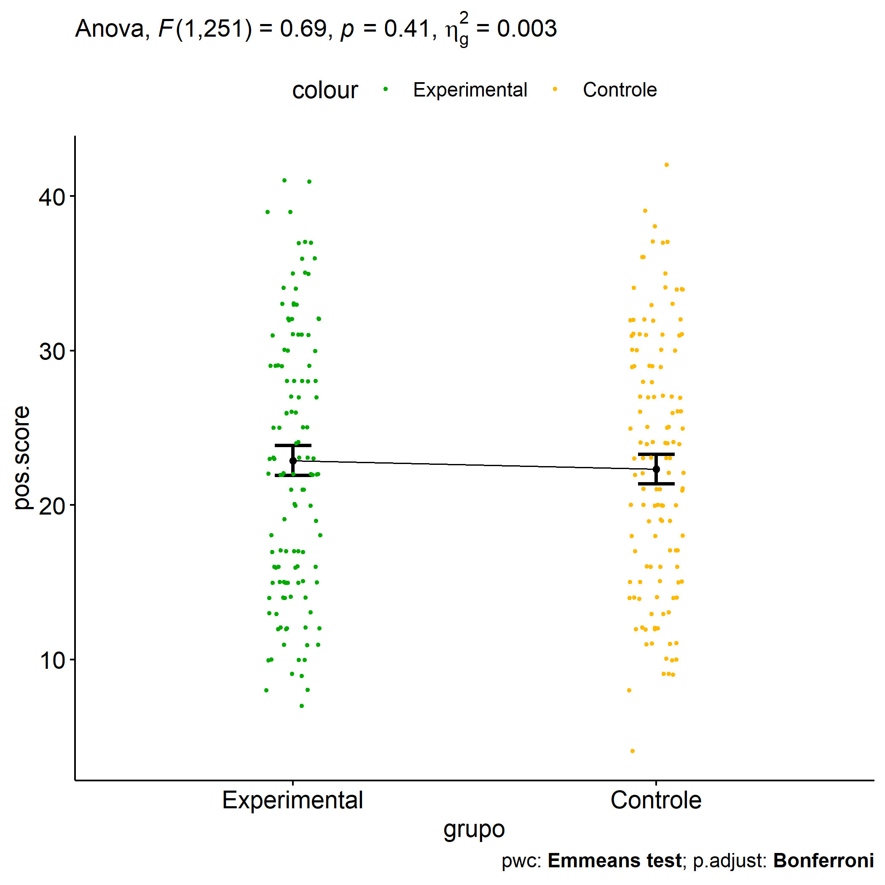<!-- -->

### Pairwise comparison using factor: **genero**

| var       | genero | group1 | group2 | estimate | conf.low | conf.high |    se | statistic |   p | p.adj | p.adj.signif |
|:----------|:-------|:-------|:-------|---------:|---------:|----------:|------:|----------:|----:|------:|:-------------|
| pos.score | NA     | F      | M      |    1.156 |   -0.225 |     2.537 | 0.701 |     1.648 | 0.1 |   0.1 | ns           |

``` r
oneWayAncovaPlots(dat, "pos.score", "genero", aov1, pwc.genero$pos.score, addParam = c("jitter"), font.label.size=14, step.increase=0.25, p.label="p.adj", subtitle = 3)$genero + ggplot2::scale_color_manual(labels=c("female","male"), values=c("#FF007F","#4D4DFF")) + scale_x_discrete("gender")
```

    ## Scale for colour is already present.
    ## Adding another scale for colour, which will replace the existing scale.

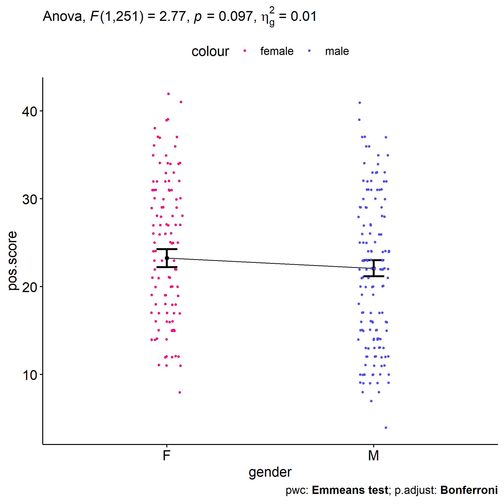<!-- -->

### Pairwise comparison using factor: **zona**

| var       | zona | group1 | group2 | estimate | conf.low | conf.high |    se | statistic |     p | p.adj | p.adj.signif |
|:----------|:-----|:-------|:-------|---------:|---------:|----------:|------:|----------:|------:|------:|:-------------|
| pos.score | NA   | Urbana | Rural  |    -0.26 |   -1.903 |     1.384 | 0.833 |    -0.312 | 0.756 | 0.756 | ns           |

``` r
oneWayAncovaPlots(sdat, "pos.score", "zona", aov2, pwc.zona$pos.score, addParam = c("jitter"), font.label.size=14, step.increase=0.25, p.label="p.adj", subtitle = 4)$zona +  ggplot2::scale_color_manual(values=c("#AA00FF","#00CCCC"))
```

    ## Scale for colour is already present.
    ## Adding another scale for colour, which will replace the existing scale.

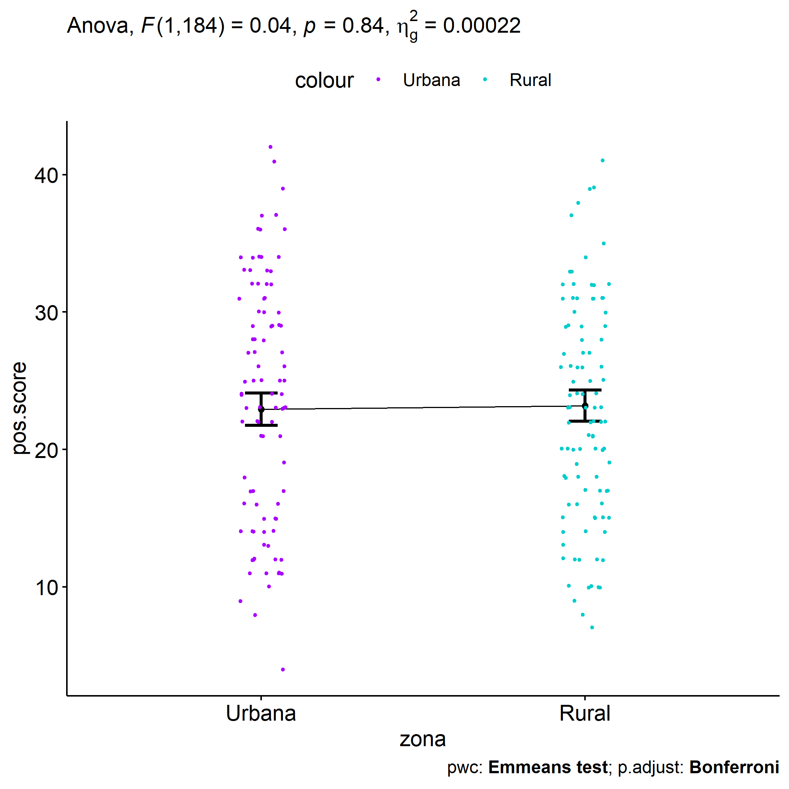<!-- -->

### Pairwise comparison using factor: **grupo:genero**

| var       | grupo        | genero | group1       | group2   | estimate | conf.low | conf.high |    se | statistic |     p | p.adj | p.adj.signif |
|:----------|:-------------|:-------|:-------------|:---------|---------:|---------:|----------:|------:|----------:|------:|------:|:-------------|
| pos.score | NA           | F      | Experimental | Controle |    0.846 |   -1.205 |     2.897 | 1.041 |     0.812 | 0.417 | 0.417 | ns           |
| pos.score | NA           | M      | Experimental | Controle |    0.357 |   -1.450 |     2.165 | 0.918 |     0.389 | 0.698 | 0.698 | ns           |
| pos.score | Experimental | NA     | F            | M        |    1.420 |   -0.549 |     3.390 | 1.000 |     1.420 | 0.157 | 0.157 | ns           |
| pos.score | Controle     | NA     | F            | M        |    0.931 |   -0.990 |     2.852 | 0.975 |     0.955 | 0.341 | 0.341 | ns           |

``` r
plots <- twoWayAncovaPlots(dat, "pos.score", c("grupo","genero"), aov1, pwc.grupo_genero$pos.score, addParam = c("jitter"), font.label.size=14, step.increase=0.25, p.label="p.adj", subtitle = 4)
```

``` r
plots$grupo + ggplot2::scale_color_manual(labels=c("female","male"), values=c("#FF007F","#4D4DFF")) + scale_x_discrete("gender")
```

    ## Scale for colour is already present.
    ## Adding another scale for colour, which will replace the existing scale.

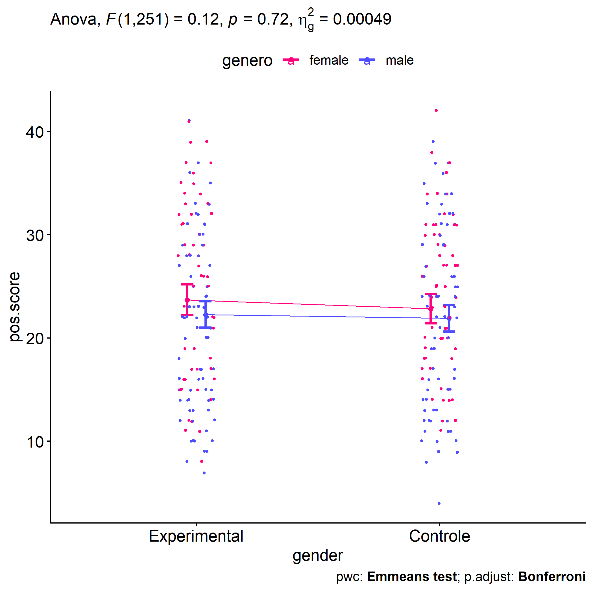<!-- -->

``` r
plots$genero + ggplot2::scale_color_manual(values=c("#00AA00","#FFBA00"))
```

    ## Scale for colour is already present.
    ## Adding another scale for colour, which will replace the existing scale.

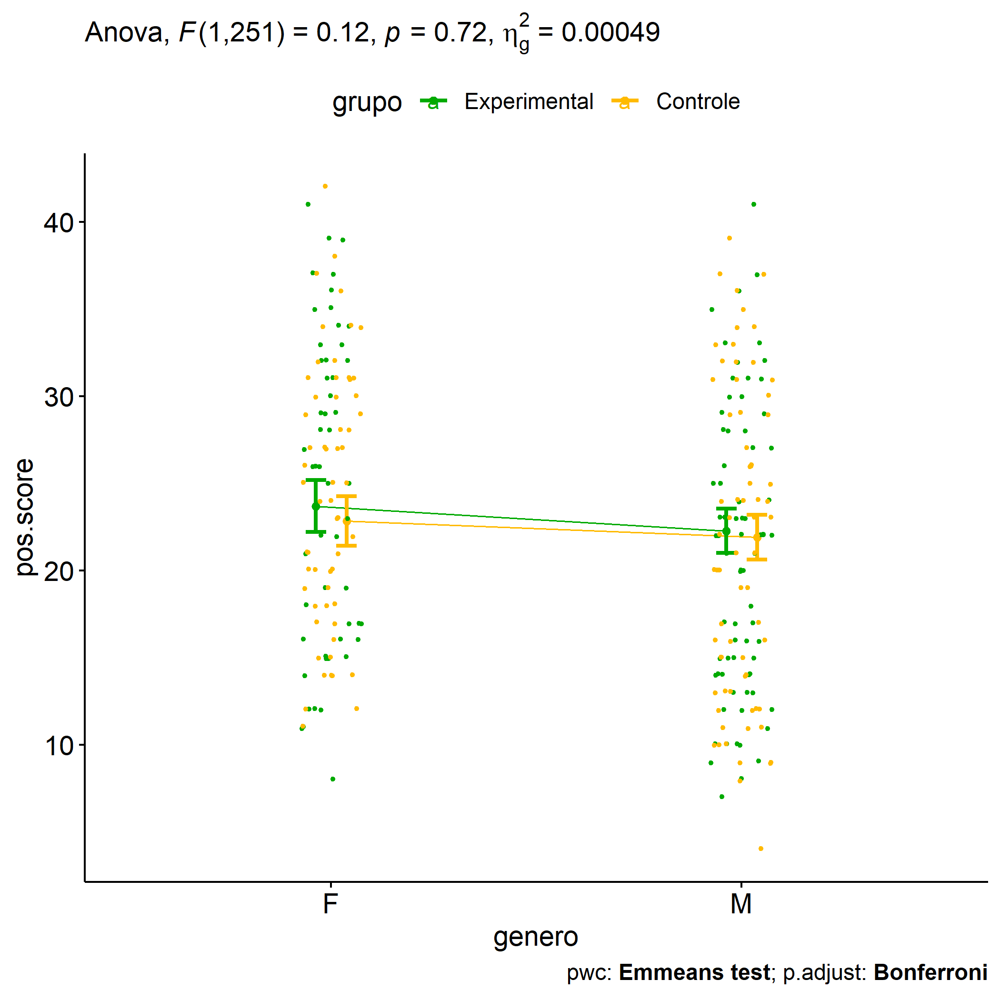<!-- -->

### Pairwise comparison using factor: **grupo:zona**

| var       | grupo        | zona   | group1       | group2   | estimate | conf.low | conf.high |    se | statistic |     p | p.adj | p.adj.signif |
|:----------|:-------------|:-------|:-------------|:---------|---------:|---------:|----------:|------:|----------:|------:|------:|:-------------|
| pos.score | NA           | Urbana | Experimental | Controle |   -0.022 |   -2.375 |     2.332 | 1.193 |    -0.018 | 0.985 | 0.985 | ns           |
| pos.score | NA           | Rural  | Experimental | Controle |    1.457 |   -0.830 |     3.745 | 1.160 |     1.257 | 0.210 | 0.210 | ns           |
| pos.score | Experimental | NA     | Urbana       | Rural    |   -0.979 |   -3.281 |     1.322 | 1.167 |    -0.839 | 0.402 | 0.402 | ns           |
| pos.score | Controle     | NA     | Urbana       | Rural    |    0.500 |   -1.845 |     2.845 | 1.189 |     0.421 | 0.675 | 0.675 | ns           |

``` r
plots <- twoWayAncovaPlots(sdat, "pos.score", c("grupo","zona"), aov2, pwc.grupo_zona$pos.score, addParam = c("jitter"), font.label.size=14, step.increase=0.25, p.label="p.adj", subtitle = 6)
```

``` r
plots$grupo + ggplot2::scale_color_manual(values=c("#AA00FF","#00CCCC"))
```

    ## Scale for colour is already present.
    ## Adding another scale for colour, which will replace the existing scale.

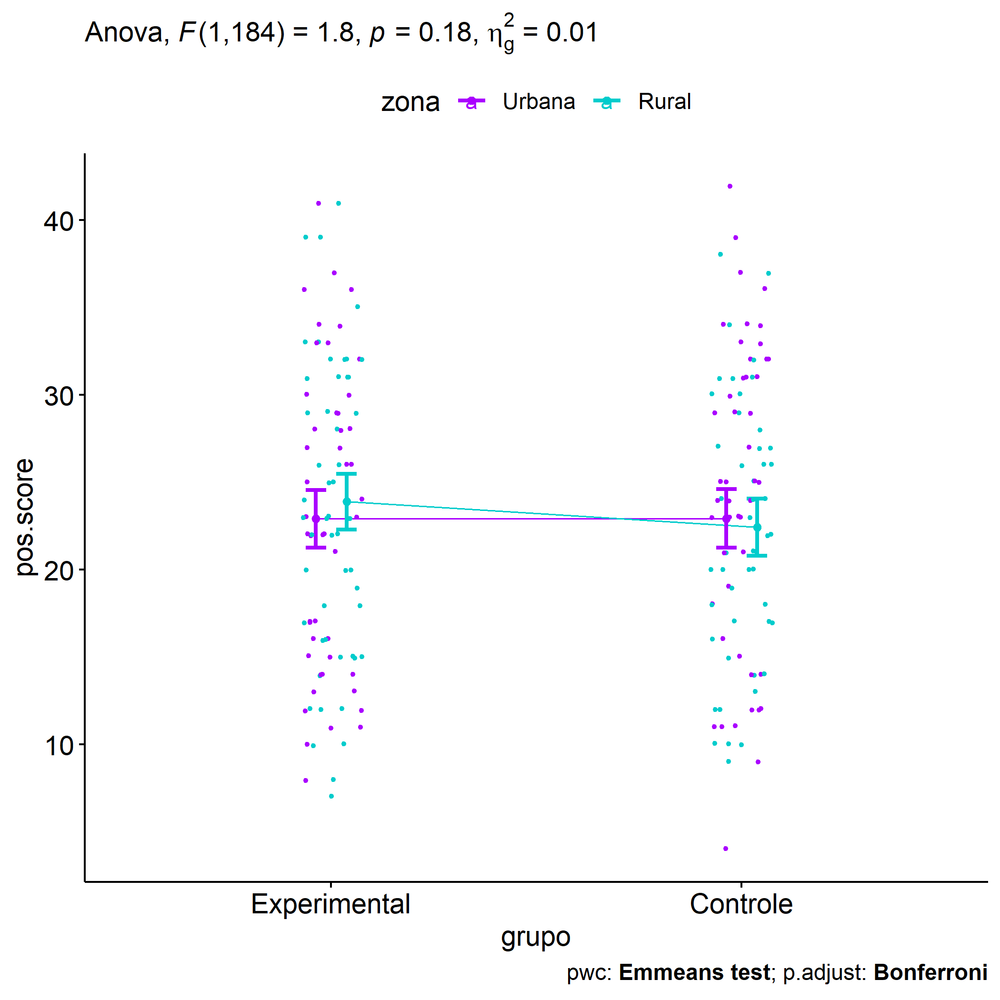<!-- -->

``` r
plots$zona + ggplot2::scale_color_manual(values=c("#00AA00","#FFBA00"))
```

    ## Scale for colour is already present.
    ## Adding another scale for colour, which will replace the existing scale.

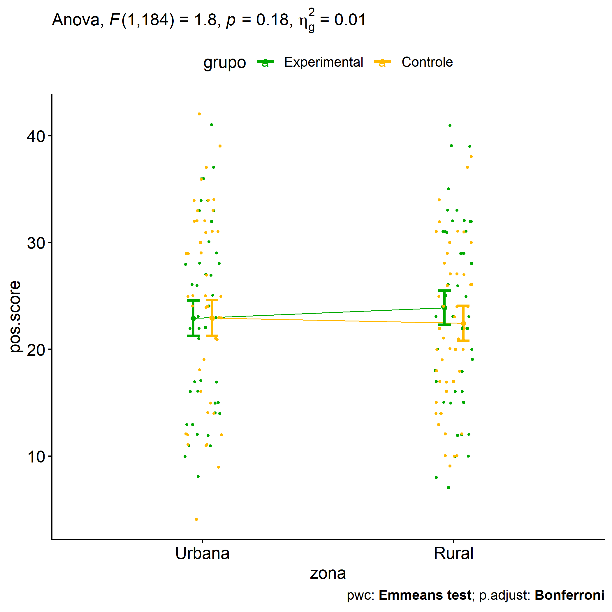<!-- -->

### Pairwise comparison using factor: **genero:zona**

| var       | genero | zona   | group1 | group2 | estimate | conf.low | conf.high |    se | statistic |     p | p.adj | p.adj.signif |
|:----------|:-------|:-------|:-------|:-------|---------:|---------:|----------:|------:|----------:|------:|------:|:-------------|
| pos.score | NA     | Urbana | F      | M      |    0.884 |   -1.490 |     3.258 | 1.203 |     0.735 | 0.463 | 0.463 | ns           |
| pos.score | NA     | Rural  | F      | M      |    1.966 |   -0.347 |     4.280 | 1.173 |     1.677 | 0.095 | 0.095 | ns           |
| pos.score | F      | NA     | Urbana | Rural  |   -0.776 |   -3.225 |     1.673 | 1.242 |    -0.625 | 0.533 | 0.533 | ns           |
| pos.score | M      | NA     | Urbana | Rural  |    0.306 |   -1.896 |     2.508 | 1.116 |     0.274 | 0.784 | 0.784 | ns           |

``` r
plots <- twoWayAncovaPlots(sdat, "pos.score", c("genero","zona"), aov2, pwc.genero_zona$pos.score, addParam = c("jitter"), font.label.size=14, step.increase=0.25, p.label="p.adj", subtitle = 7)
```

``` r
plots$genero + ggplot2::scale_color_manual(values=c("#AA00FF","#00CCCC"))
```

    ## Scale for colour is already present.
    ## Adding another scale for colour, which will replace the existing scale.

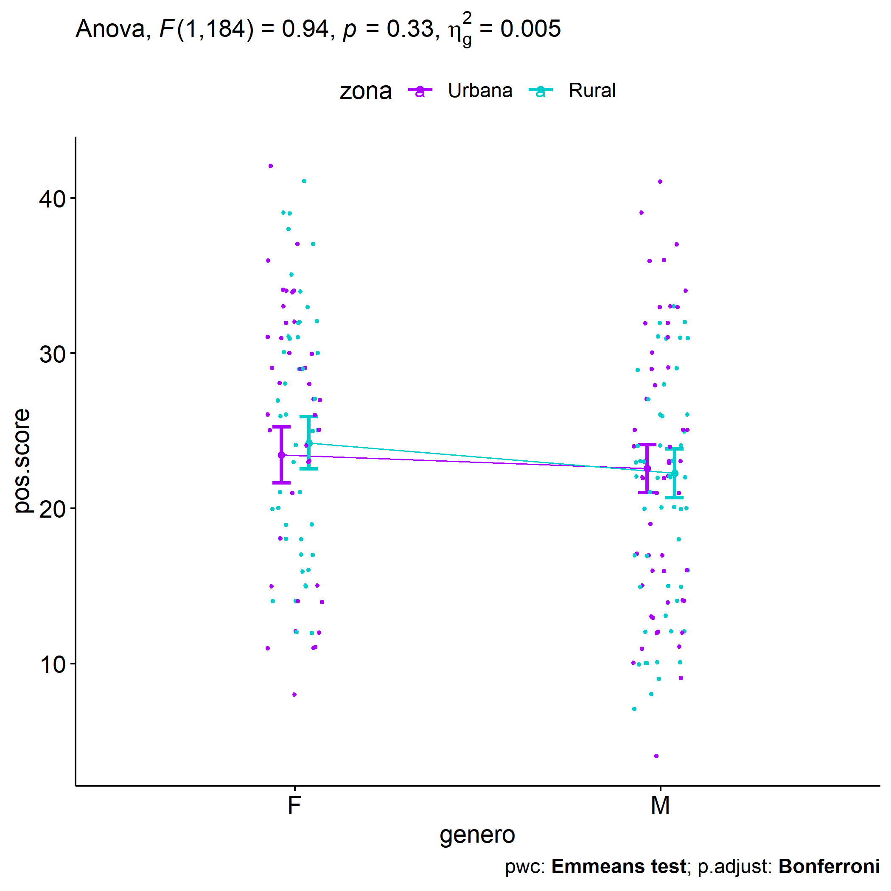<!-- -->

``` r
plots$zona + ggplot2::scale_color_manual(labels=c("female","male"), values=c("#FF007F","#4D4DFF")) + scale_x_discrete("gender")
```

    ## Scale for colour is already present.
    ## Adding another scale for colour, which will replace the existing scale.

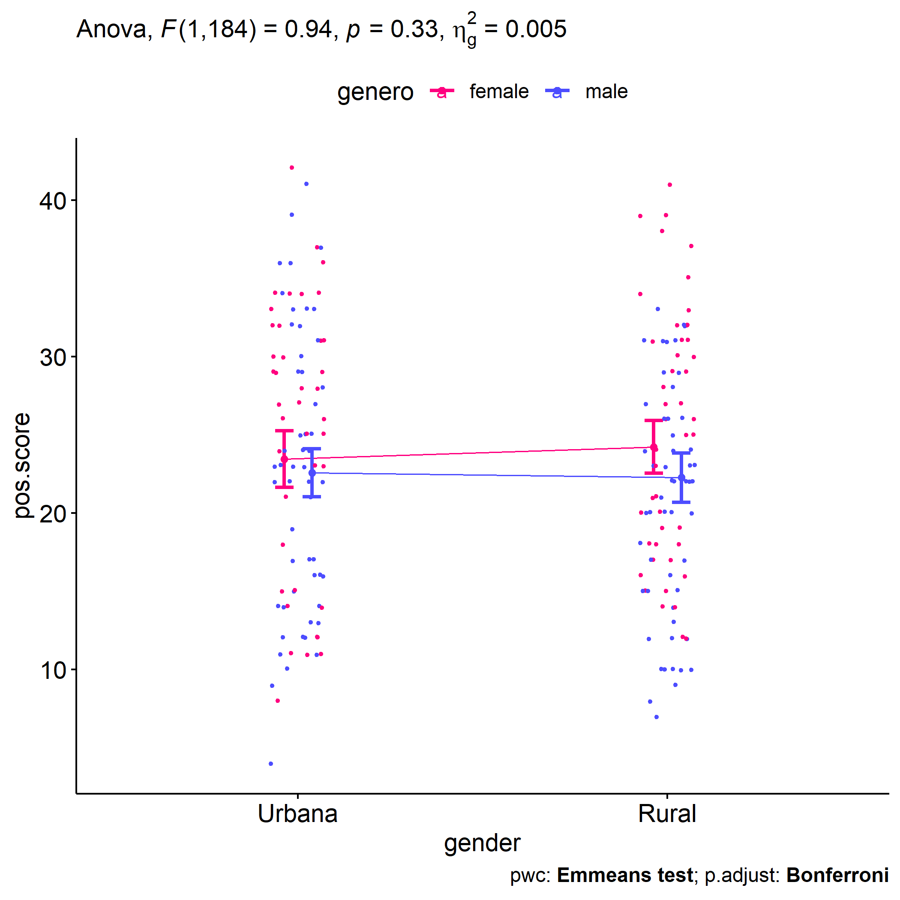<!-- -->

## Descriptive statistics and estimated marginal means to be reported by grupo and genero

| var       | grupo        |   n | M (pre) | SE (pre) | M (unadj) | SE (unadj) | M (adj) | SE (adj) |
|:----------|:-------------|----:|--------:|---------:|----------:|-----------:|--------:|---------:|
| pos.score | Controle     | 130 |  22.154 |    0.750 |    22.723 |      0.727 |  22.330 |    0.484 |
| pos.score | Experimental | 126 |  21.095 |    0.754 |    22.468 |      0.767 |  22.874 |    0.491 |

| var       | genero |   n | M (pre) | SE (pre) | M (unadj) | SE (unadj) | M (adj) | SE (adj) |
|:----------|:-------|----:|--------:|---------:|----------:|-----------:|--------:|---------:|
| pos.score | F      | 112 |  23.250 |    0.810 |    24.446 |      0.768 |  23.248 |    0.523 |
| pos.score | M      | 144 |  20.375 |    0.688 |    21.160 |      0.701 |  22.092 |    0.460 |

| var       | grupo        | genero |   n | M (pre) | SE (pre) | M (unadj) | SE (unadj) | M (adj) | SE (adj) |
|:----------|:-------------|:-------|----:|--------:|---------:|----------:|-----------:|--------:|---------:|
| pos.score | Controle     | F      |  59 |  23.644 |    1.063 |    24.339 |      0.964 |  22.845 |    0.721 |
| pos.score | Controle     | M      |  71 |  20.915 |    1.034 |    21.380 |      1.043 |  21.913 |    0.653 |
| pos.score | Experimental | F      |  53 |  22.811 |    1.245 |    24.566 |      1.228 |  23.690 |    0.757 |
| pos.score | Experimental | M      |  73 |  19.849 |    0.916 |    20.945 |      0.947 |  22.270 |    0.648 |

## Descriptive statistics and estimated marginal means to be reported with zona

| var       | zona   |   n | M (pre) | SE (pre) | M (unadj) | SE (unadj) | M (adj) | SE (adj) |
|:----------|:-------|----:|--------:|---------:|----------:|-----------:|--------:|---------:|
| pos.score | Rural  |  99 |  20.929 |    0.844 |    22.606 |      0.803 |  23.184 |    0.580 |
| pos.score | Urbana |  94 |  22.574 |    0.887 |    23.532 |      0.908 |  22.924 |    0.595 |

| var       | grupo        | zona   |   n | M (pre) | SE (pre) | M (unadj) | SE (unadj) | M (adj) | SE (adj) |
|:----------|:-------------|:-------|----:|--------:|---------:|----------:|-----------:|--------:|---------:|
| pos.score | Controle     | Rural  |  48 |  21.188 |    1.244 |    22.042 |      1.064 |  22.434 |    0.833 |
| pos.score | Controle     | Urbana |  47 |  23.532 |    1.243 |    24.234 |      1.322 |  22.934 |    0.846 |
| pos.score | Experimental | Rural  |  51 |  20.686 |    1.157 |    23.137 |      1.199 |  23.891 |    0.809 |
| pos.score | Experimental | Urbana |  47 |  21.617 |    1.265 |    22.830 |      1.252 |  22.912 |    0.841 |

| var       | genero | zona   |   n | M (pre) | SE (pre) | M (unadj) | SE (unadj) | M (adj) | SE (adj) |
|:----------|:-------|:-------|----:|--------:|---------:|----------:|-----------:|--------:|---------:|
| pos.score | F      | Rural  |  46 |  23.022 |    1.295 |    25.130 |      1.191 |  24.222 |    0.849 |
| pos.score | F      | Urbana |  40 |  23.975 |    1.353 |    25.025 |      1.380 |  23.446 |    0.914 |
| pos.score | M      | Rural  |  53 |  19.113 |    1.054 |    20.415 |      1.002 |  22.256 |    0.799 |
| pos.score | M      | Urbana |  54 |  21.537 |    1.166 |    22.426 |      1.195 |  22.562 |    0.781 |

## Tips and References

- Use the site <https://www.tablesgenerator.com> to convert the HTML
  tables into Latex format

- \[2\]: Miot, H. A. (2017). Assessing normality of data in clinical and
  experimental trials. J Vasc Bras, 16(2), 88-91.

- \[3\]: Bárány, Imre; Vu, Van (2007). “Central limit theorems for
  Gaussian polytopes”. Annals of Probability. Institute of Mathematical
  Statistics. 35 (4): 1593–1621.
