ANCOVA test for `pos.score`~`pre.score`+`grupo`*`genero`*`zona`
================
Geiser C. Challco <geiser@alumni.usp.br>

- [Initial Variables and Descriptive Statistics of initial
  data](#initial-variables-and-descriptive-statistics-of-initial-data)
- [Checking of Assumptions](#checking-of-assumptions)
  - [Identify and dealing with outliers (performing treatment of
    outliers)](#identify-and-dealing-with-outliers-performing-treatment-of-outliers)
  - [Assumption: Symmetry and treatment of
    outliers](#assumption-symmetry-and-treatment-of-outliers)
  - [Assumption: Normality distribution of
    data](#assumption-normality-distribution-of-data)
  - [Assumption: Linearity of dependent variables and covariate
    variable](#assumption-linearity-of-dependent-variables-and-covariate-variable)
  - [Assumption: Homogeneity of data
    distribution](#assumption-homogeneity-of-data-distribution)
- [Computation of T-test (Pre VS
  Pos-teste)](#computation-of-t-test-pre-vs-pos-teste)
  - [T-test from all responses](#t-test-from-all-responses)
  - [T-test from control group](#t-test-from-control-group)
  - [T-test from intervention group](#t-test-from-intervention-group)
- [Computation of ANCOVA test and Pairwise Comparison (Control VS
  Intervention)](#computation-of-ancova-test-and-pairwise-comparison-control-vs-intervention)
  - [ANCOVA test](#ancova-test)
  - [Pairwise comparison using factor:
    **grupo**](#pairwise-comparison-using-factor-grupo)
  - [Pairwise comparison using factor:
    **genero**](#pairwise-comparison-using-factor-genero)
  - [Pairwise comparison using factor:
    **zona**](#pairwise-comparison-using-factor-zona)
  - [Pairwise comparison using factor:
    **grupo:genero**](#pairwise-comparison-using-factor-grupogenero)
  - [Pairwise comparison using factor:
    **grupo:zona**](#pairwise-comparison-using-factor-grupozona)
  - [Pairwise comparison using factor:
    **genero:zona**](#pairwise-comparison-using-factor-generozona)
- [Descriptive statistics and estimated marginal means to be reported by
  grupo and
  genero](#descriptive-statistics-and-estimated-marginal-means-to-be-reported-by-grupo-and-genero)
- [Descriptive statistics and estimated marginal means to be reported
  with
  zona](#descriptive-statistics-and-estimated-marginal-means-to-be-reported-with-zona)
- [Tips and References](#tips-and-references)

## Initial Variables and Descriptive Statistics of initial data

| grupo        | genero | zona   | variable  |   n |   mean | median | min | max |     sd |    se |    ci |   iqr |
|:-------------|:-------|:-------|:----------|----:|-------:|-------:|----:|----:|-------:|------:|------:|------:|
| Experimental | F      | Urbana | pos.score |  21 | 73.571 |   81.0 |  16 |  92 | 19.671 | 4.293 | 8.954 | 17.00 |
| Experimental | F      | Rural  | pos.score |  19 | 79.789 |   82.0 |  51 |  93 | 10.433 | 2.393 | 5.028 | 12.00 |
| Experimental | F      | NA     | pos.score |  15 | 72.133 |   72.0 |  56 |  88 | 10.514 | 2.715 | 5.823 | 15.50 |
| Experimental | M      | Urbana | pos.score |  22 | 67.591 |   67.5 |  33 |  94 | 13.886 | 2.961 | 6.157 | 14.50 |
| Experimental | M      | Rural  | pos.score |  38 | 67.605 |   67.5 |  42 |  90 | 13.284 | 2.155 | 4.366 | 17.75 |
| Experimental | M      | NA     | pos.score |  15 | 72.400 |   73.0 |  35 |  91 | 14.574 | 3.763 | 8.071 | 17.50 |
| Controle     | F      | Urbana | pos.score |  24 | 78.375 |   79.0 |  53 |  93 | 10.757 | 2.196 | 4.542 | 14.50 |
| Controle     | F      | Rural  | pos.score |  30 | 73.667 |   77.0 |  47 |  96 | 13.984 | 2.553 | 5.222 | 20.75 |
| Controle     | F      | NA     | pos.score |  13 | 74.154 |   74.0 |  54 |  94 | 12.462 | 3.456 | 7.531 | 22.00 |
| Controle     | M      | Urbana | pos.score |  34 | 68.206 |   72.0 |  38 |  92 | 15.384 | 2.638 | 5.368 | 26.25 |
| Controle     | M      | Rural  | pos.score |  17 | 66.412 |   68.0 |  45 |  87 | 14.111 | 3.423 | 7.255 | 24.00 |
| Controle     | M      | NA     | pos.score |  20 | 62.400 |   63.5 |  29 |  90 | 17.742 | 3.967 | 8.304 | 19.50 |

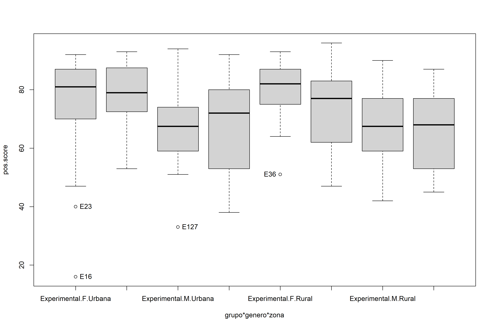<!-- -->

    ## [1] "E16"  "E23"  "E127" "E36"

## Checking of Assumptions

### Identify and dealing with outliers (performing treatment of outliers)

| grupo        | genero | zona   | id_estudante | pos.score | pre.score | is.outlier | is.extreme |
|:-------------|:-------|:-------|:-------------|----------:|----------:|:-----------|:-----------|
| Experimental | F      | Urbana | E16          |        16 |        69 | TRUE       | TRUE       |
| Experimental | F      | Urbana | E23          |        40 |        68 | TRUE       | FALSE      |
| Experimental | F      | Rural  | E36          |        51 |        70 | TRUE       | FALSE      |
| Experimental | M      | Urbana | E127         |        33 |        24 | TRUE       | FALSE      |
| Experimental | M      | NA     | E138         |        35 |        53 | TRUE       | FALSE      |

*Note*: Removing “E16” and “E127” because it is extreme

### Assumption: Symmetry and treatment of outliers

| genero | variable  |   n |   mean | median | min | max |     sd |    se |    ci | iqr | symmetry | skewness | kurtosis |
|:-------|:----------|----:|-------:|-------:|----:|----:|-------:|------:|------:|----:|:---------|---------:|---------:|
| F      | pos.score | 121 | 75.884 |     79 |  40 |  96 | 12.518 | 1.138 | 2.253 |  18 | NO       |   -0.667 |   -0.305 |
| M      | pos.score | 145 | 67.621 |     68 |  29 |  94 | 14.495 | 1.204 | 2.379 |  22 | YES      |   -0.315 |   -0.544 |

| zona   | variable  |   n |   mean | median | min | max |     sd |    se |    ci | iqr | symmetry | skewness | kurtosis |
|:-------|:----------|----:|-------:|-------:|----:|----:|-------:|------:|------:|----:|:---------|---------:|---------:|
| Urbana | pos.score |  99 | 72.556 |     76 |  38 |  94 | 14.112 | 1.418 | 2.815 |  23 | NO       |   -0.535 |   -0.660 |
| Rural  | pos.score | 104 | 71.385 |     73 |  42 |  96 | 13.867 | 1.360 | 2.697 |  23 | YES      |   -0.281 |   -1.009 |

### Assumption: Normality distribution of data

| var       |   n | skewness | kurtosis | symmetry | statistic | method     |     p | p.signif | normality |
|:----------|----:|---------:|---------:|:---------|----------:|:-----------|------:|:---------|:----------|
| pos.score | 203 |   -0.381 |    1.002 | YES      |    10.941 | D’Agostino | 0.004 | \*       | \-        |

| grupo        | genero | zona   | variable  |   n |   mean | median | min | max |     sd |    se |    ci |   iqr | normality | method       | statistic |     p | p.signif |
|:-------------|:-------|:-------|:----------|----:|-------:|-------:|----:|----:|-------:|------:|------:|------:|:----------|:-------------|----------:|------:|:---------|
| Experimental | F      | Urbana | pos.score |  20 | 76.450 |   81.5 |  40 |  92 | 14.972 | 3.348 | 7.007 | 17.25 | NO        | Shapiro-Wilk |     0.858 | 0.007 | \*\*     |
| Experimental | F      | Rural  | pos.score |  19 | 79.789 |   82.0 |  51 |  93 | 10.433 | 2.393 | 5.028 | 12.00 | YES       | Shapiro-Wilk |     0.908 | 0.069 | ns       |
| Experimental | F      | NA     | pos.score |  15 | 72.133 |   72.0 |  56 |  88 | 10.514 | 2.715 | 5.823 | 15.50 | YES       | Shapiro-Wilk |     0.955 | 0.604 | ns       |
| Experimental | M      | Urbana | pos.score |  21 | 69.238 |   68.0 |  51 |  94 | 11.823 | 2.580 | 5.382 | 13.00 | YES       | Shapiro-Wilk |     0.959 | 0.496 | ns       |
| Experimental | M      | Rural  | pos.score |  38 | 67.605 |   67.5 |  42 |  90 | 13.284 | 2.155 | 4.366 | 17.75 | YES       | Shapiro-Wilk |     0.969 | 0.361 | ns       |
| Experimental | M      | NA     | pos.score |  15 | 72.400 |   73.0 |  35 |  91 | 14.574 | 3.763 | 8.071 | 17.50 | YES       | Shapiro-Wilk |     0.912 | 0.146 | ns       |
| Controle     | F      | Urbana | pos.score |  24 | 78.375 |   79.0 |  53 |  93 | 10.757 | 2.196 | 4.542 | 14.50 | YES       | Shapiro-Wilk |     0.935 | 0.125 | ns       |
| Controle     | F      | Rural  | pos.score |  30 | 73.667 |   77.0 |  47 |  96 | 13.984 | 2.553 | 5.222 | 20.75 | YES       | Shapiro-Wilk |     0.952 | 0.194 | ns       |
| Controle     | F      | NA     | pos.score |  13 | 74.154 |   74.0 |  54 |  94 | 12.462 | 3.456 | 7.531 | 22.00 | YES       | Shapiro-Wilk |     0.944 | 0.512 | ns       |
| Controle     | M      | Urbana | pos.score |  34 | 68.206 |   72.0 |  38 |  92 | 15.384 | 2.638 | 5.368 | 26.25 | YES       | Shapiro-Wilk |     0.941 | 0.065 | ns       |
| Controle     | M      | Rural  | pos.score |  17 | 66.412 |   68.0 |  45 |  87 | 14.111 | 3.423 | 7.255 | 24.00 | YES       | Shapiro-Wilk |     0.926 | 0.189 | ns       |
| Controle     | M      | NA     | pos.score |  20 | 62.400 |   63.5 |  29 |  90 | 17.742 | 3.967 | 8.304 | 19.50 | YES       | Shapiro-Wilk |     0.957 | 0.491 | ns       |

*Note*: Normality test not fail in no one group.

### Assumption: Linearity of dependent variables and covariate variable

``` r
ggscatter(dat, x="pre.score", y="pos.score", facet.by=c("grupo","genero"), short.panel.labs = F) + stat_smooth(method = "lm", span = 0.9)
```

    ## `geom_smooth()` using formula = 'y ~ x'

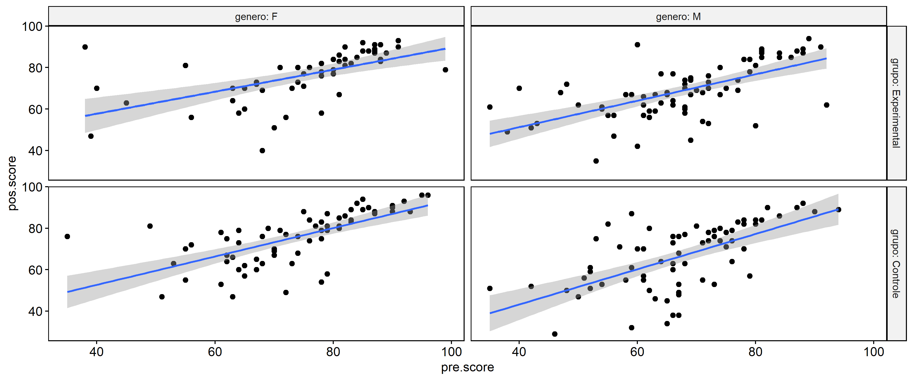<!-- -->

``` r
ggscatter(dat, x="pre.score", y="pos.score", facet.by=c("grupo","zona"), short.panel.labs = F) + stat_smooth(method = "lm", span = 0.9)
```

    ## `geom_smooth()` using formula = 'y ~ x'

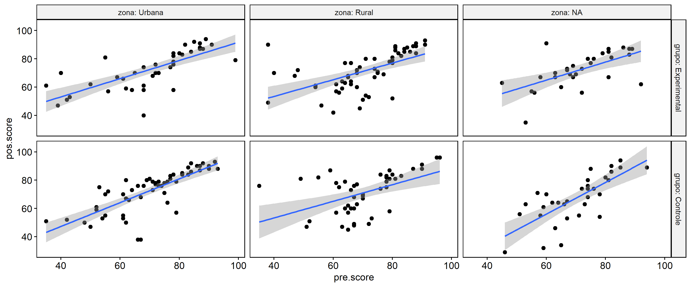<!-- -->

### Assumption: Homogeneity of data distribution

| var       | method         | formula                        |   n | DFn.df1 | DFd.df2 | statistic |     p | p.signif |
|:----------|:---------------|:-------------------------------|----:|--------:|--------:|----------:|------:|:---------|
| pos.score | Levene’s test  | `.res`~`grupo`*`genero`*`zona` | 203 |       7 |     195 |     2.079 | 0.048 | ns       |
| pos.score | Anova’s slopes | `.res`~`grupo`*`genero`*`zona` | 203 |       7 |     187 |     1.231 | 0.288 | ns       |

| var       | method         | formula                  |   n | DFn.df1 | DFd.df2 | statistic |     p | p.signif |
|:----------|:---------------|:-------------------------|----:|--------:|--------:|----------:|------:|:---------|
| pos.score | Levene’s test  | `.res`~`grupo`\*`genero` | 266 |       3 |     262 |     2.231 | 0.085 | ns       |
| pos.score | Anova’s slopes | `.res`~`grupo`\*`genero` | 266 |       3 |     258 |     1.485 | 0.219 | ns       |

## Computation of T-test (Pre VS Pos-teste)

### T-test from all responses

| .y.   | group1 | group2 |  n1 |  n2 | estimate | statistic |     p |  df | conf.low | conf.high | method | alternative | effsize | magnitude  | p.signif |
|:------|:-------|:-------|----:|----:|---------:|----------:|------:|----:|---------:|----------:|:-------|:------------|--------:|:-----------|:---------|
| score | pos    | pre    | 266 | 266 |    0.936 |     1.332 | 0.092 | 265 |   -0.224 |       Inf | T-test | greater     |   0.081 | negligible | ns       |

### T-test from control group

| .y.   | group1 | group2 |  n1 |  n2 | estimate | statistic |     p |  df | conf.low | conf.high | method | alternative | effsize | magnitude  | p.signif |
|:------|:-------|:-------|----:|----:|---------:|----------:|------:|----:|---------:|----------:|:-------|:------------|--------:|:-----------|:---------|
| score | pos    | pre    | 138 | 138 |    0.674 |     0.689 | 0.246 | 137 |   -0.945 |       Inf | T-test | greater     |   0.058 | negligible | ns       |

### T-test from intervention group

| .y.   | group1 | group2 |  n1 |  n2 | estimate | statistic |     p |  df | conf.low | conf.high | method | alternative | effsize | magnitude  | p.signif |
|:------|:-------|:-------|----:|----:|---------:|----------:|------:|----:|---------:|----------:|:-------|:------------|--------:|:-----------|:---------|
| score | pos    | pre    | 128 | 128 |    1.219 |     1.202 | 0.116 | 127 |   -0.461 |       Inf | T-test | greater     |   0.106 | negligible | ns       |

*Note*: There are no significant differences (not enough time to produce
effect in learning)

## Computation of ANCOVA test and Pairwise Comparison (Control VS Intervention)

### ANCOVA test

| Effect       | DFn | DFd |       SSn |      SSd |       F | p       |   ges | p\<.05 |
|:-------------|----:|----:|----------:|---------:|--------:|:--------|------:|:-------|
| pre.score    |   1 | 261 | 18728.192 | 29997.05 | 162.951 | \<0.001 | 0.384 | \*     |
| grupo        |   1 | 261 |    80.364 | 29997.05 |   0.699 | 0.404   | 0.003 |        |
| genero       |   1 | 261 |   915.381 | 29997.05 |   7.965 | 0.005   | 0.030 | \*     |
| grupo:genero |   1 | 261 |   107.706 | 29997.05 |   0.937 | 0.334   | 0.004 |        |

*Note*: There are significant differences on the factors: “grupo”, and
“genero”

| Effect            | DFn | DFd |       SSn |      SSd |       F | p       |   ges | p\<.05 |
|:------------------|----:|----:|----------:|---------:|--------:|:--------|------:|:-------|
| pre.score         |   1 | 194 | 13445.116 | 21425.85 | 121.739 | \<0.001 | 0.386 | \*     |
| grupo             |   1 | 194 |    31.398 | 21425.85 |   0.284 | 0.595   | 0.001 |        |
| genero            |   1 | 194 |   881.418 | 21425.85 |   7.981 | 0.005   | 0.040 | \*     |
| zona              |   1 | 194 |   142.892 | 21425.85 |   1.294 | 0.257   | 0.007 |        |
| grupo:genero      |   1 | 194 |    20.397 | 21425.85 |   0.185 | 0.668   | 0.001 |        |
| grupo:zona        |   1 | 194 |    64.318 | 21425.85 |   0.582 | 0.446   | 0.003 |        |
| genero:zona       |   1 | 194 |   107.989 | 21425.85 |   0.978 | 0.324   | 0.005 |        |
| grupo:genero:zona |   1 | 194 |   308.747 | 21425.85 |   2.796 | 0.096   | 0.014 |        |

*Note*: There are no significant differences

### Pairwise comparison using factor: **grupo**

| var       | grupo | group1       | group2   | estimate | conf.low | conf.high |    se | statistic |     p | p.adj | p.adj.signif |
|:----------|:------|:-------------|:---------|---------:|---------:|----------:|------:|----------:|------:|------:|:-------------|
| pos.score | NA    | Experimental | Controle |    0.821 |   -1.805 |     3.447 | 1.334 |     0.616 | 0.538 | 0.538 | ns           |

``` r
oneWayAncovaPlots(dat, "pos.score", "grupo", aov1, pwc.grupo$pos.score, addParam = c("jitter"), font.label.size=14, step.increase=0.25, p.label="p.adj", subtitle = 2)$grupo + ggplot2::scale_color_manual(values=c("#00AA00","#FFBA00"))
```

    ## Scale for colour is already present.
    ## Adding another scale for colour, which will replace the existing scale.

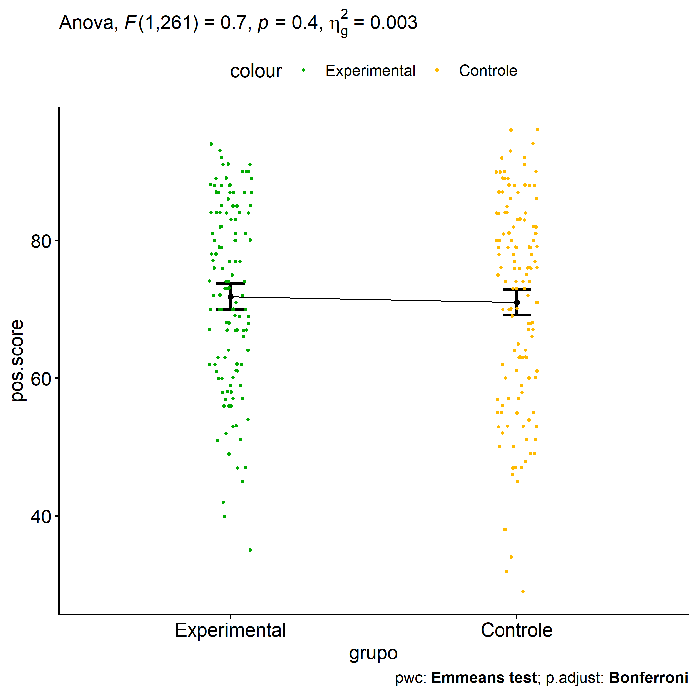<!-- -->

### Pairwise comparison using factor: **genero**

| var       | genero | group1 | group2 | estimate | conf.low | conf.high |    se | statistic |     p | p.adj | p.adj.signif |
|:----------|:-------|:-------|:-------|---------:|---------:|----------:|------:|----------:|------:|------:|:-------------|
| pos.score | NA     | F      | M      |    3.778 |    1.091 |     6.465 | 1.365 |     2.769 | 0.006 | 0.006 | \*\*         |

``` r
oneWayAncovaPlots(dat, "pos.score", "genero", aov1, pwc.genero$pos.score, addParam = c("jitter"), font.label.size=14, step.increase=0.25, p.label="p.adj", subtitle = 3)$genero + ggplot2::scale_color_manual(labels=c("female","male"), values=c("#FF007F","#4D4DFF")) + scale_x_discrete("gender")
```

    ## Scale for colour is already present.
    ## Adding another scale for colour, which will replace the existing scale.

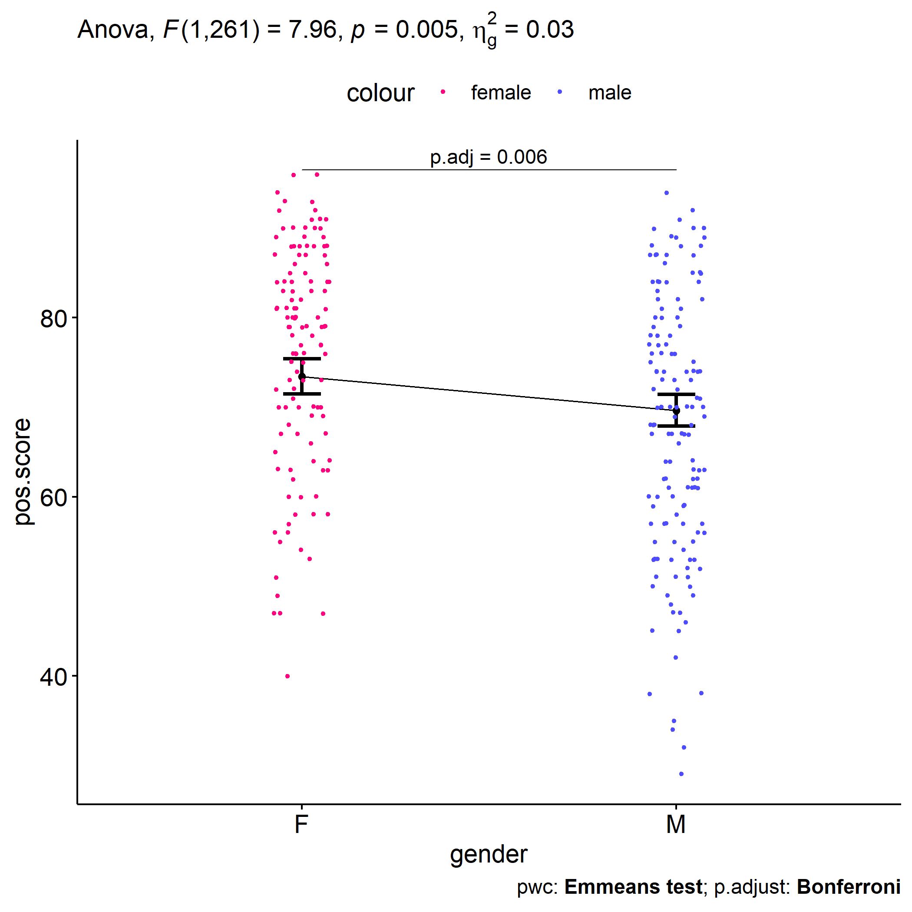<!-- -->

### Pairwise comparison using factor: **zona**

| var       | zona | group1 | group2 | estimate | conf.low | conf.high |    se | statistic |     p | p.adj | p.adj.signif |
|:----------|:-----|:-------|:-------|---------:|---------:|----------:|------:|----------:|------:|------:|:-------------|
| pos.score | NA   | Urbana | Rural  |     1.47 |   -1.482 |     4.423 | 1.497 |     0.982 | 0.327 | 0.327 | ns           |

``` r
oneWayAncovaPlots(sdat, "pos.score", "zona", aov2, pwc.zona$pos.score, addParam = c("jitter"), font.label.size=14, step.increase=0.25, p.label="p.adj", subtitle = 4)$zona +  ggplot2::scale_color_manual(values=c("#AA00FF","#00CCCC"))
```

    ## Scale for colour is already present.
    ## Adding another scale for colour, which will replace the existing scale.

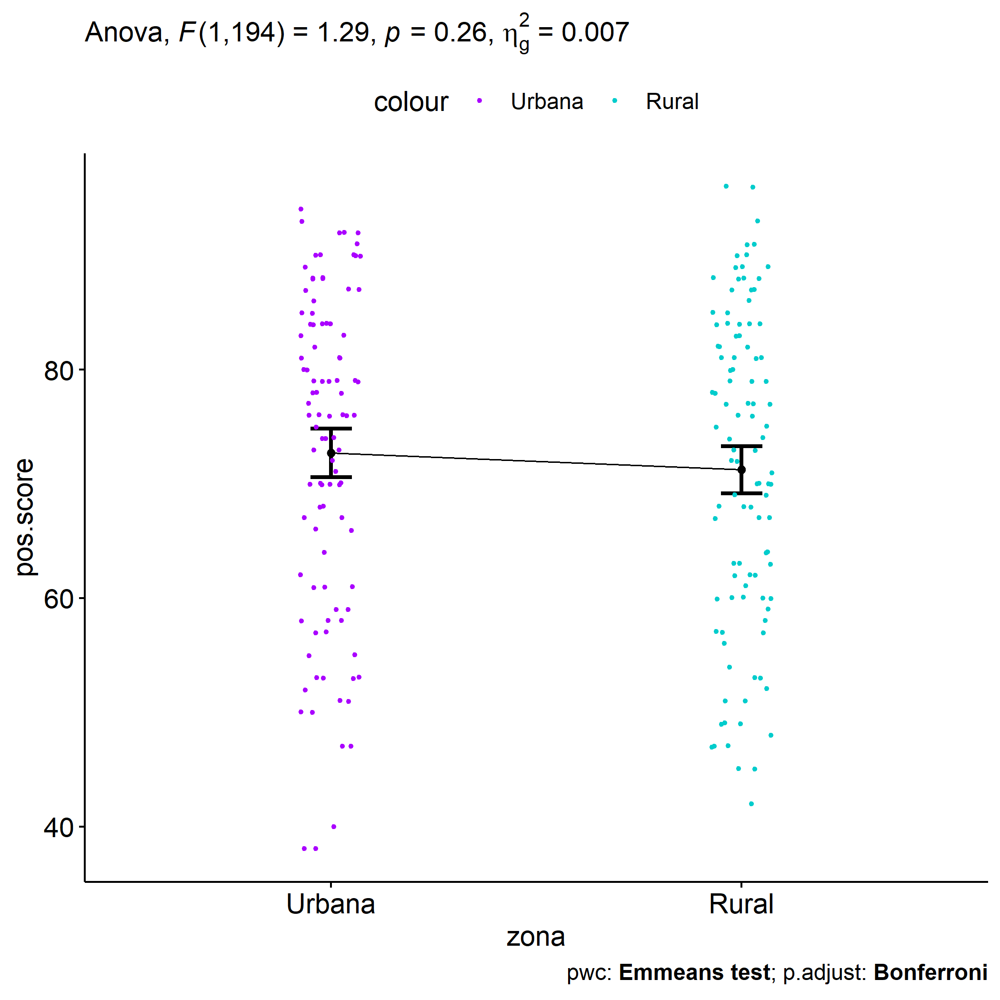<!-- -->

### Pairwise comparison using factor: **grupo:genero**

| var       | grupo        | genero | group1       | group2   | estimate | conf.low | conf.high |    se | statistic |     p | p.adj | p.adj.signif |
|:----------|:-------------|:-------|:-------------|:---------|---------:|---------:|----------:|------:|----------:|------:|------:|:-------------|
| pos.score | NA           | F      | Experimental | Controle |   -0.302 |   -4.168 |     3.563 | 1.963 |    -0.154 | 0.878 | 0.878 | ns           |
| pos.score | NA           | M      | Experimental | Controle |    2.262 |   -1.246 |     5.770 | 1.782 |     1.270 | 0.205 | 0.205 | ns           |
| pos.score | Experimental | NA     | F            | M        |    2.513 |   -1.339 |     6.365 | 1.956 |     1.285 | 0.200 | 0.200 | ns           |
| pos.score | Controle     | NA     | F            | M        |    5.077 |    1.423 |     8.732 | 1.856 |     2.736 | 0.007 | 0.007 | \*\*         |

``` r
plots <- twoWayAncovaPlots(dat, "pos.score", c("grupo","genero"), aov1, pwc.grupo_genero$pos.score, addParam = c("jitter"), font.label.size=14, step.increase=0.25, p.label="p.adj", subtitle = 4)
```

``` r
plots$grupo + ggplot2::scale_color_manual(labels=c("female","male"), values=c("#FF007F","#4D4DFF")) + scale_x_discrete("gender")
```

    ## Scale for colour is already present.
    ## Adding another scale for colour, which will replace the existing scale.

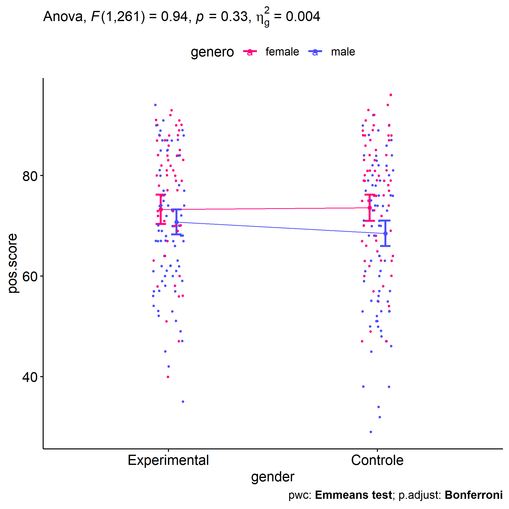<!-- -->

``` r
plots$genero + ggplot2::scale_color_manual(values=c("#00AA00","#FFBA00"))
```

    ## Scale for colour is already present.
    ## Adding another scale for colour, which will replace the existing scale.

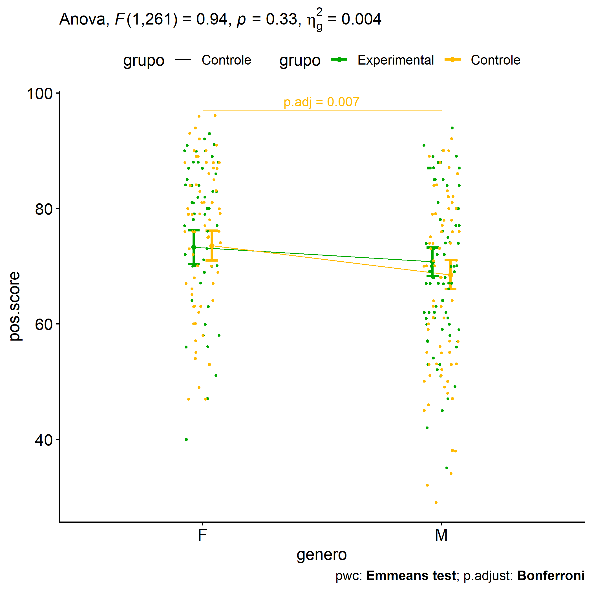<!-- -->

### Pairwise comparison using factor: **grupo:zona**

| var       | grupo        | zona   | group1       | group2   | estimate | conf.low | conf.high |    se | statistic |     p | p.adj | p.adj.signif |
|:----------|:-------------|:-------|:-------------|:---------|---------:|---------:|----------:|------:|----------:|------:|------:|:-------------|
| pos.score | NA           | Urbana | Experimental | Controle |   -0.117 |   -4.429 |     4.195 | 2.187 |    -0.054 | 0.957 | 0.957 | ns           |
| pos.score | NA           | Rural  | Experimental | Controle |    0.141 |   -4.023 |     4.305 | 2.112 |     0.067 | 0.947 | 0.947 | ns           |
| pos.score | Experimental | NA     | Urbana       | Rural    |    1.338 |   -2.989 |     5.665 | 2.194 |     0.610 | 0.543 | 0.543 | ns           |
| pos.score | Controle     | NA     | Urbana       | Rural    |    1.596 |   -2.551 |     5.743 | 2.103 |     0.759 | 0.449 | 0.449 | ns           |

``` r
plots <- twoWayAncovaPlots(sdat, "pos.score", c("grupo","zona"), aov2, pwc.grupo_zona$pos.score, addParam = c("jitter"), font.label.size=14, step.increase=0.25, p.label="p.adj", subtitle = 6)
```

``` r
plots$grupo + ggplot2::scale_color_manual(values=c("#AA00FF","#00CCCC"))
```

    ## Scale for colour is already present.
    ## Adding another scale for colour, which will replace the existing scale.

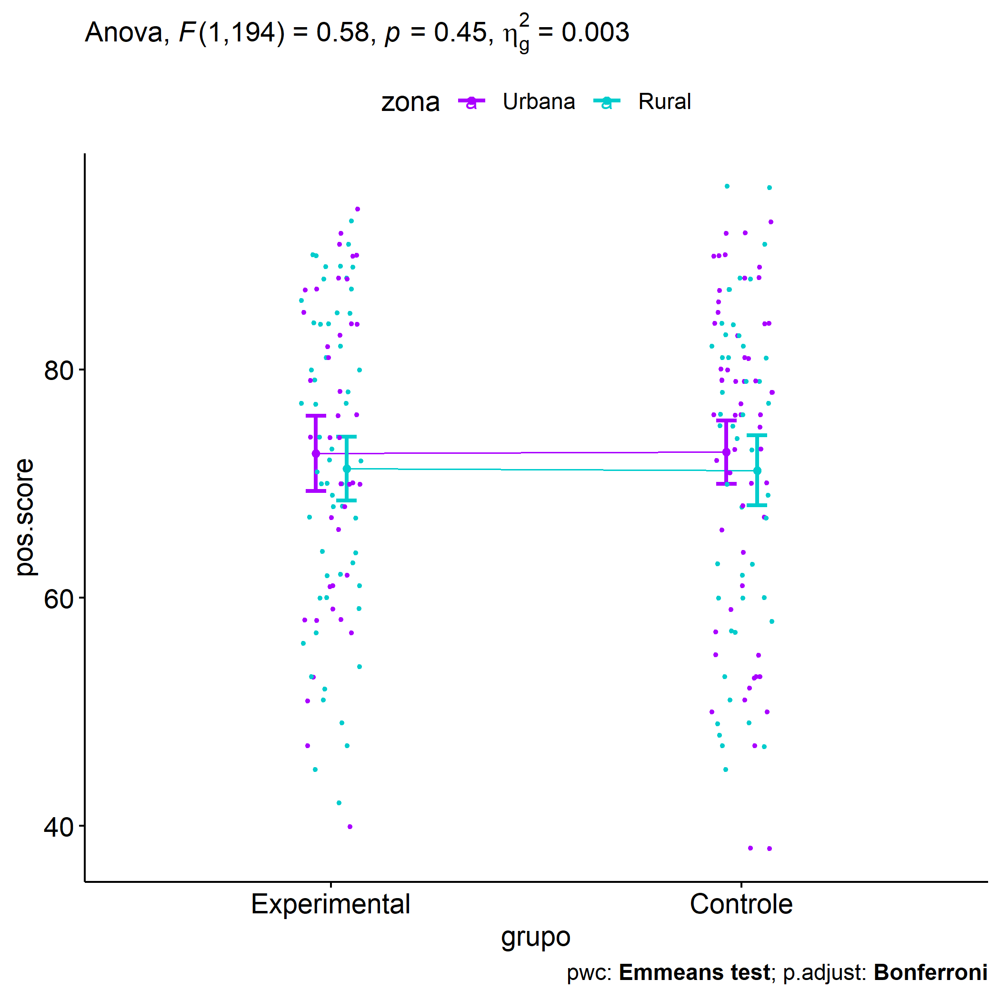<!-- -->

``` r
plots$zona + ggplot2::scale_color_manual(values=c("#00AA00","#FFBA00"))
```

    ## Scale for colour is already present.
    ## Adding another scale for colour, which will replace the existing scale.

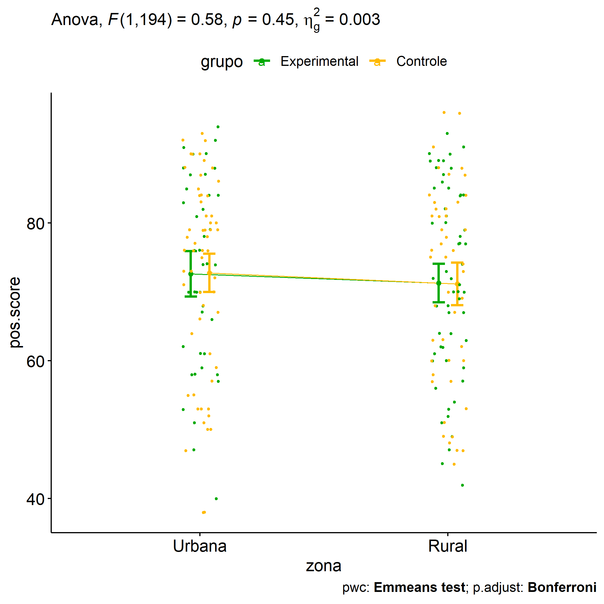<!-- -->

### Pairwise comparison using factor: **genero:zona**

| var       | genero | zona   | group1 | group2 | estimate | conf.low | conf.high |    se | statistic |     p | p.adj | p.adj.signif |
|:----------|:-------|:-------|:-------|:-------|---------:|---------:|----------:|------:|----------:|------:|------:|:-------------|
| pos.score | NA     | Urbana | F      | M      |    2.984 |   -1.336 |     7.304 | 2.191 |     1.362 | 0.175 | 0.175 | ns           |
| pos.score | NA     | Rural  | F      | M      |    5.295 |    1.178 |     9.412 | 2.088 |     2.536 | 0.012 | 0.012 | \*           |
| pos.score | F      | NA     | Urbana | Rural  |    0.310 |   -3.997 |     4.618 | 2.184 |     0.142 | 0.887 | 0.887 | ns           |
| pos.score | M      | NA     | Urbana | Rural  |    2.621 |   -1.335 |     6.578 | 2.006 |     1.306 | 0.193 | 0.193 | ns           |

``` r
plots <- twoWayAncovaPlots(sdat, "pos.score", c("genero","zona"), aov2, pwc.genero_zona$pos.score, addParam = c("jitter"), font.label.size=14, step.increase=0.25, p.label="p.adj", subtitle = 7)
```

``` r
plots$genero + ggplot2::scale_color_manual(values=c("#AA00FF","#00CCCC"))
```

    ## Scale for colour is already present.
    ## Adding another scale for colour, which will replace the existing scale.

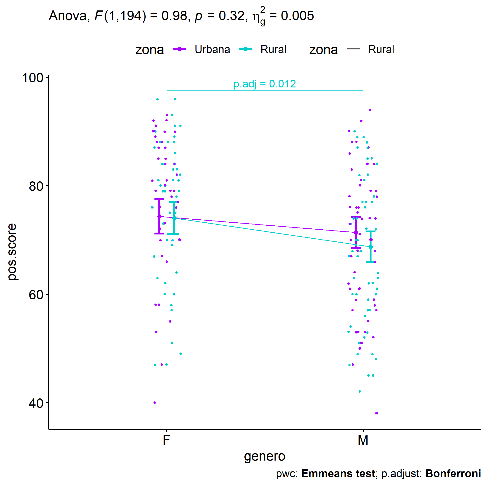<!-- -->

``` r
plots$zona + ggplot2::scale_color_manual(labels=c("female","male"), values=c("#FF007F","#4D4DFF")) + scale_x_discrete("gender")
```

    ## Scale for colour is already present.
    ## Adding another scale for colour, which will replace the existing scale.

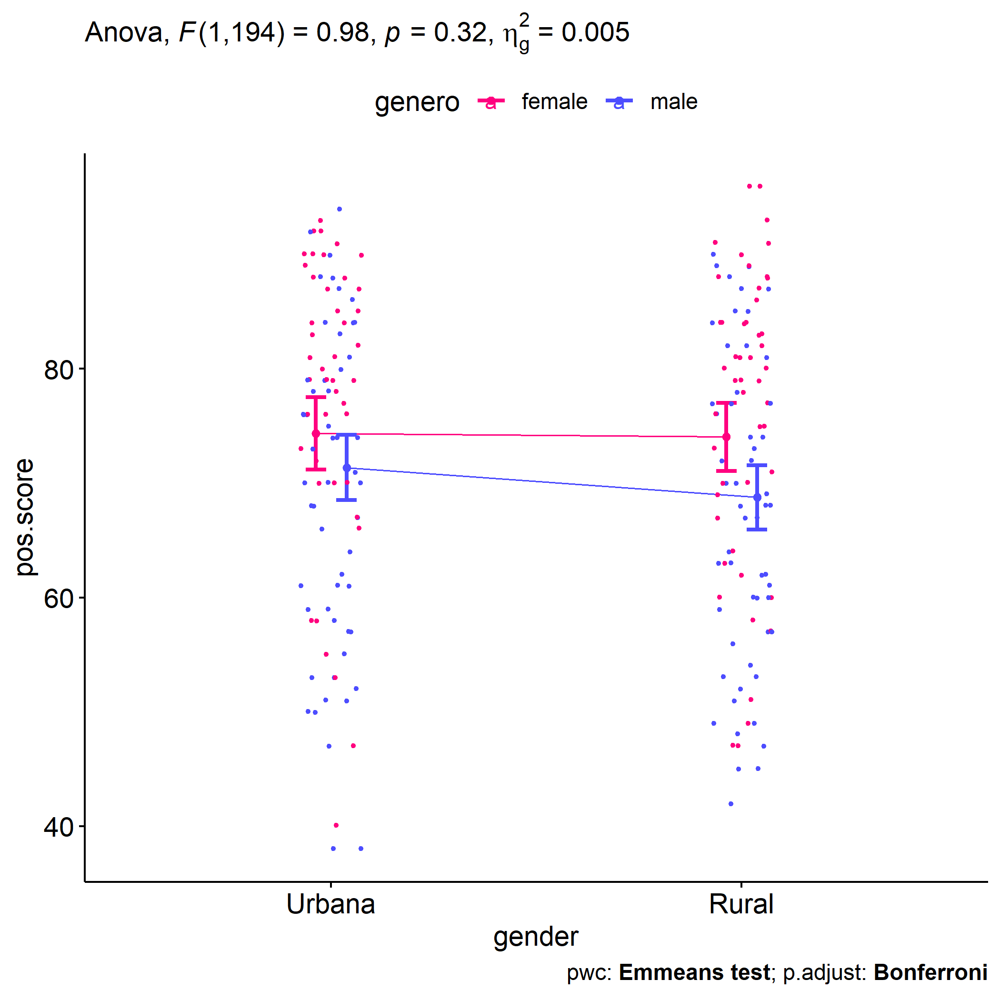<!-- -->

## Descriptive statistics and estimated marginal means to be reported by grupo and genero

| var       | grupo        |   n | M (pre) | SE (pre) | M (unadj) | SE (unadj) | M (adj) | SE (adj) |
|:----------|:-------------|----:|--------:|---------:|----------:|-----------:|--------:|---------:|
| pos.score | Controle     | 138 |  69.986 |    1.040 |    70.659 |      1.279 |  70.984 |    0.925 |
| pos.score | Experimental | 128 |  70.938 |    1.216 |    72.156 |      1.177 |  71.806 |    0.960 |

| var       | genero |   n | M (pre) | SE (pre) | M (unadj) | SE (unadj) | M (adj) | SE (adj) |
|:----------|:-------|----:|--------:|---------:|----------:|-----------:|--------:|---------:|
| pos.score | F      | 121 |  74.074 |    1.162 |    75.884 |      1.138 |  73.439 |    0.992 |
| pos.score | M      | 145 |  67.414 |    1.026 |    67.621 |      1.204 |  69.661 |    0.904 |

| var       | grupo        | genero |   n | M (pre) | SE (pre) | M (unadj) | SE (unadj) | M (adj) | SE (adj) |
|:----------|:-------------|:-------|----:|--------:|---------:|----------:|-----------:|--------:|---------:|
| pos.score | Controle     | F      |  67 |  73.224 |    1.481 |    75.448 |      1.542 |  73.580 |    1.318 |
| pos.score | Controle     | M      |  71 |  66.930 |    1.375 |    66.141 |      1.871 |  68.502 |    1.286 |
| pos.score | Experimental | F      |  54 |  75.130 |    1.851 |    76.426 |      1.699 |  73.277 |    1.480 |
| pos.score | Experimental | M      |  74 |  67.878 |    1.526 |    69.041 |      1.524 |  70.764 |    1.254 |

## Descriptive statistics and estimated marginal means to be reported with zona

| var       | zona   |   n | M (pre) | SE (pre) | M (unadj) | SE (unadj) | M (adj) | SE (adj) |
|:----------|:-------|----:|--------:|---------:|----------:|-----------:|--------:|---------:|
| pos.score | Rural  | 104 |  70.606 |    1.240 |    71.385 |      1.360 |  71.239 |    1.046 |
| pos.score | Urbana |  99 |  70.162 |    1.438 |    72.556 |      1.418 |  72.709 |    1.072 |

| var       | grupo        | zona   |   n | M (pre) | SE (pre) | M (unadj) | SE (unadj) | M (adj) | SE (adj) |
|:----------|:-------------|:-------|----:|--------:|---------:|----------:|-----------:|--------:|---------:|
| pos.score | Controle     | Rural  |  47 |  70.213 |    1.743 |    71.043 |      2.088 |  71.161 |    1.563 |
| pos.score | Controle     | Urbana |  58 |  69.879 |    1.739 |    72.414 |      1.899 |  72.757 |    1.407 |
| pos.score | Experimental | Rural  |  57 |  70.930 |    1.759 |    71.667 |      1.802 |  71.302 |    1.420 |
| pos.score | Experimental | Urbana |  41 |  70.561 |    2.476 |    72.756 |      2.151 |  72.640 |    1.674 |

| var       | genero | zona   |   n | M (pre) | SE (pre) | M (unadj) | SE (unadj) | M (adj) | SE (adj) |
|:----------|:-------|:-------|----:|--------:|---------:|----------:|-----------:|--------:|---------:|
| pos.score | F      | Rural  |  49 |  73.531 |    2.009 |    76.041 |      1.852 |  74.047 |    1.511 |
| pos.score | F      | Urbana |  44 |  75.341 |    1.902 |    77.500 |      1.918 |  74.358 |    1.609 |
| pos.score | M      | Rural  |  55 |  68.000 |    1.442 |    67.236 |      1.810 |  68.752 |    1.423 |
| pos.score | M      | Urbana |  55 |  66.018 |    1.932 |    68.600 |      1.891 |  71.374 |    1.438 |

## Tips and References

- Use the site <https://www.tablesgenerator.com> to convert the HTML
  tables into Latex format

- \[2\]: Miot, H. A. (2017). Assessing normality of data in clinical and
  experimental trials. J Vasc Bras, 16(2), 88-91.

- \[3\]: Bárány, Imre; Vu, Van (2007). “Central limit theorems for
  Gaussian polytopes”. Annals of Probability. Institute of Mathematical
  Statistics. 35 (4): 1593–1621.
